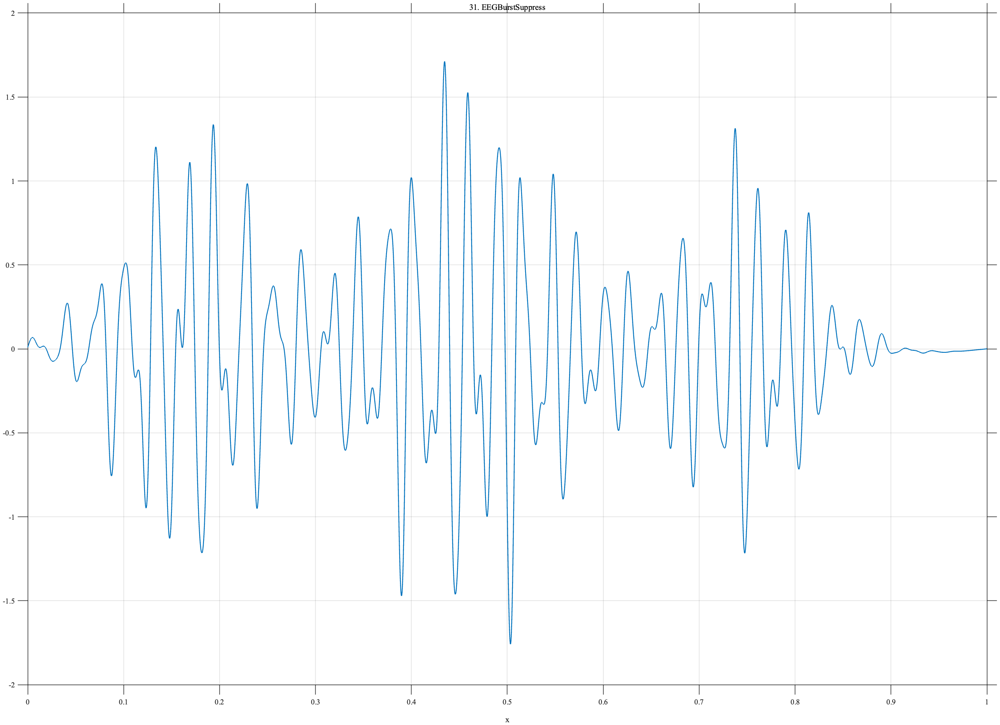

# TF031 — EEGBurstSuppress

## Overview

The **EEGBurstSuppress** signal alternates between high-frequency multicomponent bursts and strongly suppressed intervals. A very weak low-frequency oscillation remains during suppression, testing whether structured low-amplitude activity can be distinguished from noise.

## Mathematical Definition

Let

$$
\psi(x)=\sin\{2\pi(31x+4.5x^2)\}
+0.52\sin(106\pi x+0.7)
+0.23\sin(158\pi x-0.4).
$$

For burst centers, widths, and amplitudes

$$
c=(0.17,0.46,0.75),\quad
s=(0.095,0.125,0.085),\quad
A=(0.95,1.15,0.82),
$$

define

$$
w_k(x)=\exp\!\left[-\left(\frac{x-c_k}{s_k}\right)^2\right].
$$

The complete signal is

$$
f(x)=0.018\sin(10\pi x)+\sum_{k=1}^{3}A_kw_k(x)\psi(x).
$$

## Morphological Characteristics

| Property | Description |
|---|---|
| Primary family | Intermittent multiscale bursts and suppression |
| Burst centers | $0.17$, $0.46$, and $0.75$ |
| Burst content | Chirped component plus two higher frequencies |
| Suppression content | Weak 5-cycle oscillation |
| Main challenge | Separating weak structured activity from noise |

## Parameters

| Parameter | Meaning | Default |
|---|---|---|
| $N$ | Number of samples | 1024 |
| $c$ | Burst centers | $(0.17,0.46,0.75)$ |
| $s$ | Burst widths | $(0.095,0.125,0.085)$ |
| $A$ | Burst amplitudes | $(0.95,1.15,0.82)$ |

## MATLAB Implementation

~~~matlab
N = 1024; x = linspace(0,1,N);
f = 0.018*sin(2*pi*5*x);
c = [0.17 0.46 0.75]; s = [0.095 0.125 0.085]; A = [0.95 1.15 0.82];
for k = 1:numel(c)
    w = exp(-0.5*((x-c(k))/s(k)).^2).^2;
    osc = sin(2*pi*(31*x+4.5*x.^2)) + 0.52*sin(2*pi*53*x+0.7) ...
        + 0.23*sin(2*pi*79*x-0.4);
    f = f + A(k)*w.*osc;
end
plot(x,f,'LineWidth',1.2); grid on
xlabel('x'); ylabel('f(x)'); title('TF031 — EEGBurstSuppress')
exportgraphics(gcf,'TF031_EEGBurstSuppress.png','Resolution',300);
~~~

## Python Implementation

~~~python
import numpy as np
import matplotlib.pyplot as plt
N = 1024; x = np.linspace(0,1,N)
f = 0.018*np.sin(2*np.pi*5*x)
c = [0.17,0.46,0.75]; s = [0.095,0.125,0.085]; A = [0.95,1.15,0.82]
osc = (np.sin(2*np.pi*(31*x+4.5*x**2)) + 0.52*np.sin(2*np.pi*53*x+0.7)
       + 0.23*np.sin(2*np.pi*79*x-0.4))
for ck,sk,ak in zip(c,s,A):
    w = np.exp(-((x-ck)/sk)**2)
    f += ak*w*osc
plt.plot(x,f,linewidth=1.2); plt.grid(alpha=0.3)
plt.xlabel("x"); plt.ylabel("f(x)"); plt.title("TF031 — EEGBurstSuppress")
plt.tight_layout(); plt.savefig("TF031_EEGBurstSuppress.png",dpi=300)
~~~

## Recommended Uses

- Burst-suppression segmentation
- Intermittent high-frequency denoising
- Weak structured-signal retention
- Multiscale EEG-like activity analysis

## Provenance

**Status:** EEG burst-suppression-inspired deterministic surrogate.

---

[← Previous: CheyneStokes](TF030_CheyneStokes.md) | [Category 3 Catalog](index.md) | [Next: TremorOnset →](TF032_TremorOnset.md)

