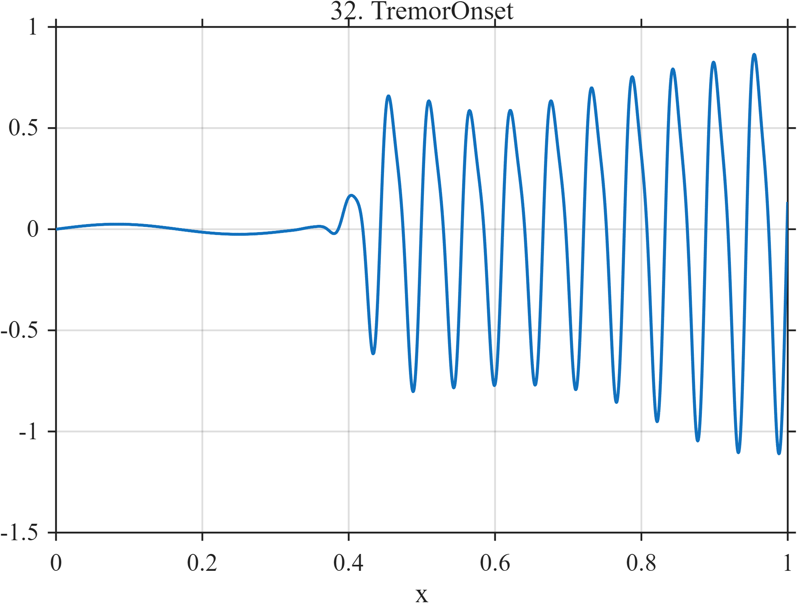

# TF032 — TremorOnset

## Overview

The **TremorOnset** signal begins with a nearly quiescent baseline and smoothly develops into sustained oscillation. After onset, the dominant frequency is accompanied by a weak harmonic and slow amplitude modulation.

## Mathematical Definition

Define the onset envelope and amplitude modulation

$$
E(x)=\frac{1}{1+e^{-75(x-0.42)}},
\qquad
A(x)=0.78+0.15\sin(2.5\pi x).
$$

The signal is

$$
f(x)=0.025\sin(6\pi x)
+E(x)A(x)\left[\sin(36\pi x)+0.24\sin(72\pi x+0.65)\right].
$$

## Morphological Characteristics

| Property | Description |
|---|---|
| Primary family | Smooth onset of sustained oscillation |
| Onset center | $x=0.42$ |
| Dominant oscillation | 18 cycles per unit interval |
| Additional structure | Weak harmonic and slow amplitude modulation |
| Main challenge | Simultaneous onset localization and periodic-signal preservation |

## Parameters

| Parameter | Meaning | Default |
|---|---|---:|
| $N$ | Number of samples | 1024 |
| $75$ | Onset sharpness | 75 |
| $0.42$ | Onset center | 0.42 |
| $18$ | Dominant frequency | 18 |
| $36$ | Harmonic frequency | 36 |

## MATLAB Implementation

~~~matlab
N = 1024; x = linspace(0,1,N);
env = 1./(1+exp(-75*(x-0.42)));
amp = 0.78+0.15*sin(2*pi*1.25*x);
f = 0.025*sin(2*pi*3*x) + env.*amp.*(sin(2*pi*18*x) ...
    + 0.24*sin(2*pi*36*x+0.65));
plot(x,f,'LineWidth',1.2); grid on
xlabel('x'); ylabel('f(x)'); title('TF032 — TremorOnset')
exportgraphics(gcf,'TF032_TremorOnset.png','Resolution',300);
~~~

## Python Implementation

~~~python
import numpy as np
import matplotlib.pyplot as plt
N = 1024; x = np.linspace(0,1,N)
env = 1/(1+np.exp(-75*(x-0.42)))
amp = 0.78+0.15*np.sin(2*np.pi*1.25*x)
f = (0.025*np.sin(2*np.pi*3*x) + env*amp*(np.sin(2*np.pi*18*x)
     + 0.24*np.sin(2*np.pi*36*x+0.65)))
plt.plot(x,f,linewidth=1.2); plt.grid(alpha=0.3)
plt.xlabel("x"); plt.ylabel("f(x)"); plt.title("TF032 — TremorOnset")
plt.tight_layout(); plt.savefig("TF032_TremorOnset.png",dpi=300)
~~~

## Recommended Uses

- Oscillatory-onset detection
- Tremor-like signal denoising
- Harmonic preservation
- Slowly modulated amplitude recovery

## Provenance

**Status:** Tremor-onset-inspired deterministic physiological surrogate.

---

[← Previous: EEGBurstSuppress](TF031_EEGBurstSuppress.md) | [Category 3 Catalog](index.md) | [Next: ArterialPulse →](TF033_ArterialPulse.md)

