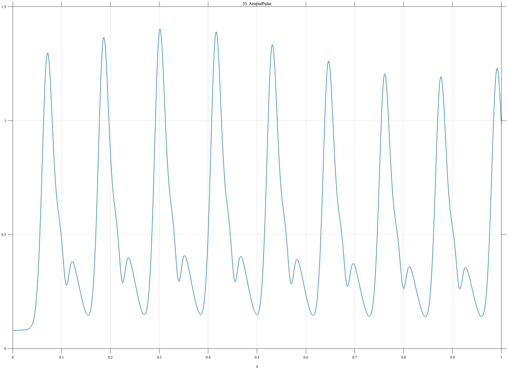

# TF033 — ArterialPulse

## Overview

The **ArterialPulse** signal is a train of idealized pressure pulses. Each pulse combines a rapid systolic component, a broader shoulder, a dicrotic notch, and a reflected wave. Beat amplitudes vary slowly across the record.

## Mathematical Definition

Let

$$
G(x;\mu,s)=\exp\!\left[-\frac12\left(\frac{x-\mu}{s}\right)^2\right].
$$

For pulse center $c_k$, define

$$
P_k(x)=1.05G(x;c_k,0.010)+0.48G(x;c_k+0.022,0.020)
-0.23G(x;c_k+0.039,0.006)+0.20G(x;c_k+0.056,0.016).
$$

The nine centers are $c_k=0.07+0.115(k-1)$, and

$$
a_k=0.92+0.08\sin\!\left(\frac{2\pi(k-1)}{9}\right).
$$

The signal is

$$
f(x)=0.08+\sum_{k=1}^{9}a_kP_k(x).
$$

## Morphological Characteristics

| Property | Description |
|---|---|
| Primary family | Repeated asymmetric multiscale pulses |
| Number of pulses | 9 |
| Local features | Systolic peak, shoulder, notch, and reflection |
| Beat variability | Slowly varying amplitude |
| Main challenge | Preserving narrow and broad components within each beat |

## Parameters

| Parameter | Meaning | Default |
|---|---|---:|
| $N$ | Number of samples | 1024 |
| $0.115$ | Pulse spacing | 0.115 |
| $0.010$ | Systolic width | 0.010 |
| $0.006$ | Notch width | 0.006 |

## MATLAB Implementation

~~~matlab
N = 1024; x = linspace(0,1,N); f = zeros(size(x));
c = 0.07:0.115:0.99;
for k = 1:numel(c)
    a = 0.92+0.08*sin(2*pi*(k-1)/numel(c));
    systolic = 1.05*exp(-0.5*((x-c(k))/0.010).^2);
    shoulder = 0.48*exp(-0.5*((x-(c(k)+0.022))/0.020).^2);
    notch = 0.23*exp(-0.5*((x-(c(k)+0.039))/0.006).^2);
    reflect = 0.20*exp(-0.5*((x-(c(k)+0.056))/0.016).^2);
    f = f+a*(systolic+shoulder-notch+reflect);
end
f = f+0.08;
plot(x,f,'LineWidth',1.3); grid on
xlabel('x'); ylabel('f(x)'); title('TF033 — ArterialPulse')
exportgraphics(gcf,'TF033_ArterialPulse.png','Resolution',300);
~~~

## Python Implementation

~~~python
import numpy as np
import matplotlib.pyplot as plt
N = 1024; x = np.linspace(0,1,N); f = np.zeros_like(x)
centers = np.arange(0.07,0.991,0.115)
G = lambda mu,s: np.exp(-0.5*((x-mu)/s)**2)
for k,c in enumerate(centers):
    a = 0.92+0.08*np.sin(2*np.pi*k/len(centers))
    f += a*(1.05*G(c,0.010)+0.48*G(c+0.022,0.020)
            -0.23*G(c+0.039,0.006)+0.20*G(c+0.056,0.016))
f += 0.08
plt.plot(x,f,linewidth=1.3); plt.grid(alpha=0.3)
plt.xlabel("x"); plt.ylabel("f(x)"); plt.title("TF033 — ArterialPulse")
plt.tight_layout(); plt.savefig("TF033_ArterialPulse.png",dpi=300)
~~~

## Recommended Uses

- Pulse-waveform denoising
- Dicrotic-notch preservation
- Recurrent multiscale feature recovery
- Beat-to-beat amplitude variation analysis

## Provenance

**Status:** Arterial-pressure-pulse-inspired deterministic physiological surrogate.

---

[← Previous: TremorOnset](TF032_TremorOnset.md) | [Category 3 Catalog](index.md) | [Next: EMGRecruitment →](TF034_EMGRecruitment.md)

