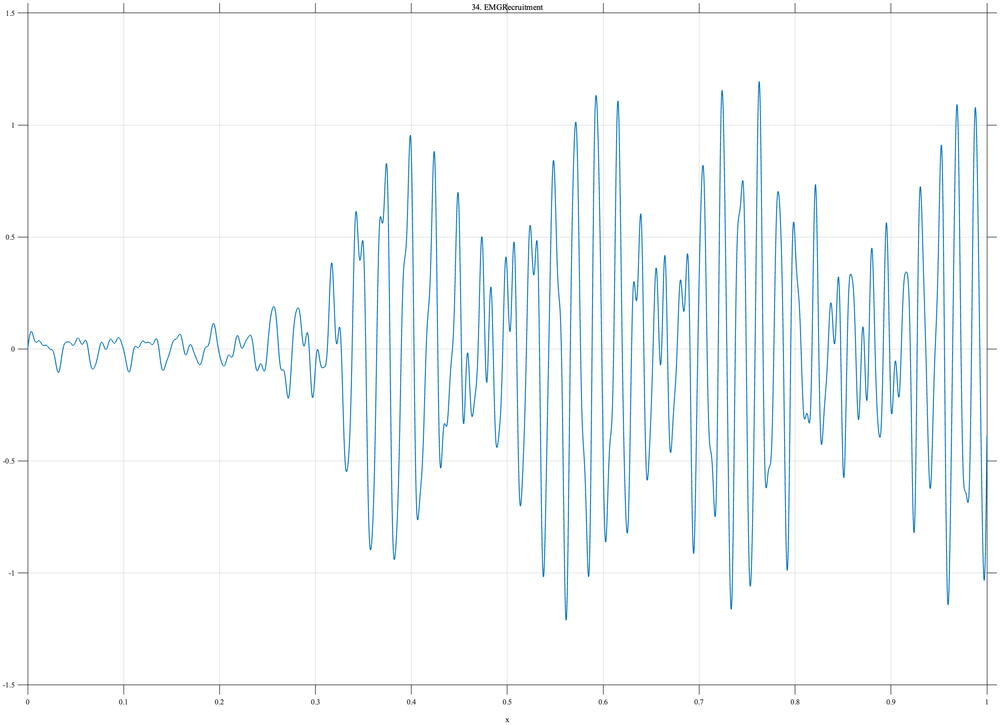

# TF034 — EMGRecruitment

## Overview

The **EMGRecruitment** signal represents progressive recruitment of muscle activity. It evolves from low-amplitude oscillation to dense, energetic multiband activity, providing both sparse and nonsparse coefficient regimes within one record.

## Mathematical Definition

The recruitment envelope is

$$
E(x)=0.08+\frac{0.92}{1+e^{-35(x-0.32)}}.
$$

Define the multiband component

$$
\begin{aligned}
q(x)={}&0.62\sin\{2\pi(24x+17x^2)\}\\
&+0.38\sin\{2\pi[49x+0.80\sin(2.6\pi x)]\}\\
&+0.23\sin(166\pi x+0.35)+0.12\sin(242\pi x-0.8).
\end{aligned}
$$

Then

$$
f(x)=E(x)q(x).
$$

## Morphological Characteristics

| Property | Description |
|---|---|
| Primary family | Progressive multiband recruitment |
| Onset center | $x=0.32$ |
| Early behavior | Sparse, low-energy oscillation |
| Late behavior | Dense, high-energy multiband activity |
| Main challenge | Adapting across sparse and nonsparse regimes |

## Parameters

| Parameter | Meaning | Default |
|---|---|---:|
| $N$ | Number of samples | 1024 |
| $35$ | Recruitment sharpness | 35 |
| $0.32$ | Recruitment center | 0.32 |
| $24,49,83,121$ | Nominal component frequencies | As shown |

## MATLAB Implementation

~~~matlab
N = 1024; x = linspace(0,1,N);
env = 0.08+0.92./(1+exp(-35*(x-0.32)));
osc = 0.62*sin(2*pi*(24*x+17*x.^2)) ...
    + 0.38*sin(2*pi*(49*x+0.80*sin(2*pi*1.3*x))) ...
    + 0.23*sin(2*pi*83*x+0.35) + 0.12*sin(2*pi*121*x-0.8);
f = env.*osc;
plot(x,f,'LineWidth',1.1); grid on
xlabel('x'); ylabel('f(x)'); title('TF034 — EMGRecruitment')
exportgraphics(gcf,'TF034_EMGRecruitment.png','Resolution',300);
~~~

## Python Implementation

~~~python
import numpy as np
import matplotlib.pyplot as plt
N = 1024; x = np.linspace(0,1,N)
env = 0.08+0.92/(1+np.exp(-35*(x-0.32)))
osc = (0.62*np.sin(2*np.pi*(24*x+17*x**2))
       + 0.38*np.sin(2*np.pi*(49*x+0.80*np.sin(2*np.pi*1.3*x)))
       + 0.23*np.sin(2*np.pi*83*x+0.35)+0.12*np.sin(2*np.pi*121*x-0.8))
f = env*osc
plt.plot(x,f,linewidth=1.1); plt.grid(alpha=0.3)
plt.xlabel("x"); plt.ylabel("f(x)"); plt.title("TF034 — EMGRecruitment")
plt.tight_layout(); plt.savefig("TF034_EMGRecruitment.png",dpi=300)
~~~

## Recommended Uses

- Nonstationary EMG-like denoising
- Progressive recruitment detection
- Sparse-to-dense regime adaptation
- Multiband oscillation preservation

## Provenance

**Status:** EMG-recruitment-inspired deterministic physiological surrogate.

---

[← Previous: ArterialPulse](TF033_ArterialPulse.md) | [Category 3 Catalog](index.md) | [Next: BearingFault →](TF035_BearingFault.md)
