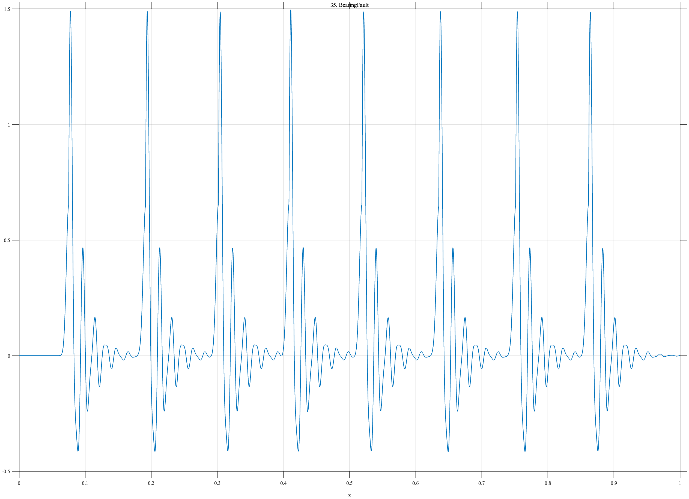

# TF035 — BearingFault

## Overview

The **BearingFault** signal models a localized rolling-element defect. Nearly periodic impacts occur when the damaged region enters the load zone, and each impact excites damped structural resonances on two frequency scales.

## Mathematical Definition

Let the base impact times be

$$
b_k=0.075+0.112(k-1),\qquad k=1,\ldots,9,
$$

and weakly modulate them as

$$
t_k=b_k+0.0045\sin\!\left(\frac{2\pi(k-1)}{5}\right).
$$

With $u_k=x-t_k$, define

$$
I_k(x)=0.65\exp\!\left[-\frac12\left(\frac{u_k}{0.0035}\right)^2\right]
$$

and

$$
R_k(x)=\mathbf{1}_{\{u_k\geq0\}}e^{-48u_k}
\left[\sin(116\pi u_k)+0.32\sin(206\pi u_k)\right].
$$

The signal is

$$
f(x)=\sum_{k=1}^{9}\left[I_k(x)+R_k(x)\right].
$$

## Morphological Characteristics

| Property | Description |
|---|---|
| Primary family | Nearly periodic impacts with damped resonances |
| Number of impacts | 9 |
| Timing | Weakly modulated from a regular grid |
| Ring-down frequencies | 58 and 103 cycles per unit interval |
| Main challenge | Preserving sharp impacts and weaker oscillatory tails |

## Parameters

| Parameter | Meaning | Default |
|---|---|---:|
| $N$ | Number of samples | 1024 |
| $0.112$ | Base impact spacing | 0.112 |
| $0.0035$ | Impact width | 0.0035 |
| $48$ | Ring-down decay rate | 48 |

## MATLAB Implementation

~~~matlab
N = 1024; x = linspace(0,1,N); f = zeros(size(x));
baseTimes = 0.075:0.112:0.97;
for k = 1:numel(baseTimes)
    tk = baseTimes(k)+0.0045*sin(2*pi*(k-1)/5);
    u = x-tk; ind = u>=0;
    impact = 0.65*exp(-0.5*(u/0.0035).^2);
    ring = zeros(size(x));
    ring(ind) = exp(-48*u(ind)).*(sin(2*pi*58*u(ind)) ...
        + 0.32*sin(2*pi*103*u(ind)));
    f = f+impact+ring;
end
plot(x,f,'LineWidth',1.1); grid on
xlabel('x'); ylabel('f(x)'); title('TF035 — BearingFault')
exportgraphics(gcf,'TF035_BearingFault.png','Resolution',300);
~~~

## Python Implementation

~~~python
import numpy as np
import matplotlib.pyplot as plt
N = 1024; x = np.linspace(0,1,N); f = np.zeros_like(x)
base_times = np.arange(0.075,0.971,0.112)
for k,b in enumerate(base_times):
    t = b+0.0045*np.sin(2*np.pi*k/5); u = x-t; ind = u>=0
    impact = 0.65*np.exp(-0.5*(u/0.0035)**2)
    ring = np.zeros_like(x)
    ring[ind] = np.exp(-48*u[ind])*(np.sin(2*np.pi*58*u[ind])
                + 0.32*np.sin(2*np.pi*103*u[ind]))
    f += impact+ring
plt.plot(x,f,linewidth=1.1); plt.grid(alpha=0.3)
plt.xlabel("x"); plt.ylabel("f(x)"); plt.title("TF035 — BearingFault")
plt.tight_layout(); plt.savefig("TF035_BearingFault.png",dpi=300)
~~~

## Recommended Uses

- Repeated-impact detection
- Ring-down preservation
- Condition-monitoring denoising
- Slightly irregular impulse-train analysis

## Provenance

**Status:** Rolling-element-bearing-fault-inspired deterministic mechanical surrogate.

---

[← Previous: EMGRecruitment](TF034_EMGRecruitment.md) | [Category 3 Catalog](index.md) | [Next: GearDefect →](TF036_GearDefect.md)

