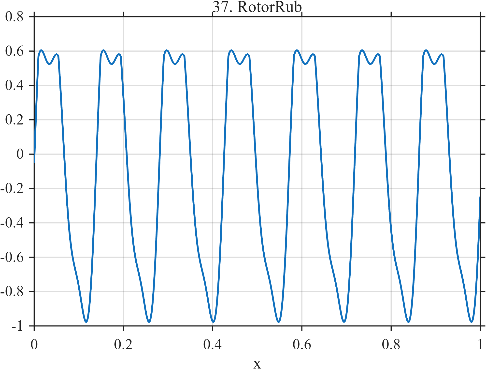

# TF037 — RotorRub

## Overview

The **RotorRub** signal begins with smooth periodic rotor motion. Whenever the trajectory exceeds a contact threshold, nonlinear clipping mimics intermittent rubbing against a stationary component, generating repeated cusps and harmonic distortion.

## Mathematical Definition

Define

$$
\phi(x)=2\pi\left[7x+0.035\sin(1.8\pi x)\right]
$$

and the unconstrained rotor trajectory

$$
z(x)=\sin\phi(x)+0.16\sin\{2\phi(x)-0.5\}.
$$

The contact component is

$$
c(x)=\max\{z(x)-0.48,0\}.
$$

The complete signal is

$$
f(x)=z(x)-0.78c(x)+0.09\sin\{3\phi(x)+0.3\}.
$$

## Morphological Characteristics

| Property | Description |
|---|---|
| Primary family | Periodic motion with nonlinear contact |
| Dominant rotation | Approximately 7 cycles |
| Contact threshold | $z=0.48$ |
| Local regularity | Repeated cusps at contact entry and exit |
| Main challenge | Preserving periodicity together with nonlinear clipping |

## Parameters

| Parameter | Meaning | Default |
|---|---|---:|
| $N$ | Number of samples | 1024 |
| $7$ | Nominal rotor frequency | 7 |
| $0.48$ | Contact threshold | 0.48 |
| $0.78$ | Contact correction weight | 0.78 |

## MATLAB Implementation

~~~matlab
N = 1024; x = linspace(0,1,N);
phase = 2*pi*(7*x+0.035*sin(2*pi*0.9*x));
z = sin(phase)+0.16*sin(2*phase-0.5);
contact = max(z-0.48,0);
f = z-0.78*contact+0.09*sin(3*phase+0.3);
plot(x,f,'LineWidth',1.3); grid on
xlabel('x'); ylabel('f(x)'); title('TF037 — RotorRub')
exportgraphics(gcf,'TF037_RotorRub.png','Resolution',300);
~~~

## Python Implementation

~~~python
import numpy as np
import matplotlib.pyplot as plt
N = 1024; x = np.linspace(0,1,N)
phase = 2*np.pi*(7*x+0.035*np.sin(2*np.pi*0.9*x))
z = np.sin(phase)+0.16*np.sin(2*phase-0.5)
contact = np.maximum(z-0.48,0)
f = z-0.78*contact+0.09*np.sin(3*phase+0.3)
plt.plot(x,f,linewidth=1.3); plt.grid(alpha=0.3)
plt.xlabel("x"); plt.ylabel("f(x)"); plt.title("TF037 — RotorRub")
plt.tight_layout(); plt.savefig("TF037_RotorRub.png",dpi=300)
~~~

## Recommended Uses

- Contact-nonlinearity detection
- Periodic cusp preservation
- Rotor-condition monitoring
- Harmonic-distortion recovery

## Provenance

**Status:** Rotor-rub-inspired deterministic mechanical surrogate.

---

[← Previous: GearDefect](TF036_GearDefect.md) | [Category 3 Catalog](index.md) | [Next: VortexLockIn →](TF038_VortexLockIn.md)

