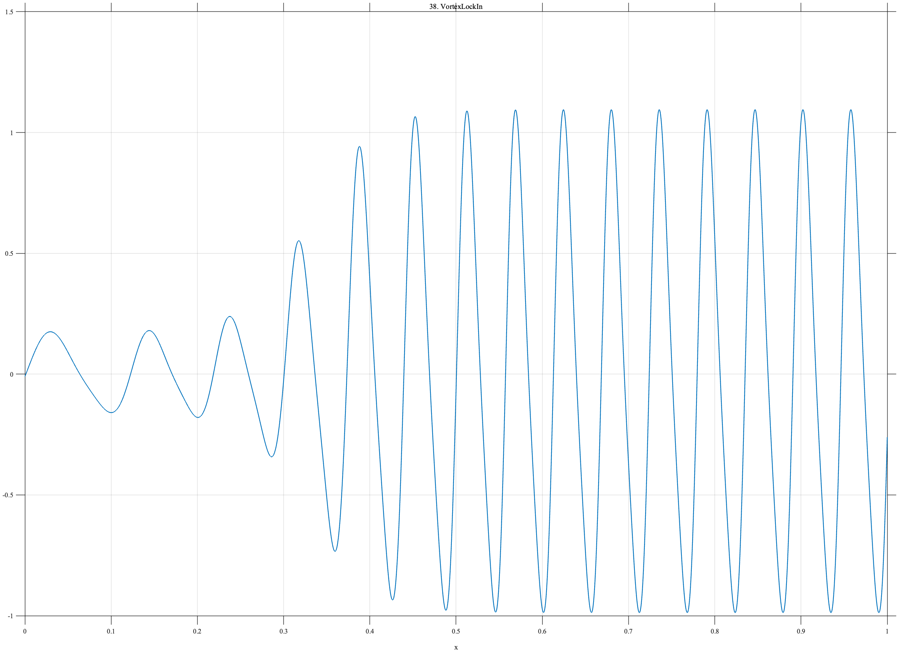

# TF038 — VortexLockIn

## Overview

The **VortexLockIn** signal represents idealized vortex-induced vibration. Its instantaneous frequency initially increases and then locks to a constant structural frequency, while its amplitude grows through approximately the same transition.

## Mathematical Definition

The instantaneous frequency is

$$
\nu(x)=
\begin{cases}
7+20x, & x\leq0.55,\\
18, & x>0.55.
\end{cases}
$$

Define the accumulated phase

$$
\phi(x)=2\pi\int_0^x\nu(t)\,dt
$$

and the amplitude envelope

$$
E(x)=0.16+\frac{0.84}{1+e^{-28(x-0.33)}}.
$$

The signal is

$$
f(x)=E(x)\left[\sin\phi(x)+0.16\sin\{2\phi(x)-0.4\}\right].
$$

## Morphological Characteristics

| Property | Description |
|---|---|
| Primary family | Chirp-to-periodic lock-in transition |
| Initial frequency | 7 |
| Locked frequency | 18 |
| Lock-in location | $x=0.55$ |
| Main challenge | Preserving simultaneous frequency and amplitude transitions |

## Parameters

| Parameter | Meaning | Default |
|---|---|---:|
| $N$ | Number of samples | 1024 |
| $0.55$ | Frequency lock location | 0.55 |
| $0.33$ | Amplitude-growth center | 0.33 |
| $28$ | Amplitude-growth sharpness | 28 |

## MATLAB Implementation

~~~matlab
N = 1024; x = linspace(0,1,N);
freq = 7+20*min(x,0.55); freq(x>0.55) = 18;
phase = 2*pi*cumtrapz(x,freq);
env = 0.16+0.84./(1+exp(-28*(x-0.33)));
f = env.*(sin(phase)+0.16*sin(2*phase-0.4));
plot(x,f,'LineWidth',1.3); grid on
xlabel('x'); ylabel('f(x)'); title('TF038 — VortexLockIn')
exportgraphics(gcf,'TF038_VortexLockIn.png','Resolution',300);
~~~

## Python Implementation

~~~python
import numpy as np
import matplotlib.pyplot as plt
from scipy.integrate import cumulative_trapezoid
N = 1024; x = np.linspace(0,1,N)
freq = 7+20*np.minimum(x,0.55); freq[x>0.55] = 18
phase = 2*np.pi*cumulative_trapezoid(freq,x,initial=0)
env = 0.16+0.84/(1+np.exp(-28*(x-0.33)))
f = env*(np.sin(phase)+0.16*np.sin(2*phase-0.4))
plt.plot(x,f,linewidth=1.3); plt.grid(alpha=0.3)
plt.xlabel("x"); plt.ylabel("f(x)"); plt.title("TF038 — VortexLockIn")
plt.tight_layout(); plt.savefig("TF038_VortexLockIn.png",dpi=300)
~~~

## Recommended Uses

- Chirp-to-lock-in transition detection
- Time-varying frequency denoising
- Amplitude-transition preservation
- Vortex-induced-vibration analysis

## Provenance

**Status:** Vortex-induced-vibration-inspired deterministic surrogate.

---

[← Previous: RotorRub](TF037_RotorRub.md) | [Category 3 Catalog](index.md) | [Next: InternalSolitons →](TF039_InternalSolitons.md)
