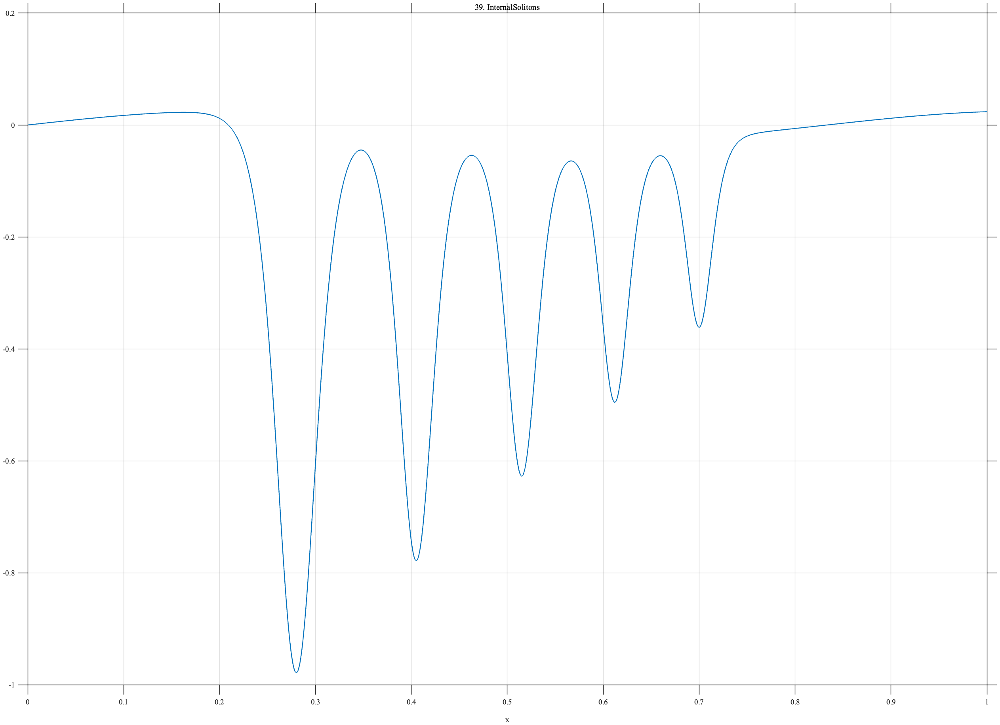

# TF039 — InternalSolitons

## Overview

The **InternalSolitons** signal is a packet of unequal internal solitary depression waves. The leading event is strongest, and later waves become progressively weaker and narrower. It tests whether small secondary structures are retained near a dominant event.

## Mathematical Definition

The centers, amplitudes, and widths are

$$
c=(0.28,0.405,0.515,0.612,0.700),
$$

$$
A=(1.00,0.78,0.61,0.47,0.34),
$$

$$
s=(0.028,0.024,0.022,0.020,0.018).
$$

Avoiding special-function notation, each depression pulse is written as

$$
P_k(x)=-\frac{A_k}{\cosh^2\!\left((x-c_k)/s_k\right)}.
$$

The complete signal is

$$
f(x)=0.025\sin(2.4\pi x)+\sum_{k=1}^{5}P_k(x).
$$

## Morphological Characteristics

| Property | Description |
|---|---|
| Primary family | Ranked packet of localized depression pulses |
| Number of pulses | 5 |
| Amplitudes | Progressively decreasing |
| Widths | Progressively narrowing |
| Main challenge | Retaining weak secondary waves near a dominant event |

## Parameters

| Parameter | Meaning | Default |
|---|---|---|
| $N$ | Number of samples | 1024 |
| $c$ | Pulse centers | $(0.28,0.405,0.515,0.612,0.700)$ |
| $A$ | Pulse amplitudes | $(1.00,0.78,0.61,0.47,0.34)$ |
| $s$ | Pulse widths | $(0.028,0.024,0.022,0.020,0.018)$ |

## MATLAB Implementation

~~~matlab
N = 1024; x = linspace(0,1,N);
f = 0.025*sin(2*pi*1.2*x);
c = [0.28 0.405 0.515 0.612 0.700];
A = [1.00 0.78 0.61 0.47 0.34];
s = [0.028 0.024 0.022 0.020 0.018];
for k = 1:numel(c)
    u = (x-c(k))/s(k);
    f = f-A(k)./(cosh(u).^2);
end
plot(x,f,'LineWidth',1.4); grid on
xlabel('x'); ylabel('f(x)'); title('TF039 — InternalSolitons')
exportgraphics(gcf,'TF039_InternalSolitons.png','Resolution',300);
~~~

## Python Implementation

~~~python
import numpy as np
import matplotlib.pyplot as plt
N = 1024; x = np.linspace(0,1,N)
f = 0.025*np.sin(2*np.pi*1.2*x)
c = [0.28,0.405,0.515,0.612,0.700]
A = [1.00,0.78,0.61,0.47,0.34]
s = [0.028,0.024,0.022,0.020,0.018]
for ck,ak,sk in zip(c,A,s):
    f -= ak/np.cosh((x-ck)/sk)**2
plt.plot(x,f,linewidth=1.4); plt.grid(alpha=0.3)
plt.xlabel("x"); plt.ylabel("f(x)"); plt.title("TF039 — InternalSolitons")
plt.tight_layout(); plt.savefig("TF039_InternalSolitons.png",dpi=300)
~~~

## Recommended Uses

- Unequal-pulse preservation
- Weak-neighbor recovery
- Oceanographic transient denoising
- Ranked multiscale-event analysis

## Provenance

**Status:** Internal-solitary-wave-inspired deterministic oceanographic surrogate.

---

[← Previous: VortexLockIn](TF038_VortexLockIn.md) | [Category 3 Catalog](index.md) | [Next: WhaleClicks →](TF040_WhaleClicks.md)

