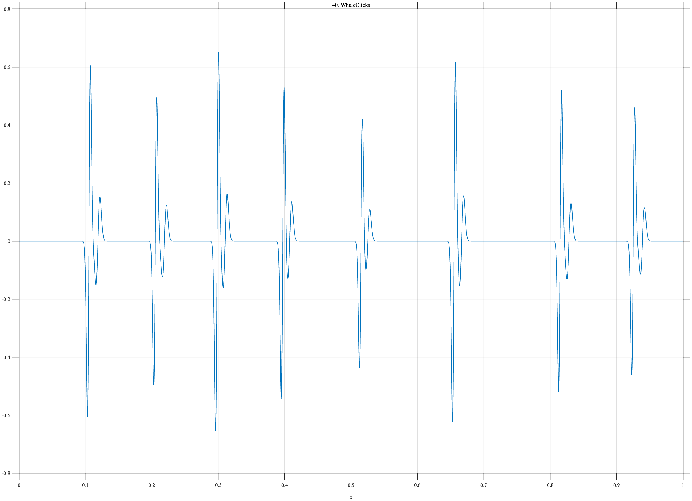

# TF040 — WhaleClicks

## Overview

The **WhaleClicks** signal consists of an irregular sequence of narrow bipolar clicks. Every primary click has a weaker delayed echo, while click amplitudes and inter-click intervals vary across the record.

## Mathematical Definition

Define the derivative-of-Gaussian pulse

$$
D(x;t,s)=\frac{x-t}{s}
\exp\!\left[-\frac12\left(\frac{x-t}{s}\right)^2\right].
$$

The primary click times and amplitudes are

$$
t=(0.105,0.205,0.298,0.397,0.515,0.655,0.815,0.925),
$$

$$
A=(1.00,0.82,1.08,0.90,0.72,1.03,0.86,0.76).
$$

For click $k$, define the echo time

$$
e_k=t_k+0.012+0.002\sin k.
$$

The complete signal is

$$
f(x)=\sum_{k=1}^{8}
\left[A_kD(x;t_k,0.0022)+0.25A_kD(x;e_k,0.0030)\right].
$$

## Morphological Characteristics

| Property | Description |
|---|---|
| Primary family | Sparse irregular bipolar clicks with echoes |
| Number of primary clicks | 8 |
| Primary width | 0.0022 |
| Echo width | 0.0030 |
| Main challenge | Recovering highly sparse features on two fine scales |

## Parameters

| Parameter | Meaning | Default |
|---|---|---:|
| $N$ | Number of samples | 1024 |
| $0.0022$ | Primary-click width | 0.0022 |
| $0.0030$ | Echo width | 0.0030 |
| $0.25$ | Relative echo amplitude | 0.25 |

## MATLAB Implementation

~~~matlab
N = 1024; x = linspace(0,1,N); f = zeros(size(x));
t = [0.105 0.205 0.298 0.397 0.515 0.655 0.815 0.925];
A = [1.00 0.82 1.08 0.90 0.72 1.03 0.86 0.76];
for k = 1:numel(t)
    u1 = (x-t(k))/0.0022;
    click = A(k)*u1.*exp(-0.5*u1.^2);
    te = t(k)+0.012+0.002*sin(k);
    u2 = (x-te)/0.0030;
    echo = 0.25*A(k)*u2.*exp(-0.5*u2.^2);
    f = f+click+echo;
end
plot(x,f,'LineWidth',1.1); grid on
xlabel('x'); ylabel('f(x)'); title('TF040 — WhaleClicks')
exportgraphics(gcf,'TF040_WhaleClicks.png','Resolution',300);
~~~

## Python Implementation

~~~python
import numpy as np
import matplotlib.pyplot as plt
N = 1024; x = np.linspace(0,1,N); f = np.zeros_like(x)
t = [0.105,0.205,0.298,0.397,0.515,0.655,0.815,0.925]
A = [1.00,0.82,1.08,0.90,0.72,1.03,0.86,0.76]
for k,(tk,ak) in enumerate(zip(t,A),start=1):
    u1 = (x-tk)/0.0022; click = ak*u1*np.exp(-0.5*u1**2)
    te = tk+0.012+0.002*np.sin(k)
    u2 = (x-te)/0.0030; echo = 0.25*ak*u2*np.exp(-0.5*u2**2)
    f += click+echo
plt.plot(x,f,linewidth=1.1); plt.grid(alpha=0.3)
plt.xlabel("x"); plt.ylabel("f(x)"); plt.title("TF040 — WhaleClicks")
plt.tight_layout(); plt.savefig("TF040_WhaleClicks.png",dpi=300)
~~~

## Recommended Uses

- Sparse-click denoising
- Echo preservation
- Irregular event-train analysis
- Fine-scale bipolar transient recovery

## Provenance

**Status:** Marine-click-train-inspired deterministic bioacoustic surrogate.

---

[← Previous: InternalSolitons](TF039_InternalSolitons.md) | [Category 3 Catalog](index.md) | [Next: SonarMultipath →](TF041_SonarMultipath.md)

