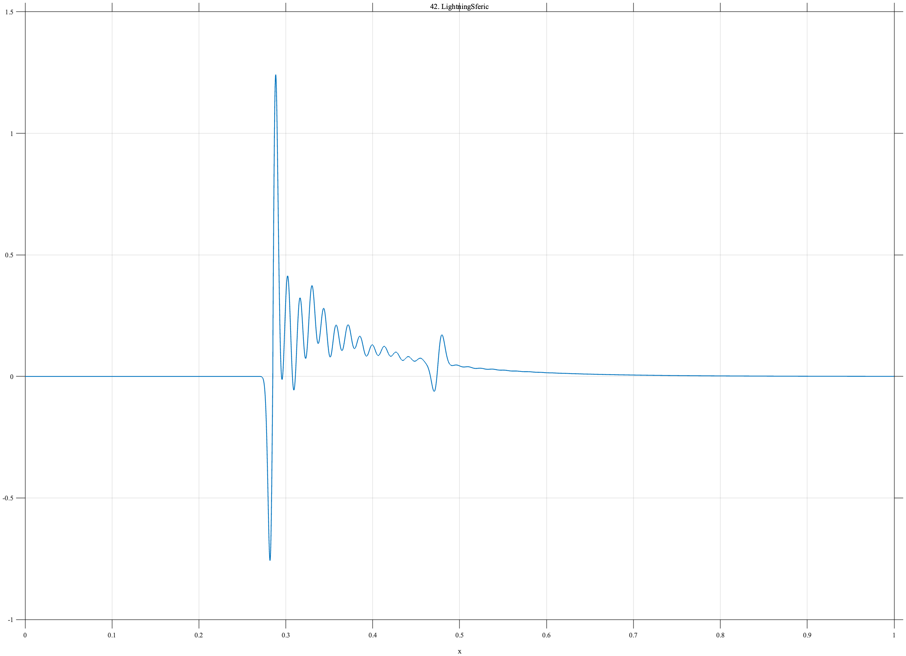

# TF042 — LightningSferic

## Overview

The **LightningSferic** signal is a multiscale atmospheric electromagnetic transient. It contains a sharp bipolar front, a slower unipolar component, damped oscillations on two frequency scales, and a weak delayed arrival.

## Mathematical Definition

Let $t_0=0.285$, $s_0=0.0032$, and $u_0=(x-t_0)/s_0$. The primary bipolar front is

$$
P(x)=1.25u_0e^{-u_0^2/2}.
$$

For $u=x-t_0$, define

$$
S(x)=0.36\mathbf{1}_{\{u\geq0\}}\left(e^{-10u}-e^{-65u}\right)
$$

and

$$
R(x)=\mathbf{1}_{\{u\geq0\}}e^{-23u}
\left[0.34\sin(144\pi u)+0.14\sin(48\pi u+0.55)\right].
$$

For the delayed arrival, let $t_d=0.475$, $s_d=0.0045$, and $u_d=(x-t_d)/s_d$:

$$
D(x)=0.20u_de^{-u_d^2/2}.
$$

The complete signal is

$$
f(x)=P(x)+S(x)+R(x)+D(x).
$$

## Morphological Characteristics

| Property | Description |
|---|---|
| Primary family | Multiscale impulsive transient |
| Primary arrival | Sharp bipolar event at $x=0.285$ |
| Post-arrival content | Slow component and two damped frequencies |
| Delayed arrival | Weak bipolar event at $x=0.475$ |
| Main challenge | Retaining small structured ringing near a dominant impulse |

## Parameters

| Parameter | Meaning | Default |
|---|---|---:|
| $N$ | Number of samples | 1024 |
| $t_0$ | Primary arrival time | 0.285 |
| $s_0$ | Primary width | 0.0032 |
| $t_d$ | Delayed arrival time | 0.475 |
| $s_d$ | Delayed width | 0.0045 |

## MATLAB Implementation

~~~matlab
N = 1024; x = linspace(0,1,N);
t0 = 0.285; s0 = 0.0032; u0 = (x-t0)/s0;
primary = 1.25*u0.*exp(-0.5*u0.^2);
u = x-t0; ind = u>=0; slow = zeros(size(x)); ring = zeros(size(x));
slow(ind) = 0.36*(exp(-10*u(ind))-exp(-65*u(ind)));
ring(ind) = exp(-23*u(ind)).*(0.34*sin(2*pi*72*u(ind)) ...
    + 0.14*sin(2*pi*24*u(ind)+0.55));
td = 0.475; sd = 0.0045; ud = (x-td)/sd;
delayed = 0.20*ud.*exp(-0.5*ud.^2);
f = primary+slow+ring+delayed;
plot(x,f,'LineWidth',1.1); grid on
xlabel('x'); ylabel('f(x)'); title('TF042 — LightningSferic')
exportgraphics(gcf,'TF042_LightningSferic.png','Resolution',300);
~~~

## Python Implementation

~~~python
import numpy as np
import matplotlib.pyplot as plt
N = 1024; x = np.linspace(0,1,N)
t0 = 0.285; s0 = 0.0032; u0 = (x-t0)/s0
primary = 1.25*u0*np.exp(-0.5*u0**2)
u = x-t0; ind = u>=0; slow = np.zeros_like(x); ring = np.zeros_like(x)
slow[ind] = 0.36*(np.exp(-10*u[ind])-np.exp(-65*u[ind]))
ring[ind] = np.exp(-23*u[ind])*(0.34*np.sin(2*np.pi*72*u[ind])
            + 0.14*np.sin(2*np.pi*24*u[ind]+0.55))
td = 0.475; sd = 0.0045; ud = (x-td)/sd
delayed = 0.20*ud*np.exp(-0.5*ud**2)
f = primary+slow+ring+delayed
plt.plot(x,f,linewidth=1.1); plt.grid(alpha=0.3)
plt.xlabel("x"); plt.ylabel("f(x)"); plt.title("TF042 — LightningSferic")
plt.tight_layout(); plt.savefig("TF042_LightningSferic.png",dpi=300)
~~~

## Recommended Uses

- Multiscale impulse denoising
- Delayed-arrival recovery
- Damped-ringing preservation
- Atmospheric-transient analysis

## Provenance

**Status:** Lightning-sferic-inspired deterministic atmospheric surrogate.

---

[← Previous: SonarMultipath](TF041_SonarMultipath.md) | [Category 3 Catalog](index.md)

