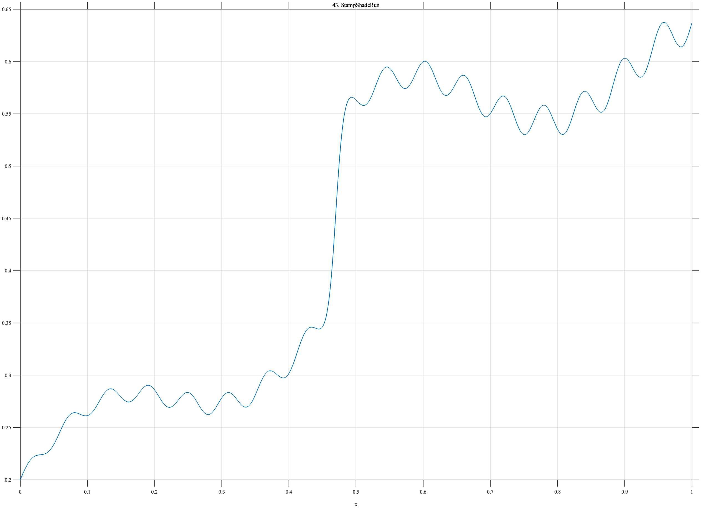

# TF043 — StampShadeRun

## Overview

The **StampShadeRun** signal represents a color coordinate, optical density, or similar shade measurement observed through a stamp-printing run. A meaningful batch change is embedded in otherwise smooth press and ink drift, with weak repeatable production oscillations.

## Mathematical Definition

Define

$$
b(x)=0.20+0.34x+0.035\sin(4.4\pi x),
$$

$$
J(x)=\frac{0.18}{1+e^{-180(x-0.47)}},
$$

$$
d(x)=-0.22(x-0.47)_+,
\qquad (u)_+=\max(u,0),
$$

and

$$
r(x)=0.018\sin(34\pi x)(0.35+0.65x).
$$

The complete signal is

$$
f(x)=b(x)+J(x)+d(x)+r(x).
$$

## Morphological Characteristics

| Property | Description |
|---|---|
| Primary family | Smooth drift with embedded batch shift |
| Batch-change location | $x=0.47$ |
| Production structure | Weak amplitude-varying oscillation |
| Post-change behavior | Renewed drift with a different slope |
| Main challenge | Preserving an abrupt intervention within smooth drift |

## Parameters

| Parameter | Meaning | Default |
|---|---|---:|
| $N$ | Number of samples | 1024 |
| $0.47$ | Batch-change location | 0.47 |
| $180$ | Batch-transition sharpness | 180 |
| $17$ | Production-oscillation frequency | 17 |

## MATLAB Implementation

~~~matlab
N = 1024; x = linspace(0,1,N);
base = 0.20+0.34*x+0.035*sin(2*pi*2.2*x);
jump = 0.18./(1+exp(-180*(x-0.47)));
late = -0.22*max(x-0.47,0);
run = 0.018*sin(2*pi*17*x).*(0.35+0.65*x);
f = base+jump+late+run;
plot(x,f,'LineWidth',1.4); grid on
xlabel('x'); ylabel('f(x)'); title('TF043 — StampShadeRun')
exportgraphics(gcf,'TF043_StampShadeRun.png','Resolution',300);
~~~

## Python Implementation

~~~python
import numpy as np
import matplotlib.pyplot as plt
N = 1024; x = np.linspace(0,1,N)
base = 0.20+0.34*x+0.035*np.sin(2*np.pi*2.2*x)
jump = 0.18/(1+np.exp(-180*(x-0.47)))
late = -0.22*np.maximum(x-0.47,0)
run = 0.018*np.sin(2*np.pi*17*x)*(0.35+0.65*x)
f = base+jump+late+run
plt.plot(x,f,linewidth=1.4); plt.grid(alpha=0.3)
plt.xlabel("x"); plt.ylabel("f(x)"); plt.title("TF043 — StampShadeRun")
plt.tight_layout(); plt.savefig("TF043_StampShadeRun.png",dpi=300)
~~~

## Recommended Uses

- Production-drift denoising
- Batch-change detection
- Weak periodic-error preservation
- Intervention-within-trend evaluation

## Provenance

**Status:** Stamp-production-inspired deterministic measurement surrogate.

---

[Category 4 Catalog](index.md) | [Next: PerforationDrift →](TF044_PerforationDrift.md)

