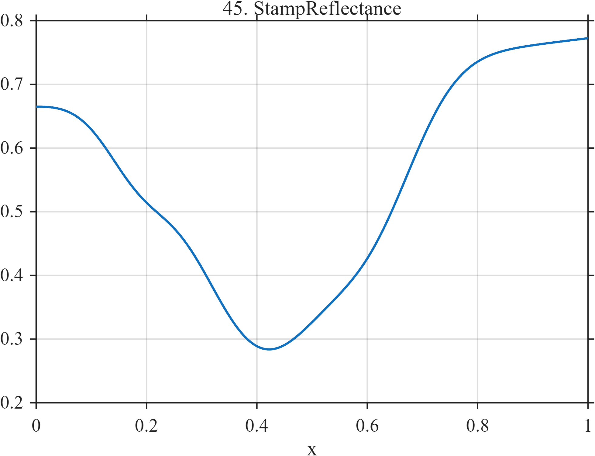

# TF045 — StampReflectance

## Overview

The **StampReflectance** signal is a toy visible reflectance spectrum for a colored stamp. Broad absorption bands, a shoulder, and a weaker secondary structure mimic spectral features used to distinguish inks, pigments, and shades.

## Mathematical Definition

Map the unit interval to wavelength in nanometers:

$$
\lambda(x)=400+300x.
$$

Define

$$
B(\lambda)=0.72+0.00035(\lambda-550),
$$

$$
A_1(\lambda)=0.42\exp\!\left[-\frac12\left(\frac{\lambda-525}{38}\right)^2\right],
$$

$$
A_2(\lambda)=0.16\exp\!\left[-\frac12\left(\frac{\lambda-585}{24}\right)^2\right],
$$

and

$$
S(\lambda)=0.08\exp\!\left[-\frac12\left(\frac{\lambda-455}{18}\right)^2\right].
$$

The reflectance signal is

$$
f(x)=B\{\lambda(x)\}-A_1\{\lambda(x)\}-A_2\{\lambda(x)\}-S\{\lambda(x)\}.
$$

## Morphological Characteristics

| Property | Description |
|---|---|
| Primary family | Smooth spectrum with unequal absorption structures |
| Wavelength range | 400–700 nm |
| Main band | Centered near 525 nm |
| Secondary features | Band near 585 nm and shoulder near 455 nm |
| Main challenge | Avoiding oversmoothing of diagnostically weak bands |

## Parameters

| Parameter | Meaning | Default |
|---|---|---:|
| $N$ | Number of samples | 1024 |
| $525$ nm | Principal-band center | 525 |
| $585$ nm | Secondary-band center | 585 |
| $455$ nm | Shoulder center | 455 |

## MATLAB Implementation

~~~matlab
N = 1024; x = linspace(0,1,N); lambda = 400+300*x;
baseline = 0.72+0.00035*(lambda-550);
band1 = 0.42*exp(-0.5*((lambda-525)/38).^2);
band2 = 0.16*exp(-0.5*((lambda-585)/24).^2);
shoulder = 0.08*exp(-0.5*((lambda-455)/18).^2);
f = baseline-band1-band2-shoulder;
plot(x,f,'LineWidth',1.4); grid on
xlabel('x'); ylabel('Reflectance'); title('TF045 — StampReflectance')
exportgraphics(gcf,'TF045_StampReflectance.png','Resolution',300);
~~~

## Python Implementation

~~~python
import numpy as np
import matplotlib.pyplot as plt
N = 1024; x = np.linspace(0,1,N); wavelength = 400+300*x
baseline = 0.72+0.00035*(wavelength-550)
band1 = 0.42*np.exp(-0.5*((wavelength-525)/38)**2)
band2 = 0.16*np.exp(-0.5*((wavelength-585)/24)**2)
shoulder = 0.08*np.exp(-0.5*((wavelength-455)/18)**2)
f = baseline-band1-band2-shoulder
plt.plot(x,f,linewidth=1.4); plt.grid(alpha=0.3)
plt.xlabel("x"); plt.ylabel("Reflectance"); plt.title("TF045 — StampReflectance")
plt.tight_layout(); plt.savefig("TF045_StampReflectance.png",dpi=300)
~~~

## Recommended Uses

- Spectral denoising
- Weak-band preservation
- Shoulder detection
- Analytical-philately measurement studies

## Provenance

**Status:** Stamp-reflectance-inspired deterministic spectral surrogate.

---

[← Previous: PerforationDrift](TF044_PerforationDrift.md) | [Category 4 Catalog](index.md) | [Next: PlateWear →](TF046_PlateWear.md)

