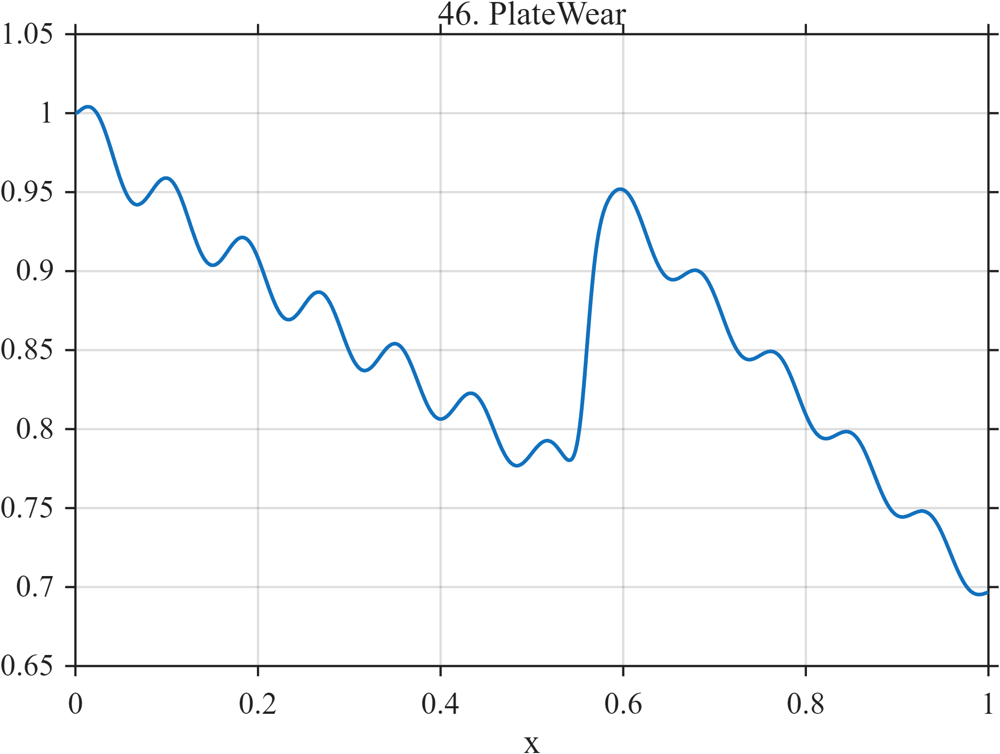

# TF046 — PlateWear

## Overview

The **PlateWear** signal represents a print-quality measurement accumulated over a production run. Progressive deterioration is interrupted by a maintenance event that partially restores performance, after which wear resumes at a different rate.

## Mathematical Definition

Define

$$
w_1(x)=1-0.38x^{0.82},
$$

$$
M(x)=\frac{0.20}{1+e^{-160(x-0.56)}},
$$

$$
w_2(x)=-0.28(x-0.56)_+,
$$

and

$$
m(x)=0.018\sin(24\pi x)(1-0.4x).
$$

Then

$$
f(x)=w_1(x)+M(x)+w_2(x)+m(x).
$$

## Morphological Characteristics

| Property | Description |
|---|---|
| Primary family | Long smooth trend with discrete intervention |
| Pre-maintenance behavior | Gradual nonlinear deterioration |
| Maintenance location | $x=0.56$ |
| Fine structure | Weak decreasing-amplitude oscillation |
| Main challenge | Preserving a reset embedded in long-term wear |

## Parameters

| Parameter | Meaning | Default |
|---|---|---:|
| $N$ | Number of samples | 1024 |
| $0.56$ | Maintenance location | 0.56 |
| $160$ | Reset sharpness | 160 |
| $12$ | Microwear frequency | 12 |

## MATLAB Implementation

~~~matlab
N = 1024; x = linspace(0,1,N);
wear1 = 1-0.38*x.^0.82;
maintenance = 0.20./(1+exp(-160*(x-0.56)));
wear2 = -0.28*max(x-0.56,0);
micro = 0.018*sin(2*pi*12*x).*(1-0.4*x);
f = wear1+maintenance+wear2+micro;
plot(x,f,'LineWidth',1.4); grid on
xlabel('x'); ylabel('f(x)'); title('TF046 — PlateWear')
exportgraphics(gcf,'TF046_PlateWear.png','Resolution',300);
~~~

## Python Implementation

~~~python
import numpy as np
import matplotlib.pyplot as plt
N = 1024; x = np.linspace(0,1,N)
wear1 = 1-0.38*x**0.82
maintenance = 0.20/(1+np.exp(-160*(x-0.56)))
wear2 = -0.28*np.maximum(x-0.56,0)
micro = 0.018*np.sin(2*np.pi*12*x)*(1-0.4*x)
f = wear1+maintenance+wear2+micro
plt.plot(x,f,linewidth=1.4); plt.grid(alpha=0.3)
plt.xlabel("x"); plt.ylabel("f(x)"); plt.title("TF046 — PlateWear")
plt.tight_layout(); plt.savefig("TF046_PlateWear.png",dpi=300)
~~~

## Recommended Uses

- Maintenance-reset detection
- Long-term degradation monitoring
- Trend and intervention separation
- Weak production-structure preservation

## Provenance

**Status:** Printing-plate-wear-inspired deterministic measurement surrogate.

---

[← Previous: StampReflectance](TF045_StampReflectance.md) | [Category 4 Catalog](index.md) | [Next: TreeRing →](TF047_TreeRing.md)
