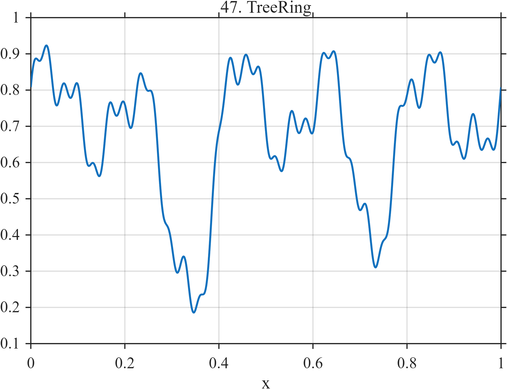

# TF047 — TreeRing

## Overview

The **TreeRing** signal represents annual ring-width variation. Multiscale oscillations mimic changing growth conditions, two narrow depressions represent drought episodes, and a local increase represents post-drought recovery.

## Mathematical Definition

Define the background growth pattern

$$
g(x)=0.75+0.12\sin(10\pi x+0.3)
+0.07\sin(26\pi x)+0.035\sin(62\pi x+0.7).
$$

The drought and recovery components are

$$
D_1(x)=0.42\exp\!\left[-\frac12\left(\frac{x-0.34}{0.055}\right)^2\right],
$$

$$
D_2(x)=0.30\exp\!\left[-\frac12\left(\frac{x-0.72}{0.035}\right)^2\right],
$$

$$
R(x)=0.14\exp\!\left[-\frac12\left(\frac{x-0.43}{0.025}\right)^2\right].
$$

Thus

$$
f(x)=g(x)-D_1(x)-D_2(x)+R(x).
$$

## Morphological Characteristics

| Property | Description |
|---|---|
| Primary family | Multiscale environmental variation with depressions |
| Drought centers | $x=0.34$ and $x=0.72$ |
| Recovery center | $x=0.43$ |
| Background scales | Frequencies 5, 13, and 31 |
| Main challenge | Preserving narrow environmental events within oscillatory growth |

## Parameters

| Parameter | Meaning | Default |
|---|---|---:|
| $N$ | Number of samples | 1024 |
| $0.055$ | First drought width | 0.055 |
| $0.035$ | Second drought width | 0.035 |
| $0.025$ | Recovery width | 0.025 |

## MATLAB Implementation

~~~matlab
N = 1024; x = linspace(0,1,N);
f = 0.75+0.12*sin(2*pi*5*x+0.3)+0.07*sin(2*pi*13*x) ...
    +0.035*sin(2*pi*31*x+0.7);
d1 = 0.42*exp(-0.5*((x-0.34)/0.055).^2);
d2 = 0.30*exp(-0.5*((x-0.72)/0.035).^2);
recovery = 0.14*exp(-0.5*((x-0.43)/0.025).^2);
f = f-d1-d2+recovery;
plot(x,f,'LineWidth',1.3); grid on
xlabel('x'); ylabel('f(x)'); title('TF047 — TreeRing')
exportgraphics(gcf,'TF047_TreeRing.png','Resolution',300);
~~~

## Python Implementation

~~~python
import numpy as np
import matplotlib.pyplot as plt
N = 1024; x = np.linspace(0,1,N)
f = (0.75+0.12*np.sin(2*np.pi*5*x+0.3)+0.07*np.sin(2*np.pi*13*x)
     +0.035*np.sin(2*np.pi*31*x+0.7))
d1 = 0.42*np.exp(-0.5*((x-0.34)/0.055)**2)
d2 = 0.30*np.exp(-0.5*((x-0.72)/0.035)**2)
recovery = 0.14*np.exp(-0.5*((x-0.43)/0.025)**2)
f = f-d1-d2+recovery
plt.plot(x,f,linewidth=1.3); plt.grid(alpha=0.3)
plt.xlabel("x"); plt.ylabel("f(x)"); plt.title("TF047 — TreeRing")
plt.tight_layout(); plt.savefig("TF047_TreeRing.png",dpi=300)
~~~

## Recommended Uses

- Drought-event preservation
- Environmental trend denoising
- Multiscale oscillation recovery
- Local depression and rebound analysis

## Provenance

**Status:** Dendrochronology-inspired deterministic measurement surrogate.

---

[← Previous: PlateWear](TF046_PlateWear.md) | [Category 4 Catalog](index.md) | [Next: IceCore →](TF048_IceCore.md)

