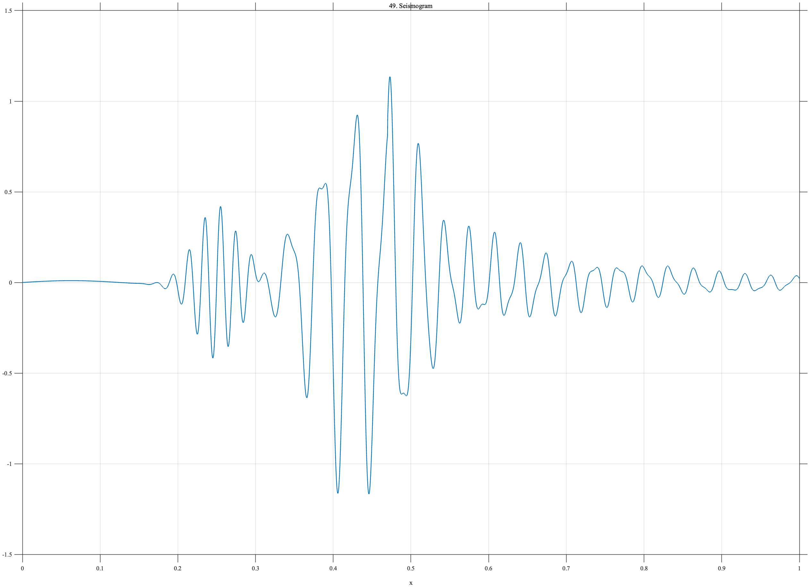

# TF049 — Seismogram

## Overview

The **Seismogram** signal begins with a quiet baseline. A smaller localized chirped packet represents the P-wave arrival, a later stronger packet represents the S wave, and a decaying multifrequency tail represents the seismic coda.

## Mathematical Definition

Let

$$
w_P(x)=\exp\!\left[-\frac12\left(\frac{x-0.25}{0.028}\right)^2\right],
$$

$$
P(x)=0.42w_P(x)\sin\{2\pi(38x+24x^2)\},
$$

$$
w_S(x)=\exp\!\left[-\frac12\left(\frac{x-0.43}{0.055}\right)^2\right],
$$

$$
S(x)=w_S(x)\left[\sin(48\pi x)+0.28\sin(102\pi x+0.5)\right].
$$

With $u=(x-0.47)_+$, the coda is

$$
C(x)=0.40\mathbf{1}_{\{x\geq0.47\}}e^{-4.8u}
\left[\sin(62\pi u)+0.35\sin(118\pi u+0.6)\right].
$$

Thus

$$
f(x)=0.01\sin(8\pi x)+P(x)+S(x)+C(x).
$$

## Morphological Characteristics

| Property | Description |
|---|---|
| Primary family | Multiple arrivals and decaying coda |
| P-wave center | $x=0.25$ |
| S-wave center | $x=0.43$ |
| Coda onset | $x=0.47$ |
| Main challenge | Preserving arrivals across several amplitude and frequency scales |

## Parameters

| Parameter | Meaning | Default |
|---|---|---:|
| $N$ | Number of samples | 1024 |
| $0.028$ | P-wave width | 0.028 |
| $0.055$ | S-wave width | 0.055 |
| $4.8$ | Coda decay rate | 4.8 |

## MATLAB Implementation

~~~matlab
N = 1024; x = linspace(0,1,N);
f = 0.01*sin(2*pi*4*x);
wP = exp(-0.5*((x-0.25)/0.028).^2);
P = 0.42*wP.*sin(2*pi*(38*x+24*x.^2));
wS = exp(-0.5*((x-0.43)/0.055).^2);
S = wS.*(sin(2*pi*24*x)+0.28*sin(2*pi*51*x+0.5));
u = max(x-0.47,0);
C = (x>=0.47).*0.40.*exp(-4.8*u).*(sin(2*pi*31*u)+0.35*sin(2*pi*59*u+0.6));
f = f+P+S+C;
plot(x,f,'LineWidth',1.1); grid on
xlabel('x'); ylabel('f(x)'); title('TF049 — Seismogram')
exportgraphics(gcf,'TF049_Seismogram.png','Resolution',300);
~~~

## Python Implementation

~~~python
import numpy as np
import matplotlib.pyplot as plt
N = 1024; x = np.linspace(0,1,N)
f = 0.01*np.sin(2*np.pi*4*x)
wP = np.exp(-0.5*((x-0.25)/0.028)**2)
P = 0.42*wP*np.sin(2*np.pi*(38*x+24*x**2))
wS = np.exp(-0.5*((x-0.43)/0.055)**2)
S = wS*(np.sin(2*np.pi*24*x)+0.28*np.sin(2*np.pi*51*x+0.5))
u = np.maximum(x-0.47,0)
C = (x>=0.47)*0.40*np.exp(-4.8*u)*(np.sin(2*np.pi*31*u)+0.35*np.sin(2*np.pi*59*u+0.6))
f = f+P+S+C
plt.plot(x,f,linewidth=1.1); plt.grid(alpha=0.3)
plt.xlabel("x"); plt.ylabel("f(x)"); plt.title("TF049 — Seismogram")
plt.tight_layout(); plt.savefig("TF049_Seismogram.png",dpi=300)
~~~

## Recommended Uses

- Seismic-arrival detection
- Coda preservation
- Localized chirp denoising
- Multiple-amplitude-scale evaluation

## Provenance

**Status:** Seismogram-inspired deterministic measurement surrogate.

---

[← Previous: IceCore](TF048_IceCore.md) | [Category 4 Catalog](index.md) | [Next: VolcanicTremor →](TF050_VolcanicTremor.md)

