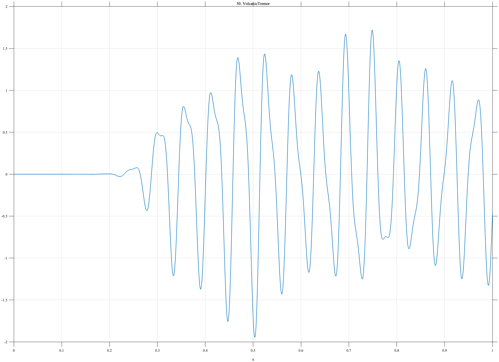

# TF050 — VolcanicTremor

## Overview

The **VolcanicTremor** signal has a smooth onset followed by persistent quasi-periodic oscillation. Two localized amplitude increases mimic bursts or changes in tremor intensity.

## Mathematical Definition

Define the onset envelope

$$
E(x)=\frac{1}{1+e^{-55(x-0.29)}},
$$

the carrier

$$
C(x)=\sin\{2\pi(17x+0.9x^2)\}+0.33\sin(70\pi x+0.4),
$$

and the burst modulation

$$
B(x)=1+0.55\exp\!\left[-\frac12\left(\frac{x-0.49}{0.045}\right)^2\right]
+0.42\exp\!\left[-\frac12\left(\frac{x-0.72}{0.035}\right)^2\right].
$$

The signal is

$$
f(x)=E(x)B(x)C(x).
$$

## Morphological Characteristics

| Property | Description |
|---|---|
| Primary family | Tremor onset with localized amplitude bursts |
| Onset center | $x=0.29$ |
| Burst centers | $x=0.49$ and $x=0.72$ |
| Oscillation | Chirped component plus frequency 35 component |
| Main challenge | Joint onset and nonstationary-amplitude preservation |

## Parameters

| Parameter | Meaning | Default |
|---|---|---:|
| $N$ | Number of samples | 1024 |
| $55$ | Onset sharpness | 55 |
| $0.045$ | First burst width | 0.045 |
| $0.035$ | Second burst width | 0.035 |

## MATLAB Implementation

~~~matlab
N = 1024; x = linspace(0,1,N);
env = 1./(1+exp(-55*(x-0.29)));
carrier = sin(2*pi*(17*x+0.9*x.^2))+0.33*sin(2*pi*35*x+0.4);
burst = 1+0.55*exp(-0.5*((x-0.49)/0.045).^2) ...
    +0.42*exp(-0.5*((x-0.72)/0.035).^2);
f = env.*burst.*carrier;
plot(x,f,'LineWidth',1.1); grid on
xlabel('x'); ylabel('f(x)'); title('TF050 — VolcanicTremor')
exportgraphics(gcf,'TF050_VolcanicTremor.png','Resolution',300);
~~~

## Python Implementation

~~~python
import numpy as np
import matplotlib.pyplot as plt
N = 1024; x = np.linspace(0,1,N)
env = 1/(1+np.exp(-55*(x-0.29)))
carrier = np.sin(2*np.pi*(17*x+0.9*x**2))+0.33*np.sin(2*np.pi*35*x+0.4)
burst = 1+0.55*np.exp(-0.5*((x-0.49)/0.045)**2)+0.42*np.exp(-0.5*((x-0.72)/0.035)**2)
f = env*burst*carrier
plt.plot(x,f,linewidth=1.1); plt.grid(alpha=0.3)
plt.xlabel("x"); plt.ylabel("f(x)"); plt.title("TF050 — VolcanicTremor")
plt.tight_layout(); plt.savefig("TF050_VolcanicTremor.png",dpi=300)
~~~

## Recommended Uses

- Tremor-onset localization
- Persistent oscillation denoising
- Amplitude-burst recovery
- Nonstationary vibration analysis

## Provenance

**Status:** Volcanic-tremor-inspired deterministic measurement surrogate.

---

[← Previous: Seismogram](TF049_Seismogram.md) | [Category 4 Catalog](index.md) | [Next: RogueWave →](TF051_RogueWave.md)
