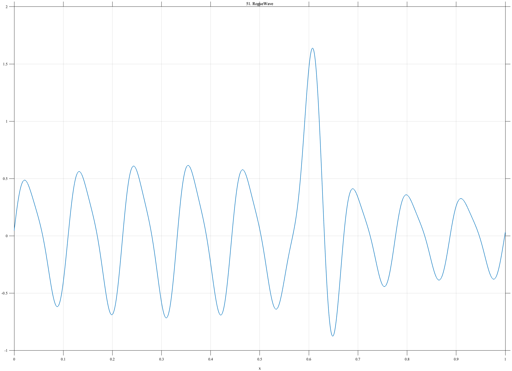

# TF051 — RogueWave

## Overview

The **RogueWave** signal combines a modulated narrow-band ocean-wave train with one localized extreme wave group. The structured background and rare high-amplitude event must both be preserved.

## Mathematical Definition

The background sea is

$$
S(x)=\left[0.48+0.15\sin(1.6\pi x)\right]
\left[\sin(18\pi x)+0.20\sin(36\pi x+0.5)\right].
$$

The localized extreme group is

$$
R(x)=1.55\exp\!\left[-\frac12\left(\frac{x-0.61}{0.030}\right)^2\right]
\sin\{18\pi(x-0.61)+\pi/2\}.
$$

The signal is

$$
f(x)=S(x)+R(x).
$$

## Morphological Characteristics

| Property | Description |
|---|---|
| Primary family | Modulated wave train with localized extreme event |
| Background frequency | 9 with weak second harmonic |
| Extreme-event center | $x=0.61$ |
| Extreme-event width | 0.030 |
| Main challenge | Preserving ordinary wave structure and a rare extreme group |

## Parameters

| Parameter | Meaning | Default |
|---|---|---:|
| $N$ | Number of samples | 1024 |
| $9$ | Carrier frequency | 9 |
| $1.55$ | Extreme-event amplitude | 1.55 |
| $0.030$ | Extreme-event width | 0.030 |

## MATLAB Implementation

~~~matlab
N = 1024; x = linspace(0,1,N);
sea = (0.48+0.15*sin(2*pi*0.8*x)).*(sin(2*pi*9*x)+0.20*sin(2*pi*18*x+0.5));
rogue = 1.55*exp(-0.5*((x-0.61)/0.030).^2).*sin(2*pi*9*(x-0.61)+pi/2);
f = sea+rogue;
plot(x,f,'LineWidth',1.3); grid on
xlabel('x'); ylabel('f(x)'); title('TF051 — RogueWave')
exportgraphics(gcf,'TF051_RogueWave.png','Resolution',300);
~~~

## Python Implementation

~~~python
import numpy as np
import matplotlib.pyplot as plt
N = 1024; x = np.linspace(0,1,N)
sea = (0.48+0.15*np.sin(2*np.pi*0.8*x))*(np.sin(2*np.pi*9*x)+0.20*np.sin(2*np.pi*18*x+0.5))
rogue = 1.55*np.exp(-0.5*((x-0.61)/0.030)**2)*np.sin(2*np.pi*9*(x-0.61)+np.pi/2)
f = sea+rogue
plt.plot(x,f,linewidth=1.3); plt.grid(alpha=0.3)
plt.xlabel("x"); plt.ylabel("f(x)"); plt.title("TF051 — RogueWave")
plt.tight_layout(); plt.savefig("TF051_RogueWave.png",dpi=300)
~~~

## Recommended Uses

- Extreme-wave preservation
- Structured-background denoising
- Localized amplitude-event detection
- Ocean-wave measurement analysis

## Provenance

**Status:** Rogue-wave-inspired deterministic oceanographic surrogate.

---

[← Previous: VolcanicTremor](TF050_VolcanicTremor.md) | [Category 4 Catalog](index.md) | [Next: StellarTransitFlare →](TF052_StellarTransitFlare.md)

