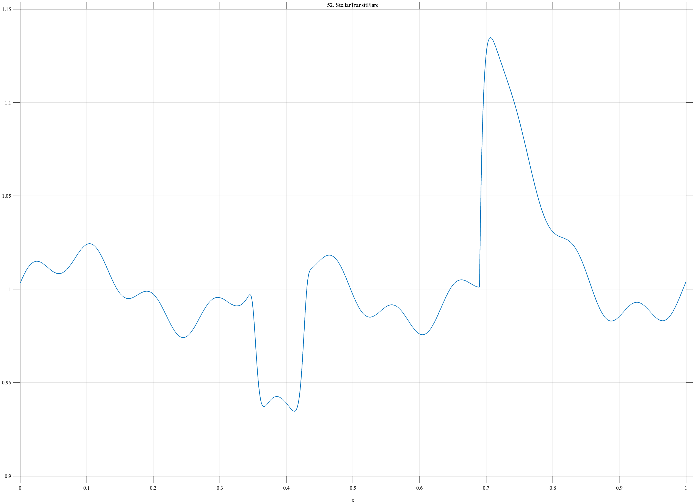

# TF052 — StellarTransitFlare

## Overview

The **StellarTransitFlare** signal contains weak periodic stellar variability, a localized transit-like decrease in brightness, and a rapidly rising but more slowly decaying flare. The transit and flare have opposite signs and different time scales.

## Mathematical Definition

Define the stellar background

$$
B(x)=1+0.018\sin(6\pi x)+0.008\sin(22\pi x+0.4),
$$

the transit

$$
T(x)=-0.080\exp\!\left[-\left(\frac{x-0.39}{0.037}\right)^8\right],
$$

and, with $u=(x-0.69)_+$, the flare

$$
F(x)=0.19\mathbf{1}_{\{x\geq0.69\}}
\left(1-e^{-150u}\right)e^{-18u}.
$$

The signal is

$$
f(x)=B(x)+T(x)+F(x).
$$

## Morphological Characteristics

| Property | Description |
|---|---|
| Primary family | Periodic baseline with opposite-sign events |
| Transit center | $x=0.39$ |
| Flare onset | $x=0.69$ |
| Flare shape | Rapid rise and slower decay |
| Main challenge | Preserving weak variability, transit, and flare simultaneously |

## Parameters

| Parameter | Meaning | Default |
|---|---|---:|
| $N$ | Number of samples | 1024 |
| $0.037$ | Transit width | 0.037 |
| $150$ | Flare rise rate | 150 |
| $18$ | Flare decay rate | 18 |

## MATLAB Implementation

~~~matlab
N = 1024; x = linspace(0,1,N);
base = 1+0.018*sin(2*pi*3*x)+0.008*sin(2*pi*11*x+0.4);
transit = -0.080*exp(-((x-0.39)/0.037).^8);
u = max(x-0.69,0);
flare = (x>=0.69).*0.19.*(1-exp(-150*u)).*exp(-18*u);
f = base+transit+flare;
plot(x,f,'LineWidth',1.4); grid on
xlabel('x'); ylabel('Relative brightness'); title('TF052 — StellarTransitFlare')
exportgraphics(gcf,'TF052_StellarTransitFlare.png','Resolution',300);
~~~

## Python Implementation

~~~python
import numpy as np
import matplotlib.pyplot as plt
N = 1024; x = np.linspace(0,1,N)
base = 1+0.018*np.sin(2*np.pi*3*x)+0.008*np.sin(2*np.pi*11*x+0.4)
transit = -0.080*np.exp(-((x-0.39)/0.037)**8)
u = np.maximum(x-0.69,0)
flare = (x>=0.69)*0.19*(1-np.exp(-150*u))*np.exp(-18*u)
f = base+transit+flare
plt.plot(x,f,linewidth=1.4); plt.grid(alpha=0.3)
plt.xlabel("x"); plt.ylabel("Relative brightness"); plt.title("TF052 — StellarTransitFlare")
plt.tight_layout(); plt.savefig("TF052_StellarTransitFlare.png",dpi=300)
~~~

## Recommended Uses

- Transit-depth preservation
- Flare detection
- Astronomical time-series denoising
- Opposite-sign multiscale feature recovery

## Provenance

**Status:** Astronomical-photometry-inspired deterministic surrogate.

---

[← Previous: RogueWave](TF051_RogueWave.md) | [Category 4 Catalog](index.md) | [Next: CyclicVoltammetry →](TF053_CyclicVoltammetry.md)

