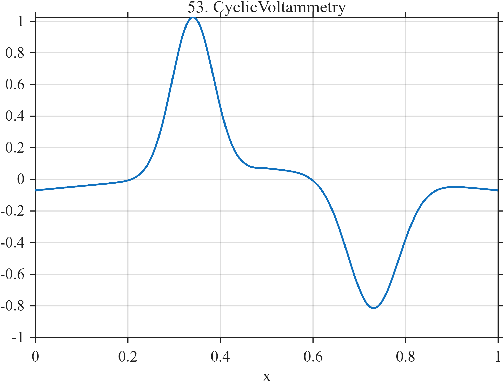

# TF053 — CyclicVoltammetry

## Overview

The **CyclicVoltammetry** signal parameterizes current along a forward and reverse potential sweep. Unequal oxidation and reduction peaks occur at different potentials, producing a smooth but highly nonmonotone hysteretic trace.

## Mathematical Definition

The potential sweep is

$$
E(x)=
\begin{cases}
-1+4x, & 0\leq x\leq0.5,\\
3-4x, & 0.5<x\leq1.
\end{cases}
$$

The current is

$$
f(x)=
\begin{cases}
0.07E(x)+\exp\!\left[-\dfrac12\left(\dfrac{E(x)-0.36}{0.18}\right)^2\right], & x\leq0.5,\\[6pt]
0.07E(x)-0.82\exp\!\left[-\dfrac12\left(\dfrac{E(x)-0.08}{0.22}\right)^2\right], & x>0.5.
\end{cases}
$$

## Morphological Characteristics

| Property | Description |
|---|---|
| Primary family | Forward–reverse hysteresis with unequal peaks |
| Forward peak | Oxidation peak near $E=0.36$ |
| Reverse peak | Reduction peak near $E=0.08$ |
| Sweep reversal | $x=0.5$ |
| Main challenge | Preserving two scientifically distinct smooth peaks |

## Parameters

| Parameter | Meaning | Default |
|---|---|---:|
| $N$ | Number of samples | 1024 |
| $0.18$ | Oxidation-peak width | 0.18 |
| $0.22$ | Reduction-peak width | 0.22 |
| $0.82$ | Reduction-peak magnitude | 0.82 |

## MATLAB Implementation

~~~matlab
N = 1024; x = linspace(0,1,N); E = zeros(size(x));
forward = x<=0.5; reverse = ~forward;
E(forward) = -1+4*x(forward); E(reverse) = 3-4*x(reverse);
f = 0.07*E;
f(forward) = f(forward)+exp(-0.5*((E(forward)-0.36)/0.18).^2);
f(reverse) = f(reverse)-0.82*exp(-0.5*((E(reverse)-0.08)/0.22).^2);
plot(x,f,'LineWidth',1.4); grid on
xlabel('x'); ylabel('Current'); title('TF053 — CyclicVoltammetry')
exportgraphics(gcf,'TF053_CyclicVoltammetry.png','Resolution',300);
~~~

## Python Implementation

~~~python
import numpy as np
import matplotlib.pyplot as plt
N = 1024; x = np.linspace(0,1,N); forward = x<=0.5
E = np.where(forward,-1+4*x,3-4*x)
f = 0.07*E
f[forward] += np.exp(-0.5*((E[forward]-0.36)/0.18)**2)
f[~forward] -= 0.82*np.exp(-0.5*((E[~forward]-0.08)/0.22)**2)
plt.plot(x,f,linewidth=1.4); plt.grid(alpha=0.3)
plt.xlabel("x"); plt.ylabel("Current"); plt.title("TF053 — CyclicVoltammetry")
plt.tight_layout(); plt.savefig("TF053_CyclicVoltammetry.png",dpi=300)
~~~

## Recommended Uses

- Electrochemical-signal denoising
- Hysteresis preservation
- Unequal-peak recovery
- Forward–reverse scan comparison

## Provenance

**Status:** Cyclic-voltammetry-inspired deterministic analytical surrogate.

---

[← Previous: StellarTransitFlare](TF052_StellarTransitFlare.md) | [Category 4 Catalog](index.md) | [Next: FractureAE →](TF054_FractureAE.md)

