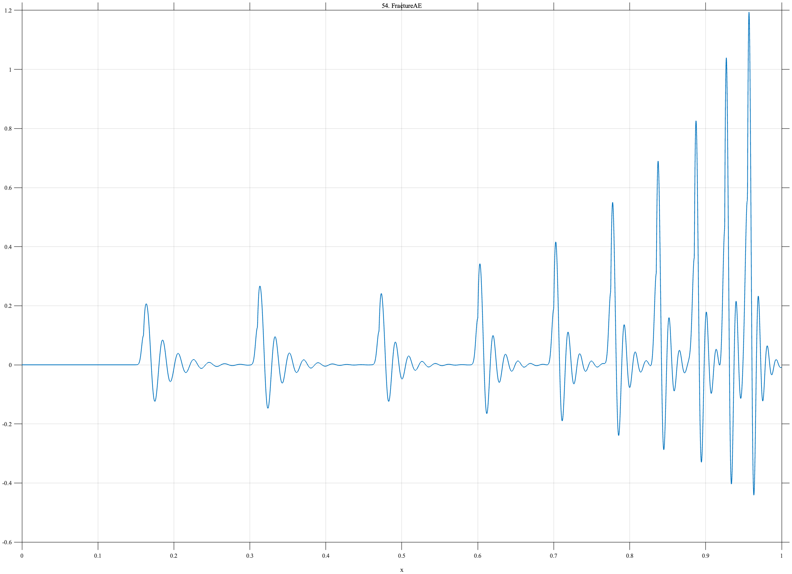

# TF054 — FractureAE

## Overview

The **FractureAE** signal represents acoustic-emission activity during progressive material damage. Short pulses and damped resonances become more frequent and generally larger toward the failure end of the record.

## Mathematical Definition

The event times and amplitudes are

$$
t=(0.16,0.31,0.47,0.60,0.70,0.775,0.835,0.885,0.925,0.955),
$$

$$
A=(0.22,0.28,0.25,0.35,0.42,0.55,0.68,0.82,1.00,1.18).
$$

With $u_k=x-t_k$, define

$$
P_k(x)=0.45A_k\exp\!\left[-\frac12\left(\frac{u_k}{0.0025}\right)^2\right]
$$

and

$$
R_k(x)=A_k\mathbf{1}_{\{u_k\geq0\}}
e^{-(30+8k)u_k}\sin\{2\pi(45+4k)u_k\}.
$$

The signal is

$$
f(x)=\sum_{k=1}^{10}\left[P_k(x)+R_k(x)\right].
$$

## Morphological Characteristics

| Property | Description |
|---|---|
| Primary family | Accelerating sparse-to-dense burst activity |
| Number of events | 10 |
| Event trend | Generally increasing amplitude and frequency |
| Local structure | Narrow pulse followed by damped resonance |
| Main challenge | Adapting from sparse events to dense pre-failure activity |

## Parameters

| Parameter | Meaning | Default |
|---|---|---:|
| $N$ | Number of samples | 1024 |
| $0.0025$ | Pulse width | 0.0025 |
| $30+8k$ | Event-dependent decay rate | As shown |
| $45+4k$ | Event-dependent frequency | As shown |

## MATLAB Implementation

~~~matlab
N = 1024; x = linspace(0,1,N); f = zeros(size(x));
t = [0.16 0.31 0.47 0.60 0.70 0.775 0.835 0.885 0.925 0.955];
A = [0.22 0.28 0.25 0.35 0.42 0.55 0.68 0.82 1.00 1.18];
for k = 1:numel(t)
    u = x-t(k); ind = u>=0; ring = zeros(size(x));
    ring(ind) = A(k)*exp(-(30+8*k)*u(ind)).*sin(2*pi*(45+4*k)*u(ind));
    pulse = 0.45*A(k)*exp(-0.5*(u/0.0025).^2);
    f = f+pulse+ring;
end
plot(x,f,'LineWidth',1.0); grid on
xlabel('x'); ylabel('f(x)'); title('TF054 — FractureAE')
exportgraphics(gcf,'TF054_FractureAE.png','Resolution',300);
~~~

## Python Implementation

~~~python
import numpy as np
import matplotlib.pyplot as plt
N = 1024; x = np.linspace(0,1,N); f = np.zeros_like(x)
t = [0.16,0.31,0.47,0.60,0.70,0.775,0.835,0.885,0.925,0.955]
A = [0.22,0.28,0.25,0.35,0.42,0.55,0.68,0.82,1.00,1.18]
for k,(tk,ak) in enumerate(zip(t,A),start=1):
    u = x-tk; ind = u>=0; ring = np.zeros_like(x)
    ring[ind] = ak*np.exp(-(30+8*k)*u[ind])*np.sin(2*np.pi*(45+4*k)*u[ind])
    pulse = 0.45*ak*np.exp(-0.5*(u/0.0025)**2)
    f += pulse+ring
plt.plot(x,f,linewidth=1.0); plt.grid(alpha=0.3)
plt.xlabel("x"); plt.ylabel("f(x)"); plt.title("TF054 — FractureAE")
plt.tight_layout(); plt.savefig("TF054_FractureAE.png",dpi=300)
~~~

## Recommended Uses

- Acoustic-emission denoising
- Pre-failure activity detection
- Sparse-to-dense adaptation
- Pulse-and-ring-down preservation

## Provenance

**Status:** Fracture-acoustic-emission-inspired deterministic measurement surrogate.

---

[← Previous: CyclicVoltammetry](TF053_CyclicVoltammetry.md) | [Category 4 Catalog](index.md) | [Next: Pharmacokinetic →](TF055_Pharmacokinetic.md)
