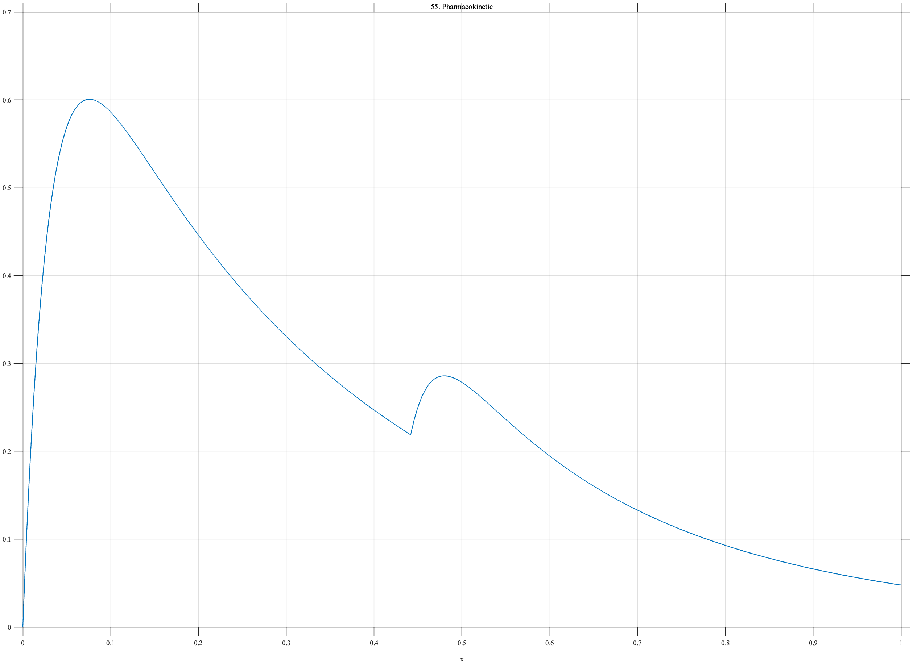

# TF055 — Pharmacokinetic

## Overview

The **Pharmacokinetic** signal represents absorption followed by biexponential elimination. A smaller delayed shoulder represents a secondary dose, redistribution effect, or meal-related perturbation.

## Mathematical Definition

Let $t=12x$ hours. Define

$$
A(t)=1-e^{-2.2t},
$$

$$
E(t)=0.78e^{-0.24t}+0.22e^{-1.3t},
$$

and, with $u=(t-5.3)_+$,

$$
S(t)=0.16\mathbf{1}_{\{t\geq5.3\}}
\left(1-e^{-2.8u}\right)e^{-0.55u}.
$$

The signal is

$$
f(x)=A(12x)E(12x)+S(12x).
$$

## Morphological Characteristics

| Property | Description |
|---|---|
| Primary family | Asymmetric absorption and multirate elimination |
| Time interval | 0–12 hours |
| Main decay | Fast and slow exponential components |
| Secondary feature | Delayed shoulder after 5.3 hours |
| Main challenge | Preserving a weak shoulder within a long asymmetric decay |

## Parameters

| Parameter | Meaning | Default |
|---|---|---:|
| $N$ | Number of samples | 1024 |
| $2.2$ | Main absorption rate | 2.2 |
| $0.24,1.3$ | Elimination rates | As shown |
| $5.3$ h | Shoulder onset | 5.3 |

## MATLAB Implementation

~~~matlab
N = 1024; x = linspace(0,1,N); t = 12*x;
absorb = 1-exp(-2.2*t);
elim = 0.78*exp(-0.24*t)+0.22*exp(-1.3*t);
f = absorb.*elim;
u = max(t-5.3,0);
f = f+(t>=5.3).*0.16.*(1-exp(-2.8*u)).*exp(-0.55*u);
plot(x,f,'LineWidth',1.4); grid on
xlabel('x'); ylabel('Concentration'); title('TF055 — Pharmacokinetic')
exportgraphics(gcf,'TF055_Pharmacokinetic.png','Resolution',300);
~~~

## Python Implementation

~~~python
import numpy as np
import matplotlib.pyplot as plt
N = 1024; x = np.linspace(0,1,N); t = 12*x
absorb = 1-np.exp(-2.2*t)
elim = 0.78*np.exp(-0.24*t)+0.22*np.exp(-1.3*t)
f = absorb*elim
u = np.maximum(t-5.3,0)
f += (t>=5.3)*0.16*(1-np.exp(-2.8*u))*np.exp(-0.55*u)
plt.plot(x,f,linewidth=1.4); plt.grid(alpha=0.3)
plt.xlabel("x"); plt.ylabel("Concentration"); plt.title("TF055 — Pharmacokinetic")
plt.tight_layout(); plt.savefig("TF055_Pharmacokinetic.png",dpi=300)
~~~

## Recommended Uses

- Pharmacokinetic-curve denoising
- Delayed-shoulder preservation
- Multirate decay recovery
- Smooth asymmetric peak evaluation

## Provenance

**Status:** Pharmacokinetic-inspired deterministic biological surrogate.

---

[← Previous: FractureAE](TF054_FractureAE.md) | [Category 4 Catalog](index.md) | [Next: EpidemicSeasonal →](TF056_EpidemicSeasonal.md)

