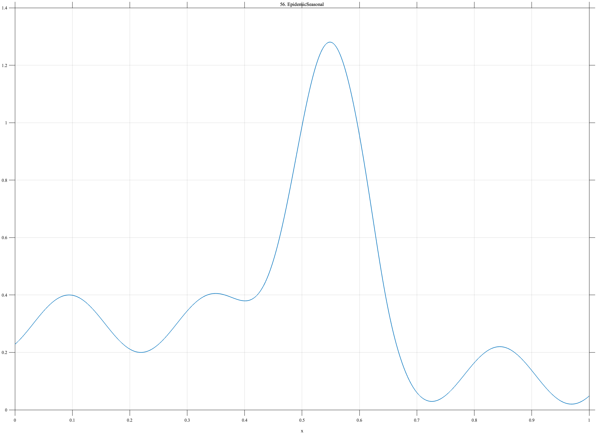

# TF056 — EpidemicSeasonal

## Overview

The **EpidemicSeasonal** signal combines a repeating endemic background with a large localized outbreak. A later sustained level decrease represents an intervention or other reduction in transmission.

## Mathematical Definition

Define

$$
S(x)=0.30+0.10\sin(8\pi x-0.8),
$$

$$
O(x)=0.95\exp\!\left[-\frac12\left(\frac{x-0.54}{0.060}\right)^2\right],
$$

and

$$
I(x)=-\frac{0.18}{1+e^{-70(x-0.63)}}.
$$

The complete signal is

$$
f(x)=S(x)+O(x)+I(x).
$$

## Morphological Characteristics

| Property | Description |
|---|---|
| Primary family | Seasonality with outbreak and regime shift |
| Seasonal frequency | 4 |
| Outbreak center | $x=0.54$ |
| Intervention center | $x=0.63$ |
| Main challenge | Separating expected seasonality from outbreak and intervention |

## Parameters

| Parameter | Meaning | Default |
|---|---|---:|
| $N$ | Number of samples | 1024 |
| $0.060$ | Outbreak width | 0.060 |
| $0.95$ | Outbreak magnitude | 0.95 |
| $70$ | Intervention sharpness | 70 |

## MATLAB Implementation

~~~matlab
N = 1024; x = linspace(0,1,N);
season = 0.30+0.10*sin(2*pi*4*x-0.8);
outbreak = 0.95*exp(-0.5*((x-0.54)/0.060).^2);
intervention = -0.18./(1+exp(-70*(x-0.63)));
f = season+outbreak+intervention;
plot(x,f,'LineWidth',1.4); grid on
xlabel('x'); ylabel('f(x)'); title('TF056 — EpidemicSeasonal')
exportgraphics(gcf,'TF056_EpidemicSeasonal.png','Resolution',300);
~~~

## Python Implementation

~~~python
import numpy as np
import matplotlib.pyplot as plt
N = 1024; x = np.linspace(0,1,N)
season = 0.30+0.10*np.sin(2*np.pi*4*x-0.8)
outbreak = 0.95*np.exp(-0.5*((x-0.54)/0.060)**2)
intervention = -0.18/(1+np.exp(-70*(x-0.63)))
f = season+outbreak+intervention
plt.plot(x,f,linewidth=1.4); plt.grid(alpha=0.3)
plt.xlabel("x"); plt.ylabel("f(x)"); plt.title("TF056 — EpidemicSeasonal")
plt.tight_layout(); plt.savefig("TF056_EpidemicSeasonal.png",dpi=300)
~~~

## Recommended Uses

- Seasonal epidemiological denoising
- Outbreak preservation
- Intervention-change detection
- Background-versus-event separation

## Provenance

**Status:** Seasonal-epidemic-inspired deterministic public-health surrogate.

---

[← Previous: Pharmacokinetic](TF055_Pharmacokinetic.md) | [Category 4 Catalog](index.md) | [Next: PollutionEpisode →](TF057_PollutionEpisode.md)

