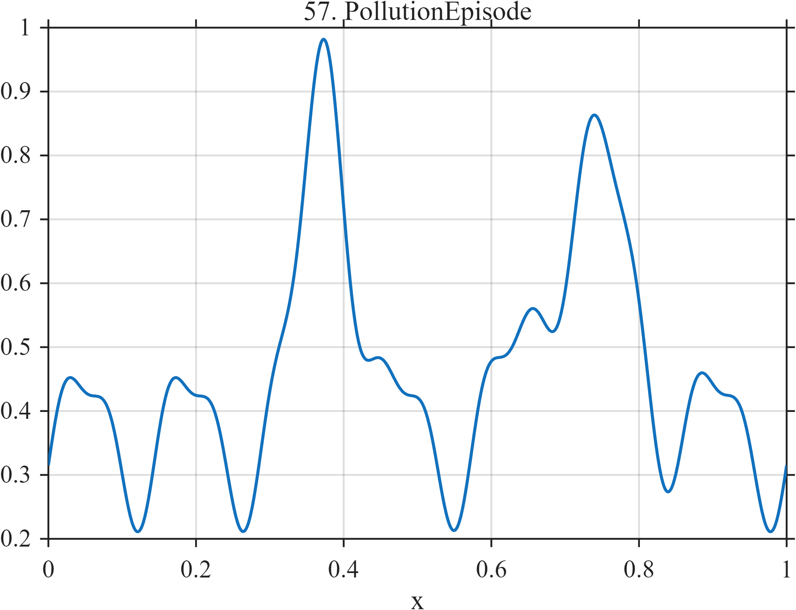

# TF057 — PollutionEpisode

## Overview

The **PollutionEpisode** signal contains a repeating diurnal cycle and two short high-concentration episodes with different durations and magnitudes. It represents regular daily activity occasionally dominated by meteorological or emission events.

## Mathematical Definition

Define the diurnal background

$$
D(x)=0.36+0.11\sin(14\pi x-0.5)+0.04\sin(28\pi x+0.2),
$$

and the two episodes

$$
E_1(x)=0.62\exp\!\left[-\frac12\left(\frac{x-0.38}{0.030}\right)^2\right],
$$

$$
E_2(x)=0.42\exp\!\left[-\frac12\left(\frac{x-0.73}{0.055}\right)^2\right].
$$

The signal is

$$
f(x)=D(x)+E_1(x)+E_2(x).
$$

## Morphological Characteristics

| Property | Description |
|---|---|
| Primary family | Periodic background with unequal transient episodes |
| Diurnal frequency | 7 plus a second harmonic |
| Episode centers | $x=0.38$ and $x=0.73$ |
| Episode widths | 0.030 and 0.055 |
| Main challenge | Preserving short episodes without distorting periodic background |

## Parameters

| Parameter | Meaning | Default |
|---|---|---:|
| $N$ | Number of samples | 1024 |
| $0.62$ | First episode magnitude | 0.62 |
| $0.42$ | Second episode magnitude | 0.42 |
| $7$ | Diurnal frequency | 7 |

## MATLAB Implementation

~~~matlab
N = 1024; x = linspace(0,1,N);
diurnal = 0.36+0.11*sin(2*pi*7*x-0.5)+0.04*sin(4*pi*7*x+0.2);
episode1 = 0.62*exp(-0.5*((x-0.38)/0.030).^2);
episode2 = 0.42*exp(-0.5*((x-0.73)/0.055).^2);
f = diurnal+episode1+episode2;
plot(x,f,'LineWidth',1.4); grid on
xlabel('x'); ylabel('Concentration'); title('TF057 — PollutionEpisode')
exportgraphics(gcf,'TF057_PollutionEpisode.png','Resolution',300);
~~~

## Python Implementation

~~~python
import numpy as np
import matplotlib.pyplot as plt
N = 1024; x = np.linspace(0,1,N)
diurnal = 0.36+0.11*np.sin(2*np.pi*7*x-0.5)+0.04*np.sin(4*np.pi*7*x+0.2)
episode1 = 0.62*np.exp(-0.5*((x-0.38)/0.030)**2)
episode2 = 0.42*np.exp(-0.5*((x-0.73)/0.055)**2)
f = diurnal+episode1+episode2
plt.plot(x,f,linewidth=1.4); plt.grid(alpha=0.3)
plt.xlabel("x"); plt.ylabel("Concentration"); plt.title("TF057 — PollutionEpisode")
plt.tight_layout(); plt.savefig("TF057_PollutionEpisode.png",dpi=300)
~~~

## Recommended Uses

- Environmental-monitoring denoising
- High-concentration episode detection
- Diurnal-pattern preservation
- Unequal transient-event recovery

## Provenance

**Status:** Pollution-monitoring-inspired deterministic environmental surrogate.

---

[← Previous: EpidemicSeasonal](TF056_EpidemicSeasonal.md) | [Category 4 Catalog](index.md) | [Next: Chromatogram →](TF058_Chromatogram.md)

