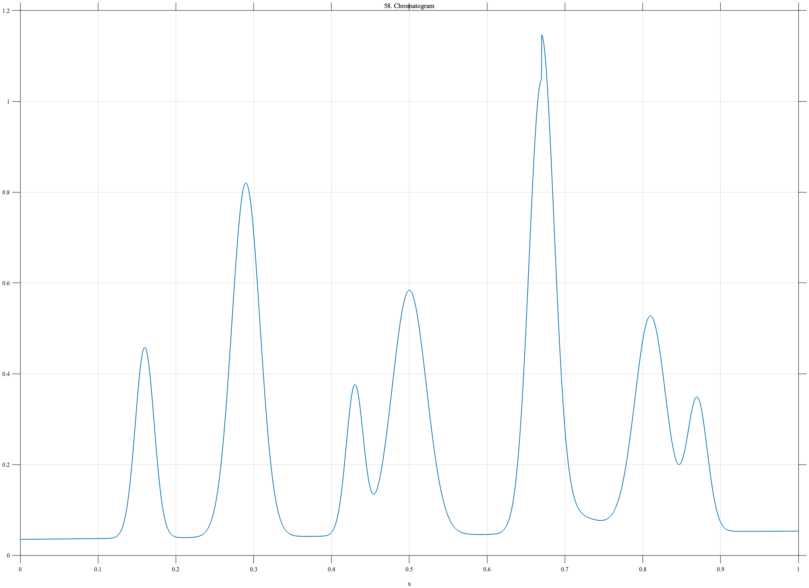

# TF058 — Chromatogram

## Overview

The **Chromatogram** signal has a weakly drifting baseline and seven unequal approximately Gaussian peaks. Some peaks are separated, others overlap, and a small post-peak tail follows the dominant component.

## Mathematical Definition

Let

$$
G(x;c,w)=\exp\!\left[-\frac12\left(\frac{x-c}{w}\right)^2\right].
$$

The centers, amplitudes, and widths are

$$
c=(0.16,0.29,0.43,0.50,0.67,0.81,0.87),
$$

$$
A=(0.42,0.78,0.33,0.54,1.00,0.47,0.29),
$$

$$
w=(0.012,0.018,0.011,0.022,0.016,0.020,0.013).
$$

The signal is

$$
f(x)=0.035+0.018x+
\sum_{k=1}^{7}A_kG(x;c_k,w_k)
+0.10\mathbf{1}_{\{x>0.67\}}e^{-18(x-0.67)}.
$$

## Morphological Characteristics

| Property | Description |
|---|---|
| Primary family | Drifting baseline with unequal overlapping peaks |
| Number of peaks | 7 |
| Dominant peak | Centered at $x=0.67$ |
| Additional feature | Exponential post-peak tail |
| Main challenge | Preserving weak and overlapping peaks adjacent to strong peaks |

## Parameters

| Parameter | Meaning | Default |
|---|---|---|
| $N$ | Number of samples | 1024 |
| $c$ | Peak centers | $(0.16,0.29,0.43,0.50,0.67,0.81,0.87)$ |
| $A$ | Peak amplitudes | $(0.42,0.78,0.33,0.54,1.00,0.47,0.29)$ |
| $w$ | Peak widths | $(0.012,0.018,0.011,0.022,0.016,0.020,0.013)$ |

## MATLAB Implementation

~~~matlab
N = 1024; x = linspace(0,1,N); f = 0.035+0.018*x;
c = [0.16 0.29 0.43 0.50 0.67 0.81 0.87];
A = [0.42 0.78 0.33 0.54 1.00 0.47 0.29];
w = [0.012 0.018 0.011 0.022 0.016 0.020 0.013];
for k = 1:numel(c)
    f = f+A(k)*exp(-0.5*((x-c(k))/w(k)).^2);
end
f = f+0.10*(x>0.67).*exp(-18*(x-0.67));
plot(x,f,'LineWidth',1.4); grid on
xlabel('x'); ylabel('Intensity'); title('TF058 — Chromatogram')
exportgraphics(gcf,'TF058_Chromatogram.png','Resolution',300);
~~~

## Python Implementation

~~~python
import numpy as np
import matplotlib.pyplot as plt
N = 1024; x = np.linspace(0,1,N); f = 0.035+0.018*x
c = [0.16,0.29,0.43,0.50,0.67,0.81,0.87]
A = [0.42,0.78,0.33,0.54,1.00,0.47,0.29]
w = [0.012,0.018,0.011,0.022,0.016,0.020,0.013]
for ck,ak,wk in zip(c,A,w):
    f += ak*np.exp(-0.5*((x-ck)/wk)**2)
f += 0.10*(x>0.67)*np.exp(-18*(x-0.67))
plt.plot(x,f,linewidth=1.4); plt.grid(alpha=0.3)
plt.xlabel("x"); plt.ylabel("Intensity"); plt.title("TF058 — Chromatogram")
plt.tight_layout(); plt.savefig("TF058_Chromatogram.png",dpi=300)
~~~

## Recommended Uses

- Chromatographic peak preservation
- Overlapping-peak recovery
- Baseline-drift denoising
- Weak-component detection near dominant peaks

## Provenance

**Status:** Chromatography-inspired deterministic analytical surrogate.

---

[← Previous: PollutionEpisode](TF057_PollutionEpisode.md) | [Category 4 Catalog](index.md)

