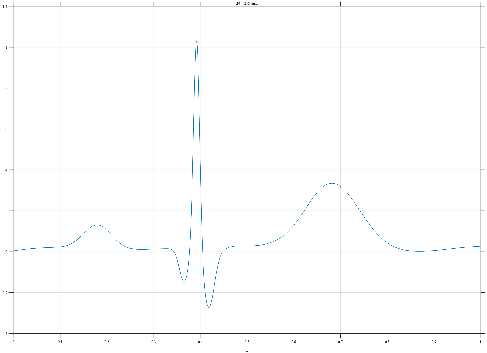

# TF059 — ECGBeat

## Overview

The **ECGBeat** signal represents one electrocardiographic beat. A small broad P wave is followed by a sharp QRS complex and a broader T wave, with weak baseline wander and a small ST-level feature.

## Mathematical Definition

Let

$$
G(x;\mu,s)=\exp\!\left[-\frac12\left(\frac{x-\mu}{s}\right)^2\right].
$$

The baseline is

$$
B(x)=0.018\sin(2.5\pi x)+0.010\sin(6.2\pi x+0.4).
$$

The waveform components are

$$
P(x)=0.12G(x;0.18,0.030),
$$

$$
Q(x)=-0.16G(x;0.365,0.010),
$$

$$
R(x)=1.05G(x;0.392,0.0065),
$$

$$
S(x)=-0.28G(x;0.418,0.012),
$$

$$
T(x)=0.34G(x;0.68,0.060),
$$

and

$$
L(x)=0.045\left[
\frac{1}{1+e^{-90(x-0.455)}}-
\frac{1}{1+e^{-55(x-0.58)}}
\right].
$$

The signal is

$$
f(x)=B(x)+P(x)+Q(x)+R(x)+S(x)+L(x)+T(x).
$$

## Morphological Characteristics

| Property | Description |
|---|---|
| Primary family | Multiscale physiological waveform |
| Broad components | P and T waves |
| Narrow components | QRS complex |
| Additional feature | Weak ST-level interval |
| Main challenge | Preserving small broad waves and a very sharp R peak |

## Parameters

| Parameter | Meaning | Default |
|---|---|---:|
| $N$ | Number of samples | 1024 |
| $0.0065$ | R-wave width | 0.0065 |
| $0.030$ | P-wave width | 0.030 |
| $0.060$ | T-wave width | 0.060 |

## MATLAB Implementation

~~~matlab
N = 1024; x = linspace(0,1,N);
B = 0.018*sin(2*pi*1.25*x)+0.010*sin(2*pi*3.1*x+0.4);
P = 0.12*exp(-0.5*((x-0.18)/0.030).^2);
Q = -0.16*exp(-0.5*((x-0.365)/0.010).^2);
R = 1.05*exp(-0.5*((x-0.392)/0.0065).^2);
S = -0.28*exp(-0.5*((x-0.418)/0.012).^2);
ST = 0.045*(1./(1+exp(-90*(x-0.455)))-1./(1+exp(-55*(x-0.58))));
T = 0.34*exp(-0.5*((x-0.68)/0.060).^2);
f = B+P+Q+R+S+ST+T;
plot(x,f,'LineWidth',1.4); grid on
xlabel('x'); ylabel('f(x)'); title('TF059 — ECGBeat')
exportgraphics(gcf,'TF059_ECGBeat.png','Resolution',300);
~~~

## Python Implementation

~~~python
import numpy as np
import matplotlib.pyplot as plt
N = 1024; x = np.linspace(0,1,N)
G = lambda mu,s: np.exp(-0.5*((x-mu)/s)**2)
B = 0.018*np.sin(2*np.pi*1.25*x)+0.010*np.sin(2*np.pi*3.1*x+0.4)
P = 0.12*G(0.18,0.030); Q = -0.16*G(0.365,0.010)
R = 1.05*G(0.392,0.0065); S = -0.28*G(0.418,0.012)
ST = 0.045*(1/(1+np.exp(-90*(x-0.455)))-1/(1+np.exp(-55*(x-0.58))))
T = 0.34*G(0.68,0.060)
f = B+P+Q+R+S+ST+T
plt.plot(x,f,linewidth=1.4); plt.grid(alpha=0.3)
plt.xlabel("x"); plt.ylabel("f(x)"); plt.title("TF059 — ECGBeat")
plt.tight_layout(); plt.savefig("TF059_ECGBeat.png",dpi=300)
~~~

## Recommended Uses

- ECG denoising
- QRS preservation
- Multiscale physiological feature recovery
- Low-amplitude P-, T-, and ST-feature detection

## Provenance

**Status:** Single-ECG-beat-inspired deterministic physiological surrogate.

---

[Category 5 Catalog](index.md) | [Next: ArterialPulse →](TF060_ArterialPulse.md)

