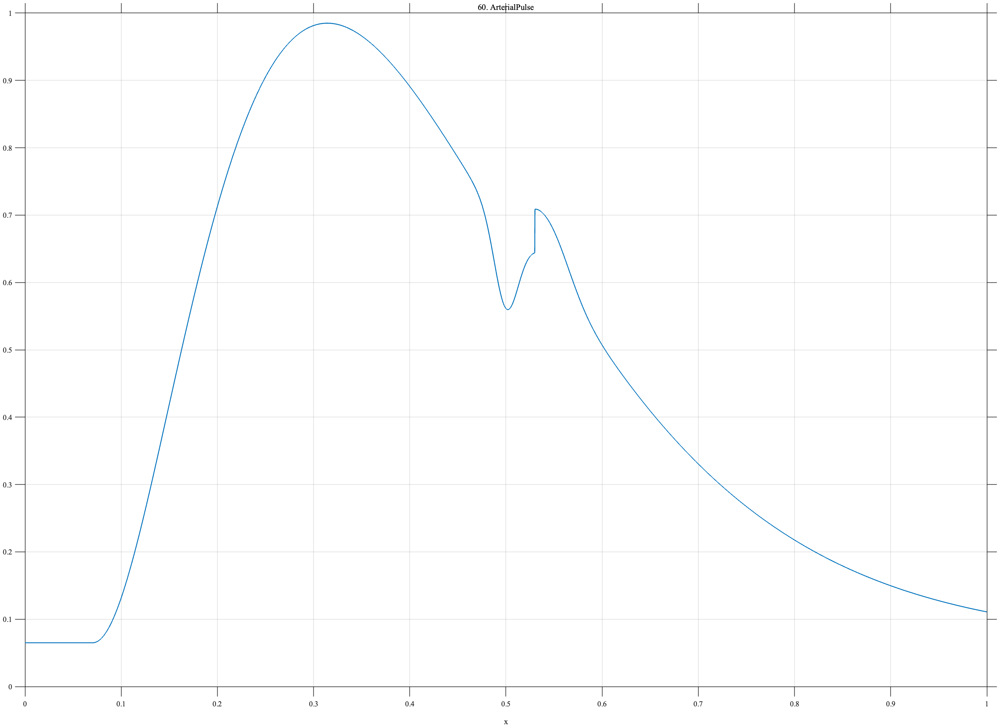

# TF060 — ArterialPulse

## Overview

The **ArterialPulse** signal contains a rapid systolic upstroke, rounded main peak, dicrotic notch, secondary rebound, and slow diastolic decay. The small notch carries structure that can easily disappear under aggressive smoothing.

## Mathematical Definition

Let $u=(x-0.07)_+$ and define

$$
h(x)=u^{2.15}e^{-8.8u},
\qquad
M(x)=\frac{h(x)}{\max_{0\leq t\leq1}h(t)}.
$$

The notch, rebound, and tail are

$$
N(x)=-0.115\exp\!\left[-\frac12\left(\frac{x-0.50}{0.012}\right)^2\right],
$$

$$
R(x)=0.060\exp\!\left[-\frac12\left(\frac{x-0.545}{0.021}\right)^2\right],
$$

$$
D(x)=0.065\mathbf{1}_{\{x\geq0.53\}}e^{-4.8(x-0.53)}.
$$

Thus

$$
f(x)=0.065+0.92M(x)+N(x)+R(x)+D(x).
$$

## Morphological Characteristics

| Property | Description |
|---|---|
| Primary family | Smooth asymmetric pulse with localized notch |
| Pulse onset | $x=0.07$ |
| Dicrotic notch | Centered at $x=0.50$ |
| Rebound | Centered at $x=0.545$ |
| Main challenge | Preserving the notch and rebound without ringing |

## Parameters

| Parameter | Meaning | Default |
|---|---|---:|
| $N$ | Number of samples | 1024 |
| $2.15$ | Pulse power | 2.15 |
| $8.8$ | Main decay rate | 8.8 |
| $0.012$ | Notch width | 0.012 |

## MATLAB Implementation

~~~matlab
N = 1024; x = linspace(0,1,N); u = max(x-0.07,0);
main = u.^2.15.*exp(-8.8*u); main = main/max(main);
notch = -0.115*exp(-0.5*((x-0.50)/0.012).^2);
rebound = 0.060*exp(-0.5*((x-0.545)/0.021).^2);
tail = 0.065*(x>=0.53).*exp(-4.8*(x-0.53));
f = 0.065+0.92*main+notch+rebound+tail;
plot(x,f,'LineWidth',1.4); grid on
xlabel('x'); ylabel('f(x)'); title('TF060 — ArterialPulse')
exportgraphics(gcf,'TF060_ArterialPulse.png','Resolution',300);
~~~

## Python Implementation

~~~python
import numpy as np
import matplotlib.pyplot as plt
N = 1024; x = np.linspace(0,1,N); u = np.maximum(x-0.07,0)
main = u**2.15*np.exp(-8.8*u); main /= main.max()
notch = -0.115*np.exp(-0.5*((x-0.50)/0.012)**2)
rebound = 0.060*np.exp(-0.5*((x-0.545)/0.021)**2)
tail = 0.065*(x>=0.53)*np.exp(-4.8*(x-0.53))
f = 0.065+0.92*main+notch+rebound+tail
plt.plot(x,f,linewidth=1.4); plt.grid(alpha=0.3)
plt.xlabel("x"); plt.ylabel("f(x)"); plt.title("TF060 — ArterialPulse")
plt.tight_layout(); plt.savefig("TF060_ArterialPulse.png",dpi=300)
~~~

## Recommended Uses

- Arterial-pulse denoising
- Dicrotic-notch preservation
- Smooth asymmetric waveform recovery
- Local indentation and rebound detection

## Provenance

**Status:** Arterial-pulse-inspired deterministic physiological surrogate.

---

[← Previous: ECGBeat](TF059_ECGBeat.md) | [Category 5 Catalog](index.md) | [Next: EEGSpindle →](TF061_EEGSpindle.md)

