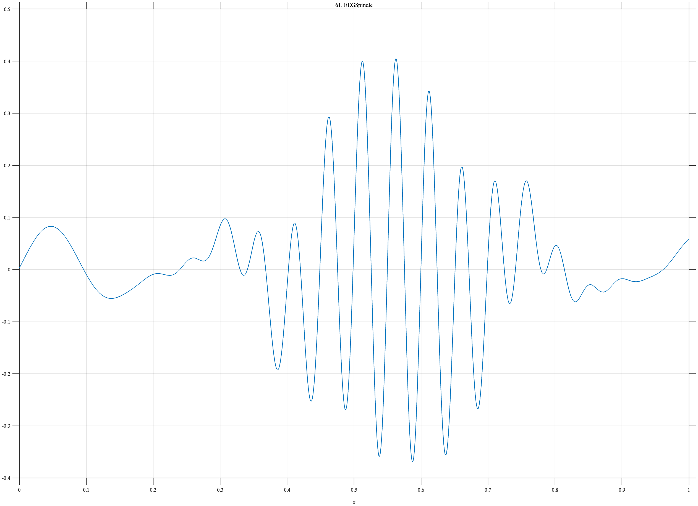

# TF061 — EEGSpindle

## Overview

The **EEGSpindle** signal represents a localized sleep-spindle-like oscillatory burst on a low-frequency EEG background. The spindle has a smooth envelope and mildly varying instantaneous frequency.

## Mathematical Definition

The background is

$$
B(x)=0.055\sin(8.4\pi x+0.3)+0.028\sin(14.2\pi x-0.5).
$$

Define

$$
E(x)=\exp\!\left[-\frac12\left(\frac{x-0.56}{0.115}\right)^2\right]
$$

and

$$
\phi(x)=2\pi\left[20x+2.2(x-0.56)^2\right].
$$

The signal is

$$
f(x)=B(x)+0.39E(x)\sin\phi(x).
$$

## Morphological Characteristics

| Property | Description |
|---|---|
| Primary family | Localized frequency-modulated oscillatory packet |
| Spindle center | $x=0.56$ |
| Envelope width | 0.115 |
| Background | Two weak low-frequency components |
| Main challenge | Preserving packet coherence without retaining noise |

## Parameters

| Parameter | Meaning | Default |
|---|---|---:|
| $N$ | Number of samples | 1024 |
| $0.39$ | Spindle amplitude | 0.39 |
| $20$ | Nominal spindle frequency | 20 |
| $2.2$ | Quadratic phase coefficient | 2.2 |

## MATLAB Implementation

~~~matlab
N = 1024; x = linspace(0,1,N);
B = 0.055*sin(2*pi*4.2*x+0.3)+0.028*sin(2*pi*7.1*x-0.5);
env = exp(-0.5*((x-0.56)/0.115).^2);
phase = 2*pi*(20*x+2.2*(x-0.56).^2);
f = B+0.39*env.*sin(phase);
plot(x,f,'LineWidth',1.2); grid on
xlabel('x'); ylabel('f(x)'); title('TF061 — EEGSpindle')
exportgraphics(gcf,'TF061_EEGSpindle.png','Resolution',300);
~~~

## Python Implementation

~~~python
import numpy as np
import matplotlib.pyplot as plt
N = 1024; x = np.linspace(0,1,N)
B = 0.055*np.sin(2*np.pi*4.2*x+0.3)+0.028*np.sin(2*np.pi*7.1*x-0.5)
env = np.exp(-0.5*((x-0.56)/0.115)**2)
phase = 2*np.pi*(20*x+2.2*(x-0.56)**2)
f = B+0.39*env*np.sin(phase)
plt.plot(x,f,linewidth=1.2); plt.grid(alpha=0.3)
plt.xlabel("x"); plt.ylabel("f(x)"); plt.title("TF061 — EEGSpindle")
plt.tight_layout(); plt.savefig("TF061_EEGSpindle.png",dpi=300)
~~~

## Recommended Uses

- Sleep-spindle detection
- Localized oscillation denoising
- Coherent-envelope preservation
- EEG background–burst separation

## Provenance

**Status:** Sleep-spindle-inspired deterministic EEG surrogate.

---

[← Previous: ArterialPulse](TF060_ArterialPulse.md) | [Category 5 Catalog](index.md) | [Next: MassSpectrum →](TF062_MassSpectrum.md)
