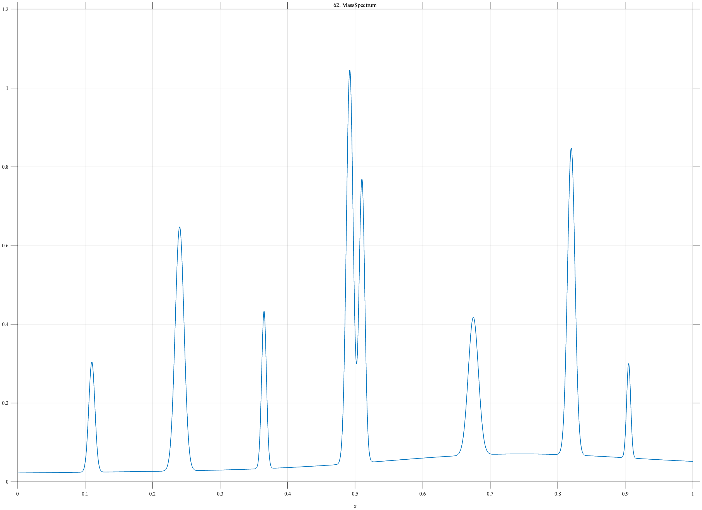

# TF062 — MassSpectrum

## Overview

The **MassSpectrum** signal contains sparse narrow peaks of unequal amplitude on a weak broad background. Two nearby peaks form a partially separated doublet, creating a stringent resolution problem.

## Mathematical Definition

Let

$$
G(x;c,w)=\exp\!\left[-\frac12\left(\frac{x-c}{w}\right)^2\right].
$$

The centers, amplitudes, and widths are

$$
c=(0.11,0.24,0.365,0.492,0.510,0.675,0.82,0.905),
$$

$$
A=(0.28,0.62,0.40,1.00,0.72,0.35,0.78,0.24),
$$

$$
w=(0.0045,0.0065,0.0035,0.0050,0.0042,0.0075,0.0055,0.0030).
$$

The signal is

$$
f(x)=0.022+0.018x+0.035G(x;0.73,0.18)
+\sum_{k=1}^{8}A_kG(x;c_k,w_k).
$$

## Morphological Characteristics

| Property | Description |
|---|---|
| Primary family | Sparse narrow peaks and close doublet |
| Number of narrow peaks | 8 |
| Close pair | Centers 0.492 and 0.510 |
| Background | Weak drift and broad component |
| Main challenge | Retaining weak lines without merging close peaks |

## Parameters

| Parameter | Meaning | Default |
|---|---|---|
| $N$ | Number of samples | 1024 |
| $c$ | Peak centers | As listed above |
| $A$ | Peak amplitudes | As listed above |
| $w$ | Peak widths | As listed above |

## MATLAB Implementation

~~~matlab
N = 1024; x = linspace(0,1,N);
f = 0.022+0.018*x+0.035*exp(-0.5*((x-0.73)/0.18).^2);
c = [0.11 0.24 0.365 0.492 0.510 0.675 0.82 0.905];
A = [0.28 0.62 0.40 1.00 0.72 0.35 0.78 0.24];
w = [0.0045 0.0065 0.0035 0.0050 0.0042 0.0075 0.0055 0.0030];
for k = 1:numel(c)
    f = f+A(k)*exp(-0.5*((x-c(k))/w(k)).^2);
end
plot(x,f,'LineWidth',1.3); grid on
xlabel('x'); ylabel('Intensity'); title('TF062 — MassSpectrum')
exportgraphics(gcf,'TF062_MassSpectrum.png','Resolution',300);
~~~

## Python Implementation

~~~python
import numpy as np
import matplotlib.pyplot as plt
N = 1024; x = np.linspace(0,1,N)
f = 0.022+0.018*x+0.035*np.exp(-0.5*((x-0.73)/0.18)**2)
c = [0.11,0.24,0.365,0.492,0.510,0.675,0.82,0.905]
A = [0.28,0.62,0.40,1.00,0.72,0.35,0.78,0.24]
w = [0.0045,0.0065,0.0035,0.0050,0.0042,0.0075,0.0055,0.0030]
for ck,ak,wk in zip(c,A,w):
    f += ak*np.exp(-0.5*((x-ck)/wk)**2)
plt.plot(x,f,linewidth=1.3); plt.grid(alpha=0.3)
plt.xlabel("x"); plt.ylabel("Intensity"); plt.title("TF062 — MassSpectrum")
plt.tight_layout(); plt.savefig("TF062_MassSpectrum.png",dpi=300)
~~~

## Recommended Uses

- Sparse spectral-peak denoising
- Doublet resolution
- Weak-line preservation
- Unequal-amplitude peak recovery

## Provenance

**Status:** Mass-spectrometry-inspired deterministic analytical surrogate.

---

[← Previous: EEGSpindle](TF061_EEGSpindle.md) | [Category 5 Catalog](index.md) | [Next: NMRMultiplet →](TF063_NMRMultiplet.md)

