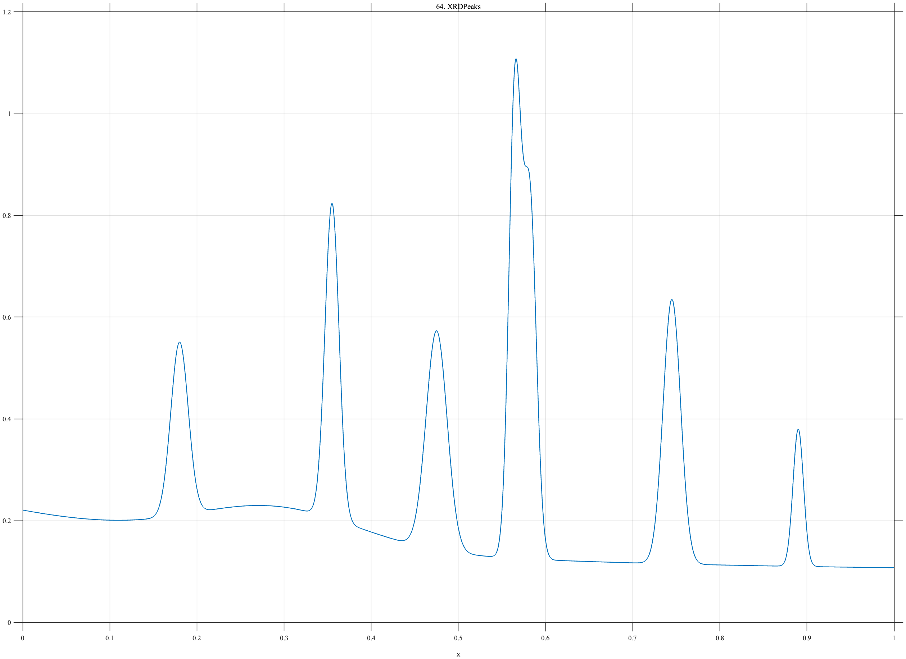

# TF064 — XRDPeaks

## Overview

The **XRDPeaks** signal mimics an X-ray diffraction profile with a decaying background, broad amorphous hump, and several sharp Bragg peaks. A deliberately close peak pair makes scale separation especially difficult.

## Mathematical Definition

Let

$$
G(x;c,w)=\exp\!\left[-\frac12\left(\frac{x-c}{w}\right)^2\right].
$$

The background is

$$
B(x)=0.10+0.12e^{-2.8x}+0.075G(x;0.29,0.095).
$$

The peak parameters are

$$
c=(0.18,0.355,0.475,0.565,0.582,0.745,0.89),
$$

$$
A=(0.34,0.62,0.43,0.92,0.70,0.52,0.27),
$$

$$
w=(0.010,0.008,0.012,0.007,0.0075,0.010,0.006).
$$

The signal is

$$
f(x)=B(x)+\sum_{k=1}^{7}A_kG(x;c_k,w_k).
$$

## Morphological Characteristics

| Property | Description |
|---|---|
| Primary family | Broad background with sharp diffraction peaks |
| Number of Bragg peaks | 7 |
| Close pair | Centers 0.565 and 0.582 |
| Broad feature | Amorphous hump near $x=0.29$ |
| Main challenge | Separating narrow peaks from broad background |

## Parameters

| Parameter | Meaning | Default |
|---|---|---|
| $N$ | Number of samples | 1024 |
| $c$ | Bragg-peak centers | As listed above |
| $A$ | Peak amplitudes | As listed above |
| $w$ | Peak widths | As listed above |

## MATLAB Implementation

~~~matlab
N = 1024; x = linspace(0,1,N);
f = 0.10+0.12*exp(-2.8*x)+0.075*exp(-0.5*((x-0.29)/0.095).^2);
c = [0.18 0.355 0.475 0.565 0.582 0.745 0.89];
A = [0.34 0.62 0.43 0.92 0.70 0.52 0.27];
w = [0.010 0.008 0.012 0.007 0.0075 0.010 0.006];
for k = 1:numel(c)
    f = f+A(k)*exp(-0.5*((x-c(k))/w(k)).^2);
end
plot(x,f,'LineWidth',1.3); grid on
xlabel('x'); ylabel('Intensity'); title('TF064 — XRDPeaks')
exportgraphics(gcf,'TF064_XRDPeaks.png','Resolution',300);
~~~

## Python Implementation

~~~python
import numpy as np
import matplotlib.pyplot as plt
N = 1024; x = np.linspace(0,1,N)
f = 0.10+0.12*np.exp(-2.8*x)+0.075*np.exp(-0.5*((x-0.29)/0.095)**2)
c = [0.18,0.355,0.475,0.565,0.582,0.745,0.89]
A = [0.34,0.62,0.43,0.92,0.70,0.52,0.27]
w = [0.010,0.008,0.012,0.007,0.0075,0.010,0.006]
for ck,ak,wk in zip(c,A,w):
    f += ak*np.exp(-0.5*((x-ck)/wk)**2)
plt.plot(x,f,linewidth=1.3); plt.grid(alpha=0.3)
plt.xlabel("x"); plt.ylabel("Intensity"); plt.title("TF064 — XRDPeaks")
plt.tight_layout(); plt.savefig("TF064_XRDPeaks.png",dpi=300)
~~~

## Recommended Uses

- XRD profile denoising
- Bragg-peak preservation
- Close-peak resolution
- Broad–narrow scale separation

## Provenance

**Status:** X-ray-diffraction-inspired deterministic analytical surrogate.

---

[← Previous: NMRMultiplet](TF063_NMRMultiplet.md) | [Category 5 Catalog](index.md) | [Next: AFMForceCurve →](TF065_AFMForceCurve.md)
