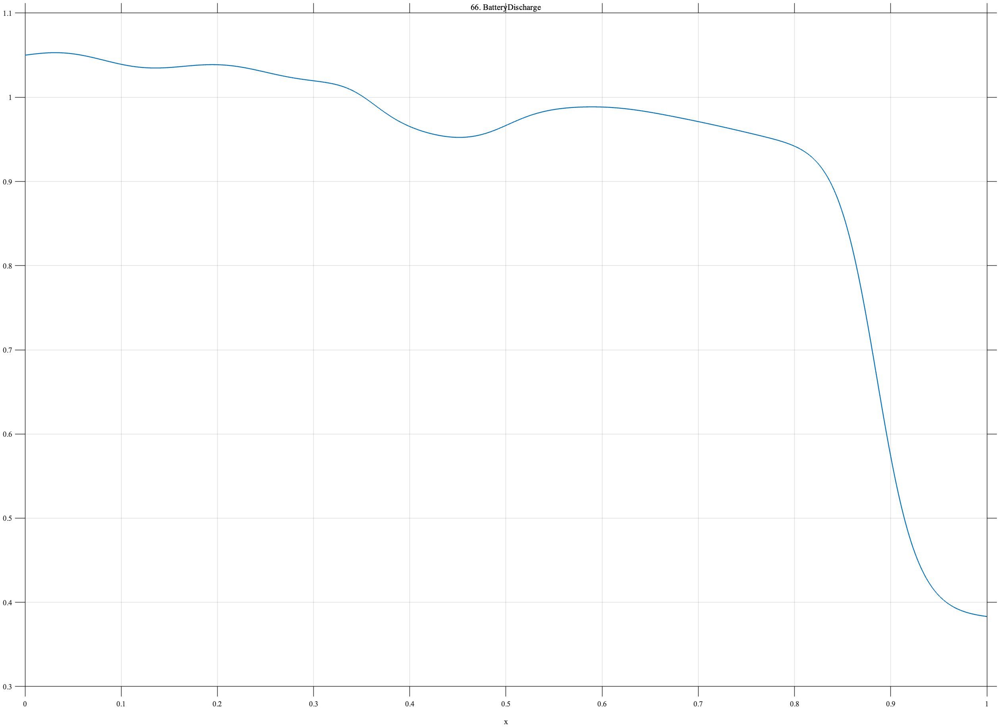

# TF066 — BatteryDischarge

## Overview

The **BatteryDischarge** signal has a long voltage plateau, weak phase-transition shoulder, and steep terminal drop. It tests whether subtle curvature changes and a dominant terminal cliff can be preserved together.

## Mathematical Definition

Define

$$
P(x)=1.05-0.075x-0.020x^2,
$$

$$
D(x)=-\frac{0.060}{1+e^{-55(x-0.36)}},
\qquad
R(x)=\frac{0.036}{1+e^{-48(x-0.50)}},
$$

$$
S(x)=0.018\exp\!\left[-\frac12\left(\frac{x-0.62}{0.050}\right)^2\right],
$$

$$
T(x)=-\frac{0.55}{1+e^{-48(x-0.885)}},
$$

and

$$
M(x)=0.006\sin(12\pi x)e^{-1.2x}.
$$

The signal is

$$
f(x)=P(x)+D(x)+R(x)+S(x)+T(x)+M(x).
$$

## Morphological Characteristics

| Property | Description |
|---|---|
| Primary family | Long plateau with shoulder and terminal cliff |
| Phase-transition region | Approximately $x=0.36$–$0.50$ |
| Weak shoulder | Centered at $x=0.62$ |
| Terminal drop | Centered at $x=0.885$ |
| Main challenge | Preserving weak plateau curvature and rapid final decline |

## Parameters

| Parameter | Meaning | Default |
|---|---|---:|
| $N$ | Number of samples | 1024 |
| $0.050$ | Shoulder width | 0.050 |
| $48$ | Terminal-drop sharpness | 48 |
| $0.55$ | Terminal-drop magnitude | 0.55 |

## MATLAB Implementation

~~~matlab
N = 1024; x = linspace(0,1,N);
plateau = 1.05-0.075*x-0.020*x.^2;
phaseDrop = -0.060./(1+exp(-55*(x-0.36)));
phaseRecover = 0.036./(1+exp(-48*(x-0.50)));
shoulder = 0.018*exp(-0.5*((x-0.62)/0.050).^2);
terminal = -0.55./(1+exp(-48*(x-0.885)));
ripple = 0.006*sin(2*pi*6*x).*exp(-1.2*x);
f = plateau+phaseDrop+phaseRecover+shoulder+terminal+ripple;
plot(x,f,'LineWidth',1.4); grid on
xlabel('x'); ylabel('Voltage'); title('TF066 — BatteryDischarge')
exportgraphics(gcf,'TF066_BatteryDischarge.png','Resolution',300);
~~~

## Python Implementation

~~~python
import numpy as np
import matplotlib.pyplot as plt
N = 1024; x = np.linspace(0,1,N)
plateau = 1.05-0.075*x-0.020*x**2
phase_drop = -0.060/(1+np.exp(-55*(x-0.36)))
phase_recover = 0.036/(1+np.exp(-48*(x-0.50)))
shoulder = 0.018*np.exp(-0.5*((x-0.62)/0.050)**2)
terminal = -0.55/(1+np.exp(-48*(x-0.885)))
ripple = 0.006*np.sin(2*np.pi*6*x)*np.exp(-1.2*x)
f = plateau+phase_drop+phase_recover+shoulder+terminal+ripple
plt.plot(x,f,linewidth=1.4); plt.grid(alpha=0.3)
plt.xlabel("x"); plt.ylabel("Voltage"); plt.title("TF066 — BatteryDischarge")
plt.tight_layout(); plt.savefig("TF066_BatteryDischarge.png",dpi=300)
~~~

## Recommended Uses

- Battery-curve denoising
- Phase-transition shoulder preservation
- Terminal-cliff detection
- Plateau-curvature recovery

## Provenance

**Status:** Battery-discharge-inspired deterministic electrochemical surrogate.

---

[← Previous: AFMForceCurve](TF065_AFMForceCurve.md) | [Category 5 Catalog](index.md) | [Next: FluorescenceBleach →](TF067_FluorescenceBleach.md)

