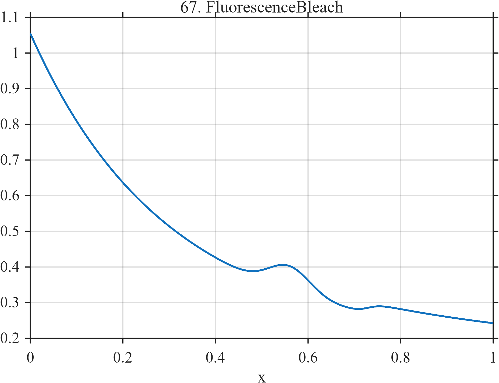

# TF067 — FluorescenceBleach

## Overview

The **FluorescenceBleach** signal represents photobleaching through fast and slow exponential decay. A weak localized recovery and small later level change represent scientifically meaningful departures from smooth decay.

## Mathematical Definition

Define

$$
B(x)=0.72e^{-3.8x}+0.30e^{-0.62x}+0.035,
$$

$$
R(x)=0.070\exp\!\left[-\frac12\left(\frac{x-0.56}{0.045}\right)^2\right],
$$

and

$$
S(x)=\frac{0.030}{1+e^{-75(x-0.73)}}.
$$

The signal is

$$
f(x)=B(x)+R(x)+S(x).
$$

## Morphological Characteristics

| Property | Description |
|---|---|
| Primary family | Multirate exponential decay with weak departures |
| Fast decay rate | 3.8 |
| Slow decay rate | 0.62 |
| Recovery center | $x=0.56$ |
| Main challenge | Retaining weak recovery and level change within smooth decay |

## Parameters

| Parameter | Meaning | Default |
|---|---|---:|
| $N$ | Number of samples | 1024 |
| $0.045$ | Recovery width | 0.045 |
| $0.73$ | Small-step center | 0.73 |
| $75$ | Small-step sharpness | 75 |

## MATLAB Implementation

~~~matlab
N = 1024; x = linspace(0,1,N);
bleach = 0.72*exp(-3.8*x)+0.30*exp(-0.62*x)+0.035;
recovery = 0.070*exp(-0.5*((x-0.56)/0.045).^2);
smallStep = 0.030./(1+exp(-75*(x-0.73)));
f = bleach+recovery+smallStep;
plot(x,f,'LineWidth',1.4); grid on
xlabel('x'); ylabel('Intensity'); title('TF067 — FluorescenceBleach')
exportgraphics(gcf,'TF067_FluorescenceBleach.png','Resolution',300);
~~~

## Python Implementation

~~~python
import numpy as np
import matplotlib.pyplot as plt
N = 1024; x = np.linspace(0,1,N)
bleach = 0.72*np.exp(-3.8*x)+0.30*np.exp(-0.62*x)+0.035
recovery = 0.070*np.exp(-0.5*((x-0.56)/0.045)**2)
small_step = 0.030/(1+np.exp(-75*(x-0.73)))
f = bleach+recovery+small_step
plt.plot(x,f,linewidth=1.4); plt.grid(alpha=0.3)
plt.xlabel("x"); plt.ylabel("Intensity"); plt.title("TF067 — FluorescenceBleach")
plt.tight_layout(); plt.savefig("TF067_FluorescenceBleach.png",dpi=300)
~~~

## Recommended Uses

- Photobleaching-curve denoising
- Multirate decay recovery
- Weak transient preservation
- Small level-change detection

## Provenance

**Status:** Fluorescence-photobleaching-inspired deterministic measurement surrogate.

---

[← Previous: BatteryDischarge](TF066_BatteryDischarge.md) | [Category 5 Catalog](index.md) | [Next: RadioAstronomyLine →](TF068_RadioAstronomyLine.md)
