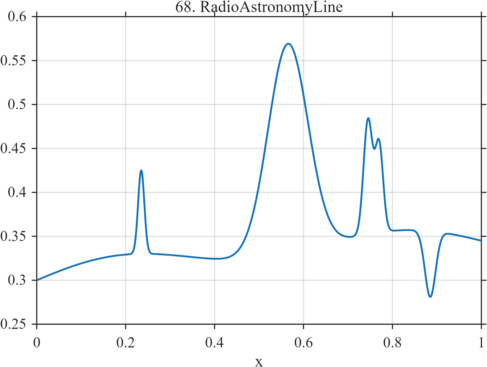

# TF068 — RadioAstronomyLine

## Overview

The **RadioAstronomyLine** signal consists of a smooth continuum with a weak narrow emission line, broader emission component, close intermediate-width pair, and shallow absorption notch.

## Mathematical Definition

Let

$$
G(x;c,w)=\exp\!\left[-\frac12\left(\frac{x-c}{w}\right)^2\right].
$$

The continuum is

$$
C(x)=0.30+0.10x-0.055x^2+0.012\sin(3\pi x).
$$

The signal is

$$
\begin{aligned}
f(x)={}&C(x)+0.095G(x;0.235,0.007)+0.24G(x;0.565,0.045)\\
&+0.13G(x;0.745,0.010)+0.10G(x;0.770,0.009)\\
&-0.075G(x;0.885,0.012).
\end{aligned}
$$

## Morphological Characteristics

| Property | Description |
|---|---|
| Primary family | Smooth continuum with unequal spectral lines |
| Weak narrow line | Centered at $x=0.235$ |
| Broad emission | Centered at $x=0.565$ |
| Close pair | Centers 0.745 and 0.770 |
| Main challenge | Retaining low-amplitude spectral information on a continuum |

## Parameters

| Feature | Center | Width | Amplitude |
|---|---:|---:|---:|
| Weak line | 0.235 | 0.007 | 0.095 |
| Broad line | 0.565 | 0.045 | 0.24 |
| Absorption notch | 0.885 | 0.012 | -0.075 |

## MATLAB Implementation

~~~matlab
N = 1024; x = linspace(0,1,N);
C = 0.30+0.10*x-0.055*x.^2+0.012*sin(2*pi*1.5*x);
f = C+0.095*exp(-0.5*((x-0.235)/0.007).^2) ...
    +0.24*exp(-0.5*((x-0.565)/0.045).^2) ...
    +0.13*exp(-0.5*((x-0.745)/0.010).^2) ...
    +0.10*exp(-0.5*((x-0.770)/0.009).^2) ...
    -0.075*exp(-0.5*((x-0.885)/0.012).^2);
plot(x,f,'LineWidth',1.4); grid on
xlabel('x'); ylabel('Intensity'); title('TF068 — RadioAstronomyLine')
exportgraphics(gcf,'TF068_RadioAstronomyLine.png','Resolution',300);
~~~

## Python Implementation

~~~python
import numpy as np
import matplotlib.pyplot as plt
N = 1024; x = np.linspace(0,1,N)
G = lambda c,w: np.exp(-0.5*((x-c)/w)**2)
C = 0.30+0.10*x-0.055*x**2+0.012*np.sin(2*np.pi*1.5*x)
f = C+0.095*G(0.235,0.007)+0.24*G(0.565,0.045)
f += 0.13*G(0.745,0.010)+0.10*G(0.770,0.009)-0.075*G(0.885,0.012)
plt.plot(x,f,linewidth=1.4); plt.grid(alpha=0.3)
plt.xlabel("x"); plt.ylabel("Intensity"); plt.title("TF068 — RadioAstronomyLine")
plt.tight_layout(); plt.savefig("TF068_RadioAstronomyLine.png",dpi=300)
~~~

## Recommended Uses

- Radio-spectral denoising
- Weak-line detection
- Close-line-pair resolution
- Emission and absorption preservation

## Provenance

**Status:** Radio-astronomy-spectroscopy-inspired deterministic surrogate.

---

[← Previous: FluorescenceBleach](TF067_FluorescenceBleach.md) | [Category 5 Catalog](index.md) | [Next: OceanThermocline →](TF069_OceanThermocline.md)

