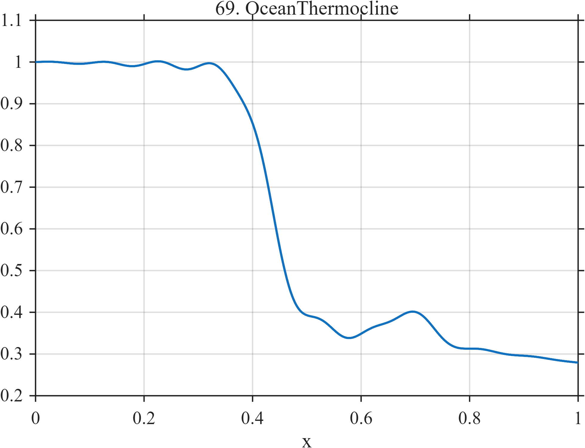

# TF069 — OceanThermocline

## Overview

The **OceanThermocline** signal represents a vertical temperature-like profile. A nearly homogeneous mixed layer is followed by a sharp but smooth thermocline and weaker deep-water gradient, with a small inversion and localized fine structure below the principal transition.

## Mathematical Definition

Define

$$
M(x)=1-0.025x,
$$

$$
T(x)=-\frac{0.62}{1+e^{-42(x-0.43)}},
$$

$$
D(x)=-0.14(x-0.46)_+,
$$

$$
I(x)=0.075\exp\!\left[-\frac12\left(\frac{x-0.69}{0.035}\right)^2\right],
$$

and

$$
F(x)=0.015\sin(20\pi x)
\exp\!\left[-\frac12\left(\frac{x-0.46}{0.20}\right)^2\right].
$$

The signal is

$$
f(x)=M(x)+T(x)+D(x)+I(x)+F(x).
$$

## Morphological Characteristics

| Property | Description |
|---|---|
| Primary family | Smooth front with weak secondary ocean structure |
| Thermocline center | $x=0.43$ |
| Deep gradient onset | $x=0.46$ |
| Inversion center | $x=0.69$ |
| Main challenge | Recovering dominant transition and weak secondary features |

## Parameters

| Parameter | Meaning | Default |
|---|---|---:|
| $N$ | Number of samples | 1024 |
| $42$ | Thermocline sharpness | 42 |
| $0.035$ | Inversion width | 0.035 |
| $10$ | Fine-structure frequency | 10 |

## MATLAB Implementation

~~~matlab
N = 1024; x = linspace(0,1,N);
mixed = 1.00-0.025*x;
thermo = -0.62./(1+exp(-42*(x-0.43)));
deep = -0.14*max(x-0.46,0);
inversion = 0.075*exp(-0.5*((x-0.69)/0.035).^2);
fine = 0.015*sin(2*pi*10*x).*exp(-0.5*((x-0.46)/0.20).^2);
f = mixed+thermo+deep+inversion+fine;
plot(x,f,'LineWidth',1.4); grid on
xlabel('x'); ylabel('Temperature-like value'); title('TF069 — OceanThermocline')
exportgraphics(gcf,'TF069_OceanThermocline.png','Resolution',300);
~~~

## Python Implementation

~~~python
import numpy as np
import matplotlib.pyplot as plt
N = 1024; x = np.linspace(0,1,N)
mixed = 1.00-0.025*x
thermo = -0.62/(1+np.exp(-42*(x-0.43)))
deep = -0.14*np.maximum(x-0.46,0)
inversion = 0.075*np.exp(-0.5*((x-0.69)/0.035)**2)
fine = 0.015*np.sin(2*np.pi*10*x)*np.exp(-0.5*((x-0.46)/0.20)**2)
f = mixed+thermo+deep+inversion+fine
plt.plot(x,f,linewidth=1.4); plt.grid(alpha=0.3)
plt.xlabel("x"); plt.ylabel("Temperature-like value"); plt.title("TF069 — OceanThermocline")
plt.tight_layout(); plt.savefig("TF069_OceanThermocline.png",dpi=300)
~~~

## Recommended Uses

- Thermocline-profile denoising
- Smooth-front preservation
- Weak inversion detection
- Localized fine-structure recovery

## Provenance

**Status:** Ocean-thermocline-inspired deterministic measurement surrogate.

---

[← Previous: RadioAstronomyLine](TF068_RadioAstronomyLine.md) | [Category 5 Catalog](index.md) | [Next: WellLog →](TF070_WellLog.md)

