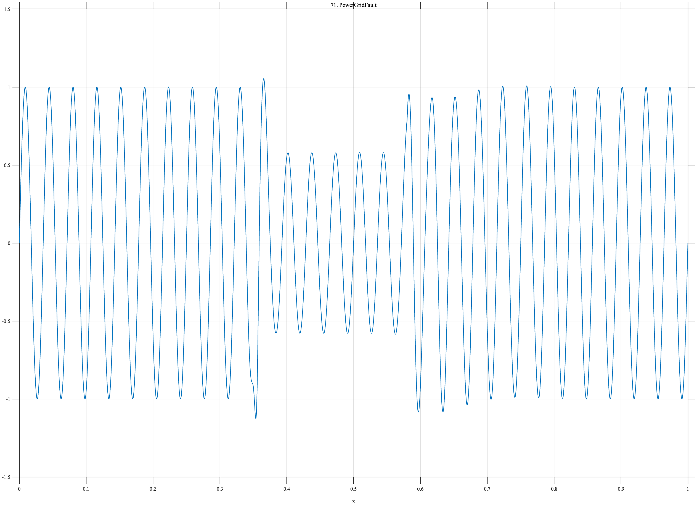

# TF071 — PowerGridFault

## Overview

The **PowerGridFault** signal is a periodic power-system waveform interrupted by a voltage sag and localized bipolar fault transient. A damped high-frequency recovery begins when the sag ends.

## Mathematical Definition

Let $s(x;c,w)=[1+e^{-(x-c)/w}]^{-1}$ and $W(x)=s(x;0.35,0.003)-s(x;0.58,0.004)$. With $u=(x-0.58)_+$,

$$
\begin{aligned}
f(x)={}&[1-0.42W(x)]\sin(56\pi x)
-0.85e^{-\frac12((x-0.355)/0.0028)^2}\\
&+0.48e^{-\frac12((x-0.365)/0.0045)^2}
+0.23\mathbf{1}_{\{x\geq0.58\}}e^{-18u}\sin(104\pi u).
\end{aligned}
$$

## Morphological Characteristics

| Property | Description |
|---|---|
| Primary family | Periodic carrier with fault interval and ring-down |
| Sag interval | Approximately $0.35<x<0.58$ |
| Fault transient | Near $x=0.355$–$0.365$ |
| Main challenge | Preserving transient and recovery without distorting carrier |

## Parameters

| Parameter | Meaning | Default |
|---|---|---:|
| $N$ | Samples | 1024 |
| $28$ | Carrier frequency | 28 |
| $52$ | Recovery frequency | 52 |

## MATLAB Implementation

~~~matlab
N=1024; x=linspace(0,1,N); s=@(z,c,w) 1./(1+exp(-(z-c)/w));
W=s(x,0.35,0.003)-s(x,0.58,0.004); u=max(x-0.58,0);
f=(1-0.42*W).*sin(2*pi*28*x) ...
 -0.85*exp(-0.5*((x-0.355)/0.0028).^2)+0.48*exp(-0.5*((x-0.365)/0.0045).^2) ...
 +(x>=0.58).*0.23.*exp(-18*u).*sin(2*pi*52*u);
plot(x,f); grid on; title('TF071 — PowerGridFault')
exportgraphics(gcf,'TF071_PowerGridFault.png','Resolution',300);
~~~

## Python Implementation

~~~python
import numpy as np
import matplotlib.pyplot as plt
N=1024; x=np.linspace(0,1,N); step=lambda c,w: 1/(1+np.exp(-(x-c)/w))
W=step(0.35,0.003)-step(0.58,0.004); u=np.maximum(x-0.58,0)
f=(1-0.42*W)*np.sin(2*np.pi*28*x)-0.85*np.exp(-0.5*((x-0.355)/0.0028)**2)
f+=0.48*np.exp(-0.5*((x-0.365)/0.0045)**2)+(x>=0.58)*0.23*np.exp(-18*u)*np.sin(2*np.pi*52*u)
plt.plot(x,f); plt.grid(alpha=.3); plt.title('TF071 — PowerGridFault'); plt.tight_layout()
plt.savefig('TF071_PowerGridFault.png',dpi=300)
~~~

## Recommended Uses

- Power-quality denoising
- Fault and sag localization
- Ring-down preservation

## Provenance

**Status:** Power-grid-fault-inspired deterministic engineering surrogate.

---

[Category 6 Catalog](index.md) | [Next: GearboxDefect →](TF072_GearboxDefect.md)

