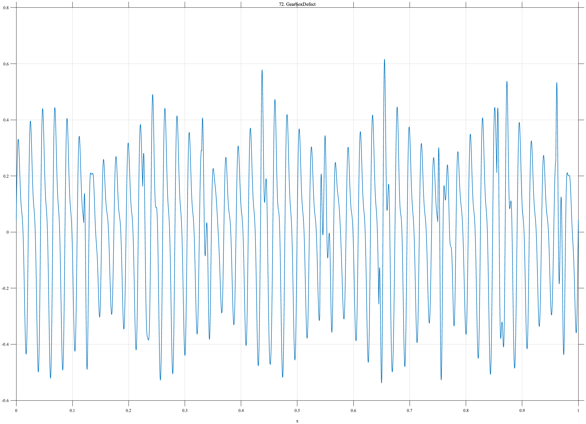

# TF072 — GearboxDefect

## Overview

The **GearboxDefect** signal contains persistent modulated vibration and recurring damped impacts that strengthen after the middle of the record.

## Mathematical Definition

Let

$$
C(x)=[1+0.28\sin(10\pi x-0.3)]
[0.32\sin(92\pi x)+0.12\sin(184\pi x+0.4)].
$$

For $c_k=0.12+0.105(k-1)$, $k=1,\ldots,9$, let $a_k=0.22+0.16\mathbf{1}_{\{c_k>0.5\}}$ and $u_k=(x-c_k)_+$. Then

$$
f(x)=C(x)+\sum_{k=1}^{9}a_k\mathbf{1}_{\{x\geq c_k\}}e^{-75u_k}\sin(250\pi u_k).
$$

## Morphological Characteristics

| Property | Description |
|---|---|
| Primary family | Modulated carrier with repeated impacts |
| Impact spacing | 0.105 |
| Change | Stronger impacts after $x=0.5$ |
| Main challenge | Retaining sparse impacts inside persistent vibration |

## Parameters

| Parameter | Meaning | Default |
|---|---|---:|
| $46,92$ | Carrier frequencies | As shown |
| $125$ | Impact resonance frequency | 125 |
| $75$ | Impact decay rate | 75 |

## MATLAB Implementation

~~~matlab
N=1024; x=linspace(0,1,N);
f=(1+0.28*sin(2*pi*5*x-0.3)).*(0.32*sin(2*pi*46*x)+0.12*sin(2*pi*92*x+0.4));
c=0.12:0.105:0.96;
for k=1:numel(c), a=0.22+0.16*(c(k)>0.5); u=max(x-c(k),0);
 f=f+a*(x>=c(k)).*exp(-75*u).*sin(2*pi*125*u); end
plot(x,f); grid on; title('TF072 — GearboxDefect')
exportgraphics(gcf,'TF072_GearboxDefect.png','Resolution',300);
~~~

## Python Implementation

~~~python
import numpy as np
import matplotlib.pyplot as plt
N=1024; x=np.linspace(0,1,N)
f=(1+0.28*np.sin(2*np.pi*5*x-0.3))*(0.32*np.sin(2*np.pi*46*x)+0.12*np.sin(2*np.pi*92*x+0.4))
for c in np.arange(0.12,0.961,0.105):
    a=0.22+0.16*(c>0.5); u=np.maximum(x-c,0)
    f+=a*(x>=c)*np.exp(-75*u)*np.sin(2*np.pi*125*u)
plt.plot(x,f); plt.grid(alpha=.3); plt.title('TF072 — GearboxDefect'); plt.tight_layout()
plt.savefig('TF072_GearboxDefect.png',dpi=300)
~~~

## Recommended Uses

- Gearbox condition monitoring
- Embedded-impact preservation
- Deterioration-change detection

## Provenance

**Status:** Gearbox-defect-inspired deterministic mechanical surrogate.

---

[← Previous: PowerGridFault](TF071_PowerGridFault.md) | [Category 6 Catalog](index.md) | [Next: LidarMultiEcho →](TF073_LidarMultiEcho.md)

