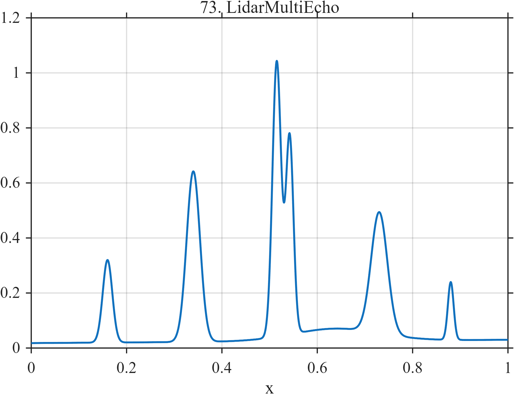

# TF073 — LidarMultiEcho

## Overview

The **LidarMultiEcho** signal contains unequal range echoes, including a deliberately close pair, on a weak drifting and broad background.

## Mathematical Definition

Let $G(x;c,w)=e^{-((x-c)/w)^2/2}$, with

$$
c=(0.16,0.34,0.515,0.542,0.73,0.88),
$$
$$
A=(0.30,0.62,1.00,0.72,0.44,0.21),
\quad
w=(0.010,0.014,0.009,0.008,0.017,0.006).
$$

Then

$$
f(x)=0.018+0.012x+0.045G(x;0.64,0.09)+\sum_{k=1}^{6}A_kG(x;c_k,w_k).
$$

## Morphological Characteristics

| Property | Description |
|---|---|
| Primary family | Unequal narrow echoes with close pair |
| Close echoes | 0.515 and 0.542 |
| Weakest echo | Centered at 0.88 |
| Main challenge | Preventing merger of nearby targets |

## Parameters

| Parameter | Meaning | Default |
|---|---|---|
| $c$ | Echo centers | As listed |
| $A$ | Echo amplitudes | As listed |
| $w$ | Echo widths | As listed |

## MATLAB Implementation

~~~matlab
N=1024; x=linspace(0,1,N); f=0.018+0.012*x;
c=[0.16 0.34 0.515 0.542 0.73 0.88]; A=[0.30 0.62 1.00 0.72 0.44 0.21];
w=[0.010 0.014 0.009 0.008 0.017 0.006];
for k=1:numel(c), f=f+A(k)*exp(-0.5*((x-c(k))/w(k)).^2); end
f=f+0.045*exp(-0.5*((x-0.64)/0.09).^2);
plot(x,f); grid on; title('TF073 — LidarMultiEcho')
exportgraphics(gcf,'TF073_LidarMultiEcho.png','Resolution',300);
~~~

## Python Implementation

~~~python
import numpy as np
import matplotlib.pyplot as plt
N=1024; x=np.linspace(0,1,N); f=0.018+0.012*x
c=[.16,.34,.515,.542,.73,.88]; A=[.30,.62,1,.72,.44,.21]; w=[.010,.014,.009,.008,.017,.006]
for ck,ak,wk in zip(c,A,w): f+=ak*np.exp(-.5*((x-ck)/wk)**2)
f+=.045*np.exp(-.5*((x-.64)/.09)**2)
plt.plot(x,f); plt.grid(alpha=.3); plt.title('TF073 — LidarMultiEcho'); plt.tight_layout()
plt.savefig('TF073_LidarMultiEcho.png',dpi=300)
~~~

## Recommended Uses

- Lidar echo denoising
- Close-target resolution
- Weak-reflector preservation

## Provenance

**Status:** Multi-echo-lidar-inspired deterministic sensing surrogate.

---

[← Previous: GearboxDefect](TF072_GearboxDefect.md) | [Category 6 Catalog](index.md) | [Next: RadarMicroDoppler →](TF074_RadarMicroDoppler.md)

