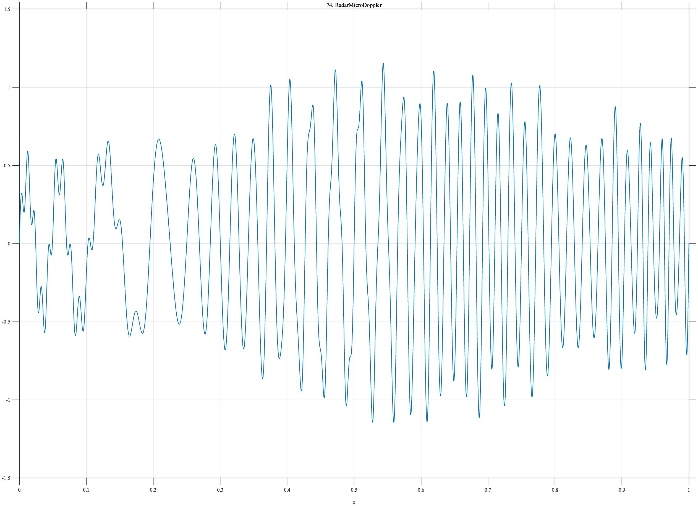

# TF074 — RadarMicroDoppler

## Overview

The **RadarMicroDoppler** signal combines changing instantaneous frequency, slow phase modulation, a broad amplitude envelope, and a higher-frequency side component.

## Mathematical Definition

$$
\phi(x)=2\pi[12x+24x^2+0.50\sin(6\pi x)],
$$
$$
E(x)=0.32+0.68e^{-\frac12((x-0.58)/0.30)^2},
$$
$$
f(x)=E(x)\sin\phi(x)+0.16\sin\{2\pi[62x+3\sin(4\pi x)]\}.
$$

## Morphological Characteristics

| Property | Description |
|---|---|
| Primary family | Chirp with micro-Doppler phase modulation |
| Envelope center | 0.58 |
| Side component | Nominal frequency 62 |
| Main challenge | Preserving local phase and frequency structure |

## Parameters

| Parameter | Meaning | Default |
|---|---|---:|
| $24$ | Quadratic phase coefficient | 24 |
| $0.50$ | Slow modulation magnitude | 0.50 |
| $0.16$ | Side-component amplitude | 0.16 |

## MATLAB Implementation

~~~matlab
N=1024; x=linspace(0,1,N);
phase=2*pi*(12*x+24*x.^2+0.50*sin(2*pi*3*x));
env=0.32+0.68*exp(-0.5*((x-0.58)/0.30).^2);
side=0.16*sin(2*pi*(62*x+3*sin(2*pi*2*x)));
f=env.*sin(phase)+side;
plot(x,f); grid on; title('TF074 — RadarMicroDoppler')
exportgraphics(gcf,'TF074_RadarMicroDoppler.png','Resolution',300);
~~~

## Python Implementation

~~~python
import numpy as np
import matplotlib.pyplot as plt
N=1024; x=np.linspace(0,1,N)
phase=2*np.pi*(12*x+24*x**2+.5*np.sin(2*np.pi*3*x))
env=.32+.68*np.exp(-.5*((x-.58)/.30)**2)
side=.16*np.sin(2*np.pi*(62*x+3*np.sin(2*np.pi*2*x)))
f=env*np.sin(phase)+side
plt.plot(x,f); plt.grid(alpha=.3); plt.title('TF074 — RadarMicroDoppler'); plt.tight_layout()
plt.savefig('TF074_RadarMicroDoppler.png',dpi=300)
~~~

## Recommended Uses

- Micro-Doppler denoising
- Time-varying frequency preservation
- Phase-modulation recovery

## Provenance

**Status:** Radar-micro-Doppler-inspired deterministic sensing surrogate.

---

[← Previous: LidarMultiEcho](TF073_LidarMultiEcho.md) | [Category 6 Catalog](index.md) | [Next: MeltPoolInstability →](TF075_MeltPoolInstability.md)

