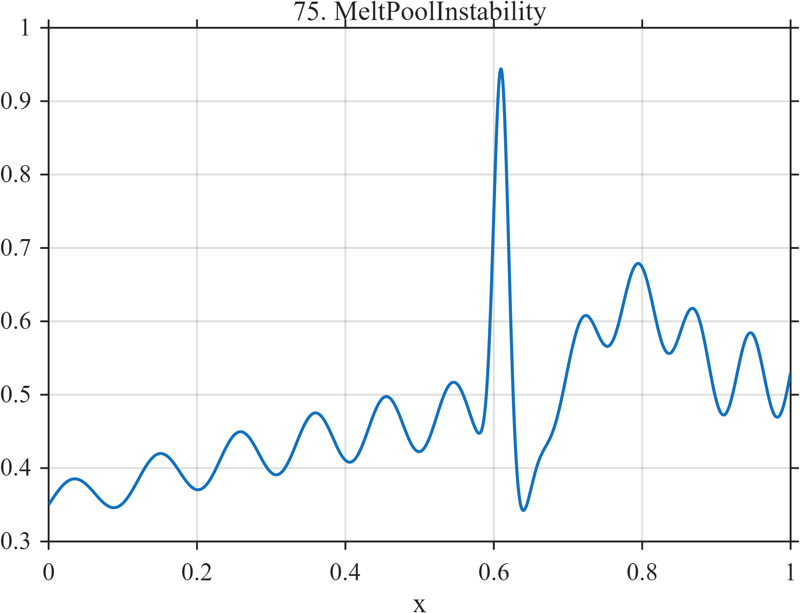

# TF075 — MeltPoolInstability

## Overview

The **MeltPoolInstability** signal combines slowly varying thermal output, process oscillation, a sharp spatter-like excursion, and a later finite-duration operating-regime change.

## Mathematical Definition

Let $s(x;c,w)=[1+e^{-(x-c)/w}]^{-1}$. Then

$$
\begin{aligned}
f(x)={}&0.35+0.28x-0.10x^2+(0.025+0.035x)\sin\{2\pi(8x+3x^2)\}\\
&+0.52e^{-\frac12((x-0.61)/0.010)^2}-0.20e^{-\frac12((x-0.635)/0.016)^2}\\
&+0.12[s(x;0.72,0.012)-s(x;0.86,0.018)].
\end{aligned}
$$

## Morphological Characteristics

| Property | Description |
|---|---|
| Primary family | Drift, oscillation, spatter, and regime interval |
| Spatter region | Near 0.61–0.635 |
| Regime interval | Approximately 0.72–0.86 |
| Main challenge | Retaining brief instability within gradual process drift |

## Parameters

| Parameter | Meaning | Default |
|---|---|---:|
| $0.010,0.016$ | Spatter widths | As shown |
| $0.12$ | Regime-change magnitude | 0.12 |
| $8x+3x^2$ | Oscillatory phase scale | As shown |

## MATLAB Implementation

~~~matlab
N=1024; x=linspace(0,1,N); s=@(z,c,w) 1./(1+exp(-(z-c)/w));
f=0.35+0.28*x-0.10*x.^2+(0.025+0.035*x).*sin(2*pi*(8*x+3*x.^2));
f=f+0.52*exp(-0.5*((x-0.61)/0.010).^2)-0.20*exp(-0.5*((x-0.635)/0.016).^2);
f=f+0.12*(s(x,0.72,0.012)-s(x,0.86,0.018));
plot(x,f); grid on; title('TF075 — MeltPoolInstability')
exportgraphics(gcf,'TF075_MeltPoolInstability.png','Resolution',300);
~~~

## Python Implementation

~~~python
import numpy as np
import matplotlib.pyplot as plt
N=1024; x=np.linspace(0,1,N); step=lambda c,w: 1/(1+np.exp(-(x-c)/w))
f=.35+.28*x-.10*x**2+(.025+.035*x)*np.sin(2*np.pi*(8*x+3*x**2))
f+=.52*np.exp(-.5*((x-.61)/.010)**2)-.20*np.exp(-.5*((x-.635)/.016)**2)
f+=.12*(step(.72,.012)-step(.86,.018))
plt.plot(x,f); plt.grid(alpha=.3); plt.title('TF075 — MeltPoolInstability'); plt.tight_layout()
plt.savefig('TF075_MeltPoolInstability.png',dpi=300)
~~~

## Recommended Uses

- Additive-manufacturing monitoring
- Spatter-event preservation
- Regime-change detection

## Provenance

**Status:** Melt-pool-monitoring-inspired deterministic manufacturing surrogate.

---

[← Previous: RadarMicroDoppler](TF074_RadarMicroDoppler.md) | [Category 6 Catalog](index.md) | [Next: FiberOTDR →](TF076_FiberOTDR.md)
