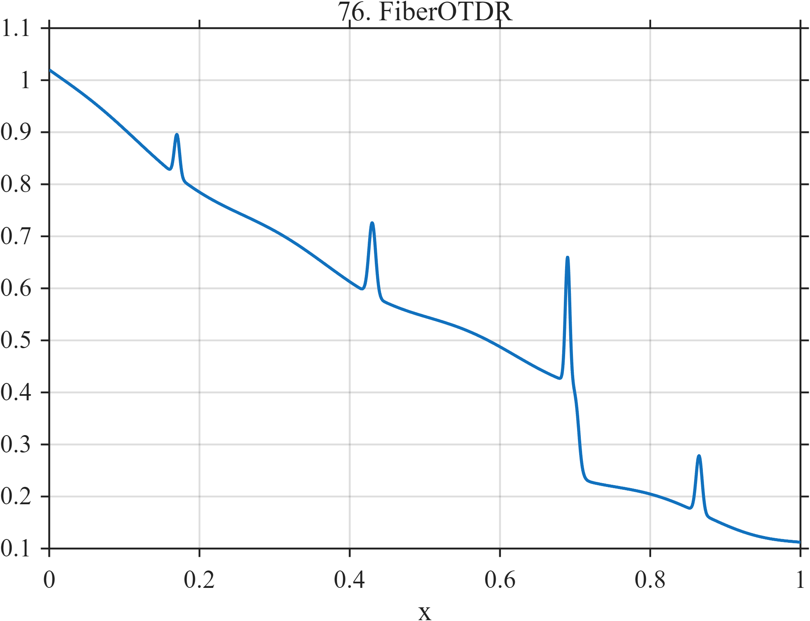

# TF076 — FiberOTDR

## Overview

The **FiberOTDR** signal models smoothly decaying optical backscatter, four narrow connector or defect reflections, and an abrupt attenuation step immediately after the largest reflection.

## Mathematical Definition

Let $g(x;c,w)=\exp[-\tfrac12((x-c)/w)^2]$ and $s(x;c,w)=[1+e^{-(x-c)/w}]^{-1}$. Then

$$
f(x)=1.02e^{-1.25x}+\sum_{k=1}^{4}a_k g(x;c_k,w_k)-0.18s(x;0.705,0.0025)+0.010\sin(8\pi x),
$$

where

$$
c=(0.17,0.43,0.69,0.865),\quad
a=(0.08,0.14,0.24,0.11),\quad
w=(0.0035,0.0045,0.0030,0.0040).
$$

## Morphological Characteristics

| Property | Description |
|---|---|
| Primary family | Decay, sparse peaks, and level step |
| Local features | Four very narrow reflections |
| Structural change | Loss step near $x=0.705$ |
| Main challenge | Preserving weak reflectors while locating the attenuation step |

## Parameters

| Parameter | Meaning | Default |
|---|---|---:|
| $1.25$ | Backscatter decay rate | 1.25 |
| $0.18$ | Loss-step magnitude | 0.18 |
| $c_k,a_k,w_k$ | Reflection centers, amplitudes, and widths | As above |

## MATLAB Implementation

~~~matlab
N=1024; x=linspace(0,1,N); s=@(z,c,w) 1./(1+exp(-(z-c)/w));
f=1.02*exp(-1.25*x);
c=[0.17 0.43 0.69 0.865]; a=[0.08 0.14 0.24 0.11];
w=[0.0035 0.0045 0.0030 0.0040];
for k=1:numel(c), f=f+a(k)*exp(-0.5*((x-c(k))/w(k)).^2); end
f=f-0.18*s(x,0.705,0.0025)+0.010*sin(2*pi*4*x);
plot(x,f); grid on; title('TF076 — FiberOTDR')
exportgraphics(gcf,'TF076_FiberOTDR.png','Resolution',300);
~~~

## Python Implementation

~~~python
import numpy as np
import matplotlib.pyplot as plt
N=1024; x=np.linspace(0,1,N); step=lambda c,w: 1/(1+np.exp(-(x-c)/w))
f=1.02*np.exp(-1.25*x)
c=[.17,.43,.69,.865]; a=[.08,.14,.24,.11]; w=[.0035,.0045,.003,.004]
for ck,ak,wk in zip(c,a,w): f+=ak*np.exp(-.5*((x-ck)/wk)**2)
f+=-.18*step(.705,.0025)+.010*np.sin(2*np.pi*4*x)
plt.plot(x,f); plt.grid(alpha=.3); plt.tight_layout()
plt.savefig('TF076_FiberOTDR.png',dpi=300)
~~~

## Recommended Uses

- OTDR trace denoising
- Sparse-reflector recovery
- Attenuation-step localization

## Provenance

**Status:** Optical-fiber-diagnostics-inspired deterministic surrogate.

---

[← Previous: MeltPoolInstability](TF075_MeltPoolInstability.md) | [Category 6 Catalog](index.md) | [Next: NetworkTrafficBursts →](TF077_NetworkTrafficBursts.md)
