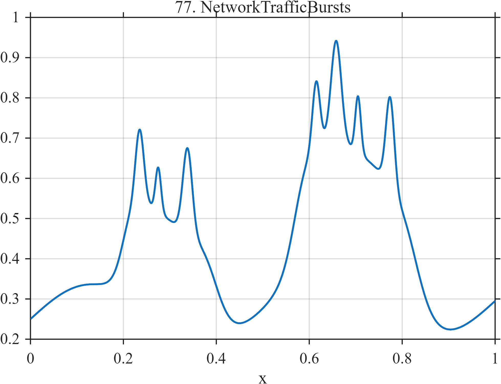

# TF077 — NetworkTrafficBursts

## Overview

The **NetworkTrafficBursts** signal combines a slowly varying baseline, two broad high-load windows, and seven shorter bursts nested within those windows.

## Mathematical Definition

With $s(x;c,w)=[1+e^{-(x-c)/w}]^{-1}$ and $g(x;c,w)=e^{-((x-c)/w)^2/2}$,

$$
\begin{aligned}
f(x)={}&0.25+0.08\sin(4\pi x)+0.045x\\
&+0.28[s(x;0.20,0.012)-s(x;0.40,0.018)]\\
&+0.34[s(x;0.57,0.015)-s(x;0.83,0.020)]
+\sum_{k=1}^{7}a_k g(x;c_k,w_k),
\end{aligned}
$$

where $c=(0.235,0.275,0.338,0.615,0.658,0.705,0.774)$, $a=(0.18,0.11,0.21,0.16,0.25,0.14,0.22)$, and $w=(0.009,0.006,0.010,0.008,0.011,0.006,0.009)$.

## Morphological Characteristics

| Property | Description |
|---|---|
| Primary family | Nested broad and narrow bursts |
| Broad windows | Approximately 0.20–0.40 and 0.57–0.83 |
| Fine structure | Seven unequal Gaussian bursts |
| Main challenge | Retaining short bursts inside longer high-load periods |

## Parameters

| Parameter | Meaning | Default |
|---|---|---:|
| $0.28,0.34$ | Broad-window amplitudes | As shown |
| $c_k,a_k,w_k$ | Short-burst parameters | As above |

## MATLAB Implementation

~~~matlab
N=1024; x=linspace(0,1,N); s=@(z,c,w) 1./(1+exp(-(z-c)/w));
f=0.25+0.08*sin(2*pi*2*x)+0.045*x;
f=f+0.28*(s(x,0.20,0.012)-s(x,0.40,0.018));
f=f+0.34*(s(x,0.57,0.015)-s(x,0.83,0.020));
c=[0.235 0.275 0.338 0.615 0.658 0.705 0.774];
a=[0.18 0.11 0.21 0.16 0.25 0.14 0.22];
w=[0.009 0.006 0.010 0.008 0.011 0.006 0.009];
for k=1:numel(c), f=f+a(k)*exp(-0.5*((x-c(k))/w(k)).^2); end
plot(x,f); grid on; title('TF077 — NetworkTrafficBursts')
exportgraphics(gcf,'TF077_NetworkTrafficBursts.png','Resolution',300);
~~~

## Python Implementation

~~~python
import numpy as np
import matplotlib.pyplot as plt
N=1024; x=np.linspace(0,1,N); s=lambda c,w: 1/(1+np.exp(-(x-c)/w))
f=.25+.08*np.sin(2*np.pi*2*x)+.045*x
f+=.28*(s(.20,.012)-s(.40,.018))+.34*(s(.57,.015)-s(.83,.020))
c=[.235,.275,.338,.615,.658,.705,.774]; a=[.18,.11,.21,.16,.25,.14,.22]
w=[.009,.006,.010,.008,.011,.006,.009]
for ck,ak,wk in zip(c,a,w): f+=ak*np.exp(-.5*((x-ck)/wk)**2)
plt.plot(x,f); plt.grid(alpha=.3); plt.tight_layout()
plt.savefig('TF077_NetworkTrafficBursts.png',dpi=300)
~~~

## Recommended Uses

- Multiscale traffic denoising
- Burst detection
- Nested-event preservation

## Provenance

**Status:** Network-telemetry-inspired deterministic surrogate.

---

[← Previous: FiberOTDR](TF076_FiberOTDR.md) | [Category 6 Catalog](index.md) | [Next: LatencyIncident →](TF078_LatencyIncident.md)
