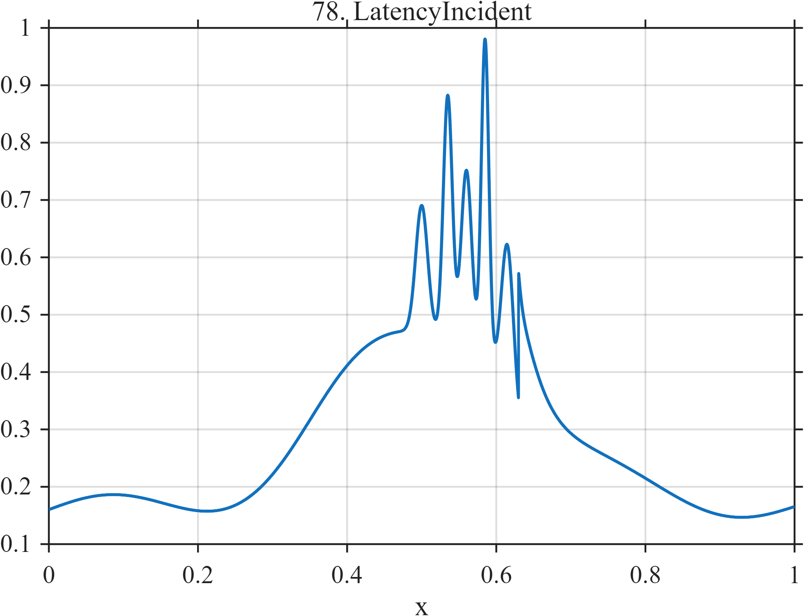

# TF078 — LatencyIncident

## Overview

The **LatencyIncident** signal begins with stable latency, develops a gradual congestion elevation, produces five heterogeneous spikes, and recovers noninstantaneously.

## Mathematical Definition

Let $s(x;c,w)=[1+e^{-(x-c)/w}]^{-1}$ and $g(x;c,w)=e^{-((x-c)/w)^2/2}$. Then

$$
\begin{aligned}
f(x)={}&0.16+0.025\sin(6\pi x)+0.33[s(x;0.36,0.050)-s(x;0.63,0.020)]\\
&+\sum_{k=1}^{5}a_k g(x;c_k,w_k)+0.22I(x\ge0.63)e^{-10(x-0.63)},
\end{aligned}
$$

where $c=(0.50,0.535,0.56,0.585,0.615)$, $a=(0.22,0.42,0.30,0.55,0.26)$, and $w=(0.008,0.006,0.007,0.005,0.008)$.

## Morphological Characteristics

| Property | Description |
|---|---|
| Primary family | Level elevation, spike cluster, and recovery |
| Incident onset | Gradual, near $x=0.36$ |
| Spike region | $0.50$–$0.615$ |
| Main challenge | Preserving heterogeneous spikes without roughening the baseline |

## Parameters

| Parameter | Meaning | Default |
|---|---|---:|
| $0.33$ | Congestion-ramp amplitude | 0.33 |
| $10$ | Recovery rate | 10 |
| $c_k,a_k,w_k$ | Spike parameters | As above |

## MATLAB Implementation

~~~matlab
N=1024; x=linspace(0,1,N); s=@(z,c,w) 1./(1+exp(-(z-c)/w));
f=0.16+0.025*sin(2*pi*3*x)+0.33*(s(x,0.36,0.050)-s(x,0.63,0.020));
c=[0.50 0.535 0.56 0.585 0.615]; a=[0.22 0.42 0.30 0.55 0.26];
w=[0.008 0.006 0.007 0.005 0.008];
for k=1:numel(c), f=f+a(k)*exp(-0.5*((x-c(k))/w(k)).^2); end
u=max(x-0.63,0); f=f+(x>=0.63).*0.22.*exp(-10*u);
plot(x,f); grid on; title('TF078 — LatencyIncident')
exportgraphics(gcf,'TF078_LatencyIncident.png','Resolution',300);
~~~

## Python Implementation

~~~python
import numpy as np
import matplotlib.pyplot as plt
N=1024; x=np.linspace(0,1,N); s=lambda c,w: 1/(1+np.exp(-(x-c)/w))
f=.16+.025*np.sin(2*np.pi*3*x)+.33*(s(.36,.050)-s(.63,.020))
c=[.50,.535,.56,.585,.615]; a=[.22,.42,.30,.55,.26]; w=[.008,.006,.007,.005,.008]
for ck,ak,wk in zip(c,a,w): f+=ak*np.exp(-.5*((x-ck)/wk)**2)
u=np.maximum(x-.63,0); f+=(x>=.63)*.22*np.exp(-10*u)
plt.plot(x,f); plt.grid(alpha=.3); plt.tight_layout()
plt.savefig('TF078_LatencyIncident.png',dpi=300)
~~~

## Recommended Uses

- Cloud-latency denoising
- Incident localization
- Spike-cluster preservation

## Provenance

**Status:** Cloud-telemetry-inspired deterministic surrogate.

---

[← Previous: NetworkTrafficBursts](TF077_NetworkTrafficBursts.md) | [Category 6 Catalog](index.md) | [Next: CacheThrash →](TF079_CacheThrash.md)
