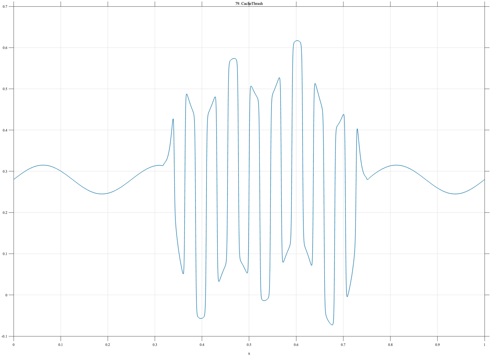

# TF079 — CacheThrash

## Overview

The **CacheThrash** signal has a stable workload outside a finite central interval and rapid nonlinear switching with weaker oscillation inside it.

## Mathematical Definition

Let $s(x;c,w)=[1+e^{-(x-c)/w}]^{-1}$ and $W(x)=s(x;0.34,0.005)-s(x;0.73,0.005)$. The signal is

$$
f(x)=0.28+0.035\sin(8\pi x)+0.24W(x)\tanh[5\sin(44\pi x)]+0.08W(x)\sin(14\pi x).
$$

## Morphological Characteristics

| Property | Description |
|---|---|
| Primary family | Finite switching regime |
| Thrashing window | Approximately 0.34–0.73 |
| Internal structure | Rapid high/low switching plus weak oscillation |
| Main challenge | Locating regime boundaries while preserving fast internal behavior |

## Parameters

| Parameter | Meaning | Default |
|---|---|---:|
| $0.34,0.73$ | Thrashing-window boundaries | As shown |
| $44\pi$ | Switching angular scale | As shown |
| $0.24$ | Switching amplitude | 0.24 |

## MATLAB Implementation

~~~matlab
N=1024; x=linspace(0,1,N); s=@(z,c,w) 1./(1+exp(-(z-c)/w));
base=0.28+0.035*sin(2*pi*4*x);
window=s(x,0.34,0.005)-s(x,0.73,0.005);
switching=0.24*tanh(5*sin(2*pi*22*x));
edge=0.08*sin(2*pi*7*x).*window;
f=base+window.*switching+edge;
plot(x,f); grid on; title('TF079 — CacheThrash')
exportgraphics(gcf,'TF079_CacheThrash.png','Resolution',300);
~~~

## Python Implementation

~~~python
import numpy as np
import matplotlib.pyplot as plt
N=1024; x=np.linspace(0,1,N); s=lambda c,w: 1/(1+np.exp(-(x-c)/w))
base=.28+.035*np.sin(2*np.pi*4*x); window=s(.34,.005)-s(.73,.005)
switching=.24*np.tanh(5*np.sin(2*np.pi*22*x)); edge=.08*np.sin(2*np.pi*7*x)*window
f=base+window*switching+edge
plt.plot(x,f); plt.grid(alpha=.3); plt.tight_layout()
plt.savefig('TF079_CacheThrash.png',dpi=300)
~~~

## Recommended Uses

- Regime-switching denoising
- Cache-thrashing detection
- Fast-state preservation

## Provenance

**Status:** Computer-architecture-inspired deterministic surrogate.

---

[← Previous: LatencyIncident](TF078_LatencyIncident.md) | [Category 6 Catalog](index.md) | [Next: TrainingLossSchedule →](TF080_TrainingLossSchedule.md)
