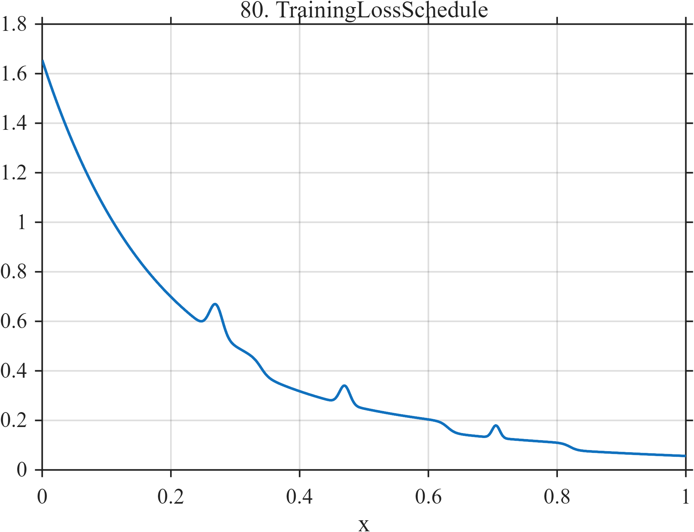

# TF080 — TrainingLossSchedule

## Overview

The **TrainingLossSchedule** signal combines fast and slow optimization decay, three discrete schedule-related improvements, and three transient loss spikes.

## Mathematical Definition

Let $s(x;c,w)=[1+e^{-(x-c)/w}]^{-1}$ and $g(x;c,w)=e^{-((x-c)/w)^2/2}$. Then

$$
\begin{aligned}
f(x)={}&1.35e^{-5.8x}+0.24e^{-0.65x}+0.065\\
&-0.065s(x;0.34,0.006)-0.045s(x;0.58,0.006)-0.028s(x;0.78,0.005)\\
&+0.12g(x;0.27,0.010)+0.075g(x;0.47,0.008)+0.050g(x;0.705,0.006).
\end{aligned}
$$

## Morphological Characteristics

| Property | Description |
|---|---|
| Primary family | Multirate decay with steps and spikes |
| Schedule changes | Near 0.34, 0.58, and 0.78 |
| Transients | Three narrow positive spikes |
| Main challenge | Separating genuine schedule changes from optimization roughness |

## Parameters

| Parameter | Meaning | Default |
|---|---|---:|
| $5.8,0.65$ | Fast and slow decay rates | As shown |
| $0.34,0.58,0.78$ | Schedule locations | As shown |
| $0.27,0.47,0.705$ | Spike centers | As shown |

## MATLAB Implementation

~~~matlab
N=1024; x=linspace(0,1,N); s=@(z,c,w) 1./(1+exp(-(z-c)/w));
f=1.35*exp(-5.8*x)+0.24*exp(-0.65*x)+0.065;
f=f-0.065*s(x,0.34,0.006)-0.045*s(x,0.58,0.006)-0.028*s(x,0.78,0.005);
c=[0.27 0.47 0.705]; a=[0.12 0.075 0.050]; w=[0.010 0.008 0.006];
for k=1:numel(c), f=f+a(k)*exp(-0.5*((x-c(k))/w(k)).^2); end
plot(x,f); grid on; title('TF080 — TrainingLossSchedule')
exportgraphics(gcf,'TF080_TrainingLossSchedule.png','Resolution',300);
~~~

## Python Implementation

~~~python
import numpy as np
import matplotlib.pyplot as plt
N=1024; x=np.linspace(0,1,N); s=lambda c,w: 1/(1+np.exp(-(x-c)/w))
f=1.35*np.exp(-5.8*x)+.24*np.exp(-.65*x)+.065
f-=.065*s(.34,.006)+.045*s(.58,.006)+.028*s(.78,.005)
c=[.27,.47,.705]; a=[.12,.075,.050]; w=[.010,.008,.006]
for ck,ak,wk in zip(c,a,w): f+=ak*np.exp(-.5*((x-ck)/wk)**2)
plt.plot(x,f); plt.grid(alpha=.3); plt.tight_layout()
plt.savefig('TF080_TrainingLossSchedule.png',dpi=300)
~~~

## Recommended Uses

- Optimization-curve denoising
- Change-point preservation
- Transient-spike analysis

## Provenance

**Status:** Machine-learning-optimization-inspired deterministic surrogate.

---

[← Previous: CacheThrash](TF079_CacheThrash.md) | [Category 6 Catalog](index.md) | [Next: ExoplanetTransitSpots →](TF081_ExoplanetTransitSpots.md)
