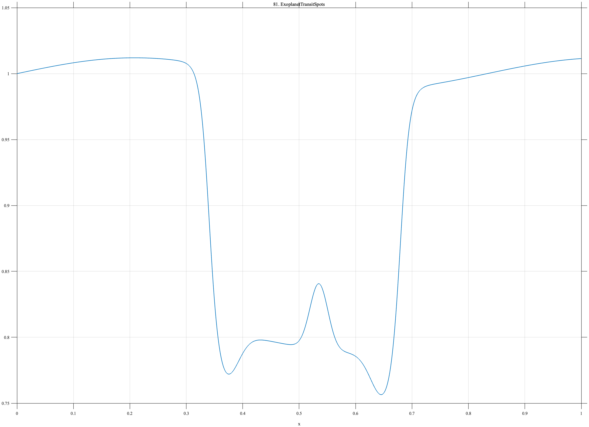

# TF081 — ExoplanetTransitSpots

## Overview

The **ExoplanetTransitSpots** signal contains weak stellar variability, a broad transit depression with finite ingress and egress, limb features, and a much smaller spot-crossing bump inside the transit.

## Mathematical Definition

Let $s(x;c,w)=[1+e^{-(x-c)/w}]^{-1}$, $g(x;c,w)=e^{-((x-c)/w)^2/2}$, and $W(x)=s(x;0.34,0.008)-s(x;0.68,0.008)$. Then

$$
f(x)=1+0.012\sin(2\pi\,1.2x)-0.20W(x)-0.035g(x;0.37,0.022)-0.035g(x;0.65,0.022)+0.050g(x;0.535,0.016).
$$

## Morphological Characteristics

| Property | Description |
|---|---|
| Primary family | Broad depression with weak internal anomaly |
| Transit interval | Approximately 0.34–0.68 |
| Small feature | Positive spot-crossing bump near $x=0.535$ |
| Main challenge | Preserving a weak anomaly relative to the transit depth |

## Parameters

| Parameter | Meaning | Default |
|---|---|---:|
| $0.20$ | Transit depth | 0.20 |
| $0.050$ | Spot-crossing amplitude | 0.050 |
| $0.016$ | Spot-crossing width | 0.016 |

## MATLAB Implementation

~~~matlab
N=1024; x=linspace(0,1,N); s=@(z,c,w) 1./(1+exp(-(z-c)/w));
baseline=1+0.012*sin(2*pi*1.2*x);
W=s(x,0.34,0.008)-s(x,0.68,0.008);
bottom=-0.20*W;
limb=-0.035*exp(-0.5*((x-0.37)/0.022).^2)-0.035*exp(-0.5*((x-0.65)/0.022).^2);
spot=0.050*exp(-0.5*((x-0.535)/0.016).^2);
f=baseline+bottom+limb+spot;
plot(x,f); grid on; title('TF081 — ExoplanetTransitSpots')
exportgraphics(gcf,'TF081_ExoplanetTransitSpots.png','Resolution',300);
~~~

## Python Implementation

~~~python
import numpy as np
import matplotlib.pyplot as plt
N=1024; x=np.linspace(0,1,N); s=lambda c,w: 1/(1+np.exp(-(x-c)/w))
baseline=1+.012*np.sin(2*np.pi*1.2*x); W=s(.34,.008)-s(.68,.008)
bottom=-.20*W
limb=-.035*np.exp(-.5*((x-.37)/.022)**2)-.035*np.exp(-.5*((x-.65)/.022)**2)
spot=.050*np.exp(-.5*((x-.535)/.016)**2); f=baseline+bottom+limb+spot
plt.plot(x,f); plt.grid(alpha=.3); plt.tight_layout()
plt.savefig('TF081_ExoplanetTransitSpots.png',dpi=300)
~~~

## Recommended Uses

- Transit-light-curve denoising
- Weak-anomaly preservation
- Ingress and egress recovery

## Provenance

**Status:** Exoplanet-photometry-inspired deterministic surrogate.

---

[← Previous: TrainingLossSchedule](TF080_TrainingLossSchedule.md) | [Category 6 Catalog](index.md) | [Next: PulsarProfile →](TF082_PulsarProfile.md)
