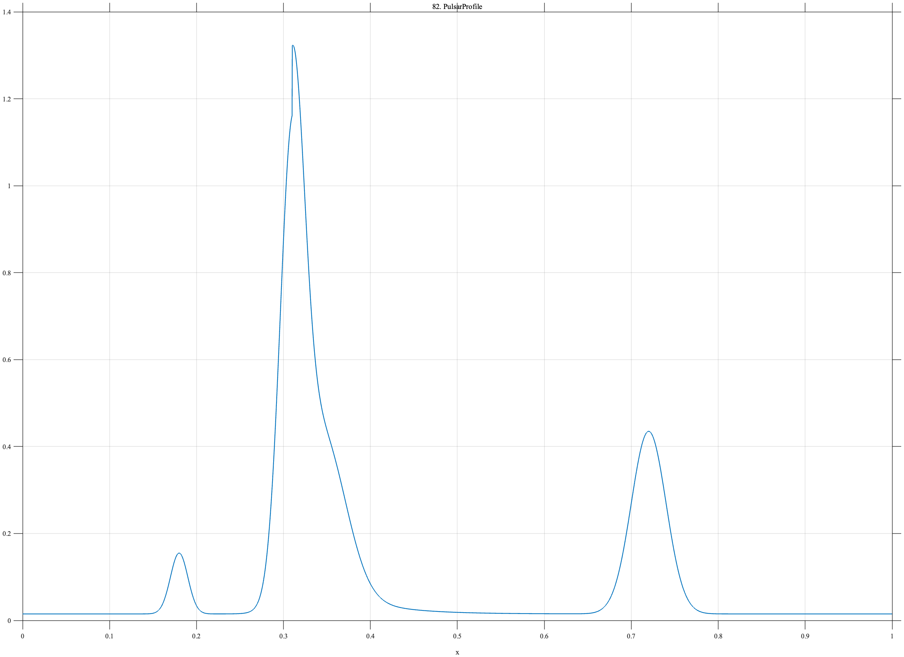

# TF082 — PulsarProfile

## Overview

The **PulsarProfile** signal combines a small precursor, a narrow principal pulse, a broader component and asymmetric tail, and a weaker interpulse separated in phase.

## Mathematical Definition

Let $g(x;c,w)=e^{-((x-c)/w)^2/2}$. The signal is

$$
\begin{aligned}
f(x)={}&0.015+0.14g(x;0.18,0.010)+g(x;0.31,0.014)\\
&+0.34g(x;0.345,0.027)+0.42g(x;0.72,0.020)\\
&+0.16I(x\ge0.31)e^{-20(x-0.31)}.
\end{aligned}
$$

## Morphological Characteristics

| Property | Description |
|---|---|
| Primary family | Sparse unequal pulse components |
| Principal pulse | Narrow peak near $x=0.31$ |
| Secondary features | Precursor, asymmetric tail, and interpulse |
| Main challenge | Preserving both sharp and weak pulse structure |

## Parameters

| Parameter | Meaning | Default |
|---|---|---:|
| $0.31$ | Principal-pulse phase | 0.31 |
| $20$ | Tail decay rate | 20 |
| $0.72$ | Interpulse phase | 0.72 |

## MATLAB Implementation

~~~matlab
N=1024; x=linspace(0,1,N);
f=0.015+0.14*exp(-0.5*((x-0.18)/0.010).^2)+exp(-0.5*((x-0.31)/0.014).^2);
f=f+0.34*exp(-0.5*((x-0.345)/0.027).^2)+0.42*exp(-0.5*((x-0.72)/0.020).^2);
u=max(x-0.31,0); f=f+0.16*(x>=0.31).*exp(-20*u);
plot(x,f); grid on; title('TF082 — PulsarProfile')
exportgraphics(gcf,'TF082_PulsarProfile.png','Resolution',300);
~~~

## Python Implementation

~~~python
import numpy as np
import matplotlib.pyplot as plt
N=1024; x=np.linspace(0,1,N); g=lambda c,w: np.exp(-.5*((x-c)/w)**2)
f=.015+.14*g(.18,.010)+g(.31,.014)+.34*g(.345,.027)+.42*g(.72,.020)
u=np.maximum(x-.31,0); f+=.16*(x>=.31)*np.exp(-20*u)
plt.plot(x,f); plt.grid(alpha=.3); plt.tight_layout()
plt.savefig('TF082_PulsarProfile.png',dpi=300)
~~~

## Recommended Uses

- Folded-profile denoising
- Precursor and interpulse recovery
- Asymmetric-tail preservation

## Provenance

**Status:** Pulsar-profile-inspired deterministic surrogate.

---

[← Previous: ExoplanetTransitSpots](TF081_ExoplanetTransitSpots.md) | [Category 6 Catalog](index.md) | [Next: GravitationalWaveChirp →](TF083_GravitationalWaveChirp.md)
