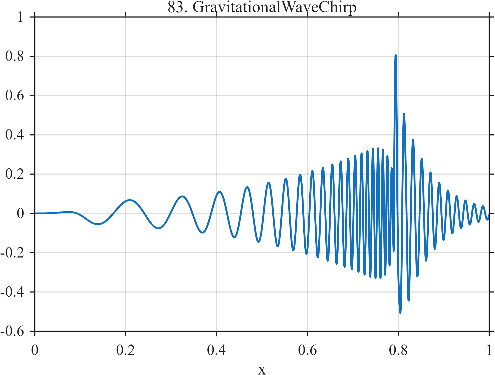

# TF083 — GravitationalWaveChirp

## Overview

The **GravitationalWaveChirp** signal has simultaneous amplitude and frequency acceleration toward a merger-like event, followed by a short damped ring-down.

## Mathematical Definition

Let $s(x;c,w)=[1+e^{-(x-c)/w}]^{-1}$, $W(x)=s(x;0.10,0.018)-s(x;0.79,0.010)$, and

$$
\phi(x)=2\pi(5x+4x^2+18x^4+38x^7),\qquad A(x)=0.06+0.62x^{2.8}.
$$

Then

$$
f(x)=W(x)A(x)\sin\phi(x)+0.70I(x\ge0.79)e^{-15(x-0.79)}\sin[2\pi\,52(x-0.79)+0.3].
$$

## Morphological Characteristics

| Property | Description |
|---|---|
| Primary family | Accelerating chirp and damped ring-down |
| Active chirp | Approximately 0.10–0.79 |
| Nonstationarity | Rapidly changing frequency and amplitude |
| Main challenge | Preserving merger-localized fine scales and post-event ringing |

## Parameters

| Parameter | Meaning | Default |
|---|---|---:|
| $0.79$ | Merger/ring-down time | 0.79 |
| $15$ | Ring-down decay rate | 15 |
| $52$ | Ring-down cycle frequency | 52 |

## MATLAB Implementation

~~~matlab
N=1024; x=linspace(0,1,N); s=@(z,c,w) 1./(1+exp(-(z-c)/w));
W=s(x,0.10,0.018)-s(x,0.79,0.010);
phase=2*pi*(5*x+4*x.^2+18*x.^4+38*x.^7);
amp=0.06+0.62*x.^2.8; chirp=W.*amp.*sin(phase);
u=max(x-0.79,0); ring=(x>=0.79).*0.70.*exp(-15*u).*sin(2*pi*52*u+0.3);
f=chirp+ring;
plot(x,f); grid on; title('TF083 — GravitationalWaveChirp')
exportgraphics(gcf,'TF083_GravitationalWaveChirp.png','Resolution',300);
~~~

## Python Implementation

~~~python
import numpy as np
import matplotlib.pyplot as plt
N=1024; x=np.linspace(0,1,N); s=lambda c,w: 1/(1+np.exp(-(x-c)/w))
W=s(.10,.018)-s(.79,.010); phase=2*np.pi*(5*x+4*x**2+18*x**4+38*x**7)
amp=.06+.62*x**2.8; chirp=W*amp*np.sin(phase)
u=np.maximum(x-.79,0); ring=(x>=.79)*.70*np.exp(-15*u)*np.sin(2*np.pi*52*u+.3)
f=chirp+ring
plt.plot(x,f); plt.grid(alpha=.3); plt.tight_layout()
plt.savefig('TF083_GravitationalWaveChirp.png',dpi=300)
~~~

## Recommended Uses

- Chirp denoising
- Time-varying frequency recovery
- Ring-down preservation

## Provenance

**Status:** Compact-binary-waveform-inspired deterministic surrogate; not a physical simulator.

---

[← Previous: PulsarProfile](TF082_PulsarProfile.md) | [Category 6 Catalog](index.md) | [Next: MicrolensingPlanet →](TF084_MicrolensingPlanet.md)
