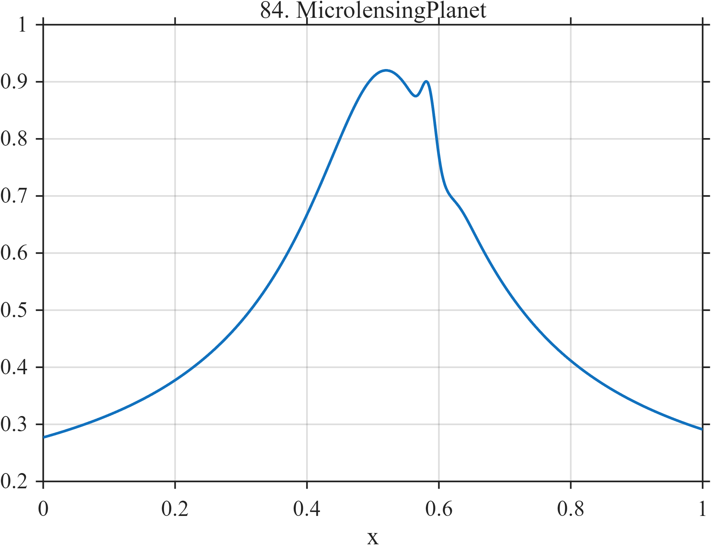

# TF084 — MicrolensingPlanet

## Overview

The **MicrolensingPlanet** signal places a weak, localized positive-negative planetary anomaly on a dominant, broad, smooth lensing curve.

## Mathematical Definition

Let $u=(x-0.52)/0.115$ and $g(x;c,w)=e^{-((x-c)/w)^2/2}$. Then

$$
f(x)=0.10+\frac{0.82}{\sqrt{1+u^2}}+0.095g(x;0.585,0.010)-0.035g(x;0.605,0.016).
$$

## Morphological Characteristics

| Property | Description |
|---|---|
| Primary family | Broad smooth peak with weak local anomaly |
| Dominant center | $x=0.52$ |
| Planetary feature | Positive-negative perturbation near 0.585–0.605 |
| Main challenge | Preserving scientifically meaningful local shape despite low global-error contribution |

## Parameters

| Parameter | Meaning | Default |
|---|---|---:|
| $0.115$ | Broad-event scale | 0.115 |
| $0.095$ | Positive anomaly amplitude | 0.095 |
| $-0.035$ | Negative anomaly amplitude | -0.035 |

## MATLAB Implementation

~~~matlab
N=1024; x=linspace(0,1,N);
u=(x-0.52)/0.115;
smooth=0.10+0.82./sqrt(1+u.^2);
planet=0.095*exp(-0.5*((x-0.585)/0.010).^2)-0.035*exp(-0.5*((x-0.605)/0.016).^2);
f=smooth+planet;
plot(x,f); grid on; title('TF084 — MicrolensingPlanet')
exportgraphics(gcf,'TF084_MicrolensingPlanet.png','Resolution',300);
~~~

## Python Implementation

~~~python
import numpy as np
import matplotlib.pyplot as plt
N=1024; x=np.linspace(0,1,N); u=(x-.52)/.115
smooth=.10+.82/np.sqrt(1+u**2)
planet=.095*np.exp(-.5*((x-.585)/.010)**2)-.035*np.exp(-.5*((x-.605)/.016)**2)
f=smooth+planet
plt.plot(x,f); plt.grid(alpha=.3); plt.tight_layout()
plt.savefig('TF084_MicrolensingPlanet.png',dpi=300)
~~~

## Recommended Uses

- Weak-anomaly preservation
- Broad-versus-local scale separation
- Feature-aware denoising evaluation

## Provenance

**Status:** Planetary-microlensing-inspired deterministic surrogate.

---

[← Previous: GravitationalWaveChirp](TF083_GravitationalWaveChirp.md) | [Category 6 Catalog](index.md) | [Next: SolarFlare →](TF085_SolarFlare.md)
