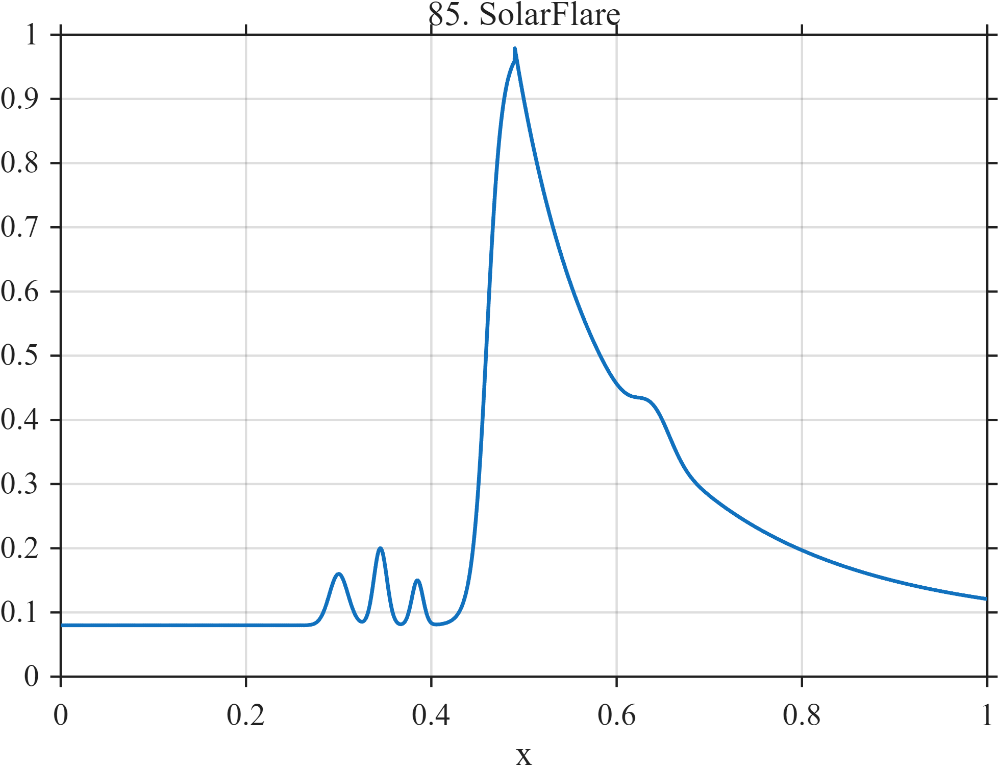

# TF085 — SolarFlare

## Overview

The **SolarFlare** signal includes three weak precursors, an impulsive logistic rise, a two-rate post-peak decay, and a smaller late excursion.

## Mathematical Definition

Let $s(x;c,w)=[1+e^{-(x-c)/w}]^{-1}$ and $g(x;c,w)=e^{-((x-c)/w)^2/2}$. Define

$$
p(x)=0.08g(x;0.30,0.010)+0.12g(x;0.345,0.007)+0.07g(x;0.385,0.006).
$$

The signal is

$$
f(x)=
\begin{cases}
0.08+p(x)+0.90s(x;0.46,0.008)+0.055g(x;0.64,0.018), & x<0.49,\\
0.08+0.58e^{-5.2(x-0.49)}+0.32e^{-18(x-0.49)}+0.055g(x;0.64,0.018), & x\ge0.49.
\end{cases}
$$

## Morphological Characteristics

| Property | Description |
|---|---|
| Primary family | Precursors, impulsive event, and multirate decay |
| Precursor region | 0.30–0.385 |
| Main event | Rapid rise near 0.46–0.49 |
| Main challenge | Retaining weak precursors next to a dominant flare |

## Parameters

| Parameter | Meaning | Default |
|---|---|---:|
| $0.49$ | Post-peak transition time | 0.49 |
| $5.2,18$ | Slow and fast decay rates | As shown |
| $0.64$ | Late-excursion center | 0.64 |

## MATLAB Implementation

~~~matlab
N=1024; x=linspace(0,1,N); s=@(z,c,w) 1./(1+exp(-(z-c)/w));
prec=0.08*exp(-0.5*((x-0.30)/0.010).^2)+0.12*exp(-0.5*((x-0.345)/0.007).^2)+0.07*exp(-0.5*((x-0.385)/0.006).^2);
rise=0.90*s(x,0.46,0.008); u=max(x-0.49,0);
decay=(x>=0.49).*(0.58*exp(-5.2*u)+0.32*exp(-18*u));
f=0.08+prec+rise; post=x>=0.49; f(post)=0.08+decay(post);
f=f+0.055*exp(-0.5*((x-0.64)/0.018).^2);
plot(x,f); grid on; title('TF085 — SolarFlare')
exportgraphics(gcf,'TF085_SolarFlare.png','Resolution',300);
~~~

## Python Implementation

~~~python
import numpy as np
import matplotlib.pyplot as plt
N=1024; x=np.linspace(0,1,N); s=lambda c,w: 1/(1+np.exp(-(x-c)/w))
g=lambda c,w: np.exp(-.5*((x-c)/w)**2)
prec=.08*g(.30,.010)+.12*g(.345,.007)+.07*g(.385,.006); rise=.90*s(.46,.008)
u=np.maximum(x-.49,0); decay=(x>=.49)*(.58*np.exp(-5.2*u)+.32*np.exp(-18*u))
f=.08+prec+rise; post=x>=.49; f[post]=.08+decay[post]; f+=.055*g(.64,.018)
plt.plot(x,f); plt.grid(alpha=.3); plt.tight_layout()
plt.savefig('TF085_SolarFlare.png',dpi=300)
~~~

## Recommended Uses

- Flare-profile denoising
- Precursor recovery
- Multirate-decay preservation

## Provenance

**Status:** Solar-flare-morphology-inspired deterministic surrogate.

---

[← Previous: MicrolensingPlanet](TF084_MicrolensingPlanet.md) | [Category 6 Catalog](index.md) | [Next: QuasarFlare →](TF086_QuasarFlare.md)
