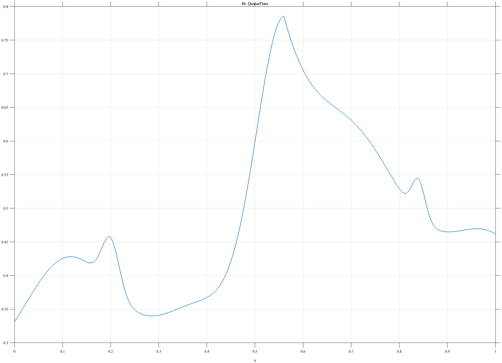

# TF086 — QuasarFlare

## Overview

The **QuasarFlare** signal places a broad asymmetric flare and two smaller excursions on a slowly wandering astronomical baseline.

## Mathematical Definition

Let $g(x;c,w)=e^{-((x-c)/w)^2/2}$ and

$$
b(x)=0.34+0.055\sin(2\pi\,1.4x+0.2)+0.035\sin(2\pi\,3.3x-0.6)+0.020x.
$$

The asymmetric flare is

$$
q(x)=
\begin{cases}
0.52g(x;0.56,0.060), & x<0.56,\\
0.52e^{-(x-0.56)/0.18}, & x\ge0.56,
\end{cases}
$$

and

$$
f(x)=b(x)+q(x)+0.075g(x;0.20,0.018)+0.055g(x;0.84,0.014).
$$

## Morphological Characteristics

| Property | Description |
|---|---|
| Primary family | Wandering baseline with asymmetric flare |
| Principal flare | Centered near $x=0.56$ |
| Secondary features | Small excursions near 0.20 and 0.84 |
| Main challenge | Preserving transients without distorting low-frequency variability |

## Parameters

| Parameter | Meaning | Default |
|---|---|---:|
| $0.060$ | Flare rise width | 0.060 |
| $0.18$ | Flare decay scale | 0.18 |
| $0.52$ | Principal-flare amplitude | 0.52 |

## MATLAB Implementation

~~~matlab
N=1024; x=linspace(0,1,N);
wander=0.34+0.055*sin(2*pi*1.4*x+0.2)+0.035*sin(2*pi*3.3*x-0.6)+0.020*x;
left=0.52*exp(-0.5*((x-0.56)/0.060).^2);
right=0.52*exp(-(x-0.56)/0.18).*(x>=0.56);
flare=left.*(x<0.56)+right;
small=0.075*exp(-0.5*((x-0.20)/0.018).^2)+0.055*exp(-0.5*((x-0.84)/0.014).^2);
f=wander+flare+small;
plot(x,f); grid on; title('TF086 — QuasarFlare')
exportgraphics(gcf,'TF086_QuasarFlare.png','Resolution',300);
~~~

## Python Implementation

~~~python
import numpy as np
import matplotlib.pyplot as plt
N=1024; x=np.linspace(0,1,N); g=lambda c,w: np.exp(-.5*((x-c)/w)**2)
wander=.34+.055*np.sin(2*np.pi*1.4*x+.2)+.035*np.sin(2*np.pi*3.3*x-.6)+.020*x
left=.52*g(.56,.060); right=.52*np.exp(-(x-.56)/.18)*(x>=.56)
flare=left*(x<.56)+right; small=.075*g(.20,.018)+.055*g(.84,.014); f=wander+flare+small
plt.plot(x,f); plt.grid(alpha=.3); plt.tight_layout()
plt.savefig('TF086_QuasarFlare.png',dpi=300)
~~~

## Recommended Uses

- Asymmetric-transient denoising
- Baseline-versus-flare separation
- Weak-excursion recovery

## Provenance

**Status:** Quasar-variability-inspired deterministic surrogate.

---

[← Previous: SolarFlare](TF085_SolarFlare.md) | [Category 6 Catalog](index.md) | [Next: PromoDemand →](TF087_PromoDemand.md)
