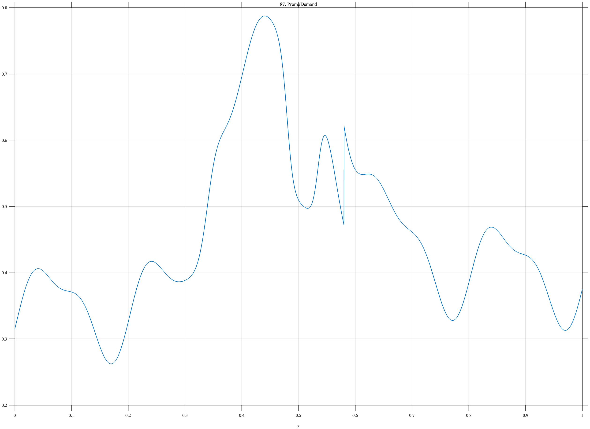

# TF087 — PromoDemand

## Overview

The **PromoDemand** signal combines secular growth, seasonality, a temporary promotion lift, a sharp stockout depression during the promotion, and decaying post-promotion carry-over.

## Mathematical Definition

Let $s(x;c,w)=[1+e^{-(x-c)/w}]^{-1}$. Then

$$
\begin{aligned}
f(x)={}&0.34+0.055x+0.065\sin(10\pi x-0.4)+0.025\sin(20\pi x)\\
&+0.36[s(x;0.34,0.010)-s(x;0.58,0.016)]\\
&-0.25[s(x;0.48,0.006)-s(x;0.535,0.006)]\\
&+0.15I(x\ge0.58)e^{-8(x-0.58)}.
\end{aligned}
$$

## Morphological Characteristics

| Property | Description |
|---|---|
| Primary family | Seasonal trend with nested intervention effects |
| Promotion | Approximately 0.34–0.58 |
| Stockout | Approximately 0.48–0.535 |
| Main challenge | Separating trend, seasonality, promotion, and operational disruption |

## Parameters

| Parameter | Meaning | Default |
|---|---|---:|
| $0.36$ | Promotion lift | 0.36 |
| $-0.25$ | Stockout effect | -0.25 |
| $8$ | Carry-over decay rate | 8 |

## MATLAB Implementation

~~~matlab
N=1024; x=linspace(0,1,N); s=@(z,c,w) 1./(1+exp(-(z-c)/w));
season=0.34+0.055*x+0.065*sin(2*pi*5*x-0.4)+0.025*sin(2*pi*10*x);
promo=0.36*(s(x,0.34,0.010)-s(x,0.58,0.016));
stockout=-0.25*(s(x,0.48,0.006)-s(x,0.535,0.006));
u=max(x-0.58,0); carry=(x>=0.58).*0.15.*exp(-8*u);
f=season+promo+stockout+carry;
plot(x,f); grid on; title('TF087 — PromoDemand')
exportgraphics(gcf,'TF087_PromoDemand.png','Resolution',300);
~~~

## Python Implementation

~~~python
import numpy as np
import matplotlib.pyplot as plt
N=1024; x=np.linspace(0,1,N); s=lambda c,w: 1/(1+np.exp(-(x-c)/w))
season=.34+.055*x+.065*np.sin(2*np.pi*5*x-.4)+.025*np.sin(2*np.pi*10*x)
promo=.36*(s(.34,.010)-s(.58,.016)); stockout=-.25*(s(.48,.006)-s(.535,.006))
u=np.maximum(x-.58,0); carry=(x>=.58)*.15*np.exp(-8*u); f=season+promo+stockout+carry
plt.plot(x,f); plt.grid(alpha=.3); plt.tight_layout()
plt.savefig('TF087_PromoDemand.png',dpi=300)
~~~

## Recommended Uses

- Demand-series denoising
- Promotion-effect preservation
- Nested stockout detection

## Provenance

**Status:** Retail-demand-inspired deterministic surrogate.

---

[← Previous: QuasarFlare](TF086_QuasarFlare.md) | [Category 6 Catalog](index.md) | [Next: ProductLaunch →](TF088_ProductLaunch.md)
